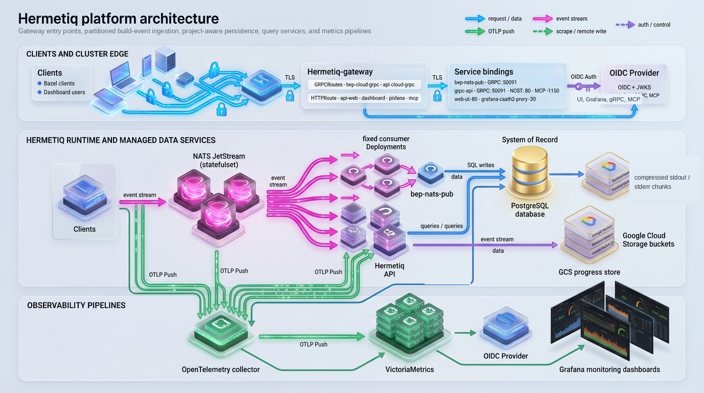
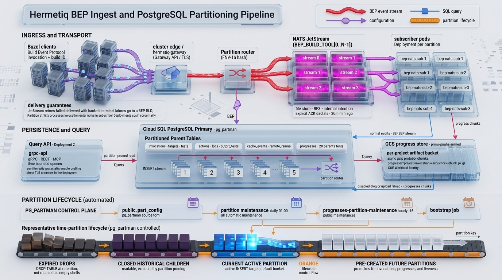
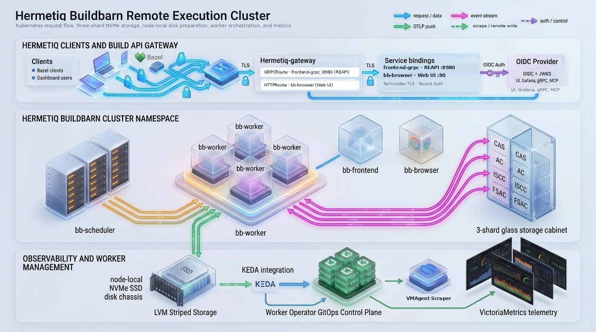

# Hermetiq Kubernetes

This repository is the source for Hermetiq's Kubernetes deployment artifacts:

- Helm charts for Hermetiq, Buildbarn, and the Buildbarn worker operator
- starter values for the charts and their external dependencies
- example `RbeWorker` pools and Bazel integrations
- operational and architecture runbooks

The Helm charts, starter values, examples, and operational runbooks in this
repository are licensed under Apache-2.0. The Hermetiq application container
images deployed by the charts are commercial software distributed under the
[Hermetiq Software License Agreement](charts/hermetiq/SOFTWARE-LICENSE-AGREEMENT.md);
see [License](#license).

Customer installations should use the versioned OCI charts published at
`oci://ghcr.io/hermetiq/`. The chart sources under [`charts/`](charts/) are for
development, review, and pre-release testing.

The examples are tailored for GKE, but the Helm charts work on any conformant
Kubernetes 1.32+ cluster. EKS, AKS, and other environments need equivalent
PostgreSQL, storage, workload identity, Gateway/Ingress, DNS, and TLS
configuration.

## Contents

- [Key features](#key-features)
  - [Hermetiq chart](#hermetiq-chart)
  - [Buildbarn chart](#buildbarn-chart)
- [Repository layout](#repository-layout)
- [Supported chart bundle](#supported-chart-bundle)
- [Architecture](#architecture)
- [Prerequisites](#prerequisites)
- [Installation](#installation)
  - [Prepare custom values](#prepare-custom-values)
  - [Create the namespace](#create-the-namespace)
  - [Prepare routing, DNS, and TLS](#prepare-routing-dns-and-tls)
  - [Provision external services](#provision-external-services)
  - [Install Hermetiq](#install-hermetiq)
  - [Install the worker operator](#install-the-worker-operator)
  - [Install Buildbarn and worker pools](#install-buildbarn-and-worker-pools)
- [Verify the stack](#verify-the-stack)
- [Post-installation configuration](#post-installation-configuration)
- [Examples and runbooks](#examples-and-runbooks)
- [Shared chart conventions](#shared-chart-conventions)
- [Upgrading](#upgrading)
- [Uninstalling](#uninstalling)
- [Getting help](#getting-help)
- [License](#license)

## Key features

### Hermetiq chart

Hermetiq turns Bazel's Build Event Protocol into answers: why this build was
slow, what missed the cache, which test is flaky, what remote execution cost.
This chart runs all of it in your cluster.

- **From `helm install` to first insight in one sitting.** One release brings
  up the gRPC and REST API, the dashboard, the BEP publisher, partitioned
  subscribers, the MCP server, schema bootstrap, and maintenance CronJobs,
  already wired together. The dashboard's Quickstart page then hands your
  developers the exact Bazel flags, with the credential-helper step
  customizable for your environment.
- **Every remote action, not just every build.** Buildbarn workers stream each
  completed action to Hermetiq through the Completed Action Logger, and
  Hermetiq joins it to the invocation that requested it. You get per-action
  queue, input-fetch, execution, and output-upload timing, worker and platform
  attribution, and the command that ran, grouped and trended over time, so a
  slow remote build points at the action, the worker pool, or the scheduler
  queue that caused it instead of a wall-clock guess.
- **Ingest that shrugs at your busiest CI hour.** Partitioned NATS JetStream
  streams with one subscriber Deployment per partition spread the load while
  keeping every build's events in order. A dead-letter queue quarantines
  poison events instead of stalling the pipeline, the publisher can autoscale,
  and anti-affinity plus PodDisruptionBudgets are on by default so a node
  drain never drops a BEP stream mid-build. Raw BEP export to a bucket is one
  flag away.
- **A database that maintains itself.** Schema migrations run as a Helm hook
  before workloads roll forward, so an upgrade never races its own schema.
  `pg_partman` time partitioning prunes queries to the days they ask about and
  drops aged data instantly, and CronJobs keep partitions and trend views
  ahead of incoming data. Per-project progress-log storage can stream build
  stdout and stderr to GCS or Azure Blob through GKE, AKS, or IRSA workload
  identity, so the hottest table never balloons and log retention becomes a
  bucket lifecycle rule.
- **Set one issuer URL and every login just works.** `oidc.issuerUrl` drives
  dashboard SSO, JWT validation on the API, and JWKS machine-to-machine auth
  for Bazel uploads. Admins come from a group claim or an email allowlist, and
  Grafana and Buildbarn Browser ride the same session, so people sign in once.
- **Ask your build cluster questions in plain English.** The built-in MCP server
  lets Claude and other assistants register themselves through OAuth Dynamic
  Client Registration, then dig into build and invocation analytics, diagnose
  Buildbarn health from PromQL, discover what is deployed through the
  Kubernetes API, inspect proto intelligence, and price remote execution with
  OpenCost.
- **Try it before anyone talks to sales.** Provide a contact email and a
  30-day trial is issued on first boot, fully functional from the first pod.
  Paid keys drop into a Secret and are picked up in about two minutes with no
  rollout, and fully air-gapped clusters verify an offline license file with
  zero network calls.
- **Speaks your ingress dialect.** Envoy Gateway with `GRPCRoute`, GKE Gateway
  with `HTTPRoute`, Contour `HTTPProxy`, classic Ingress, or bring your own.
  Stream timeouts come pre-tuned so BES uploads finish instead of failing in
  the last second of an otherwise green build, with health-check policies,
  CORS, and Envoy client-traffic tuning for teams half a world from the
  cluster.
- **Thirteen Grafana dashboards on day one.** BEP ingest, query and SQL
  performance, NATS, JetStream, Dragonfly, and six Buildbarn dashboards ship
  as ConfigMaps that the Grafana sidecar imports automatically, alongside
  VMPodScrapes for NATS and Dragonfly and OTLP metrics export with optional
  mTLS.
- **Fails fast in `helm template`, not at 2 a.m.** Non-root containers with
  read-only root filesystems, dropped capabilities, and seccomp by default.
  Per-workload ServiceAccount token control and individually gated RBAC rules
  give your security review something to say yes to. Externally managed
  ConfigMaps carry rollout checksums for GitOps, and render-time validation
  refuses inconsistent auth, routing, or licensing values with a message that
  names the fix.

### Buildbarn chart

Buildbarn is the remote cache and remote execution engine behind Hermetiq.
This chart turns a dozen Deployments and a pile of Jsonnet into one coherent
release.

- **One `helm install`, a whole build cluster.** Frontend for the remote cache
  and execution APIs, scheduler, sharded storage, Browser, and optional Remote
  Asset API and bb-portal, all generated from one Jsonnet model so shard
  addresses, authentication, tracing, and message limits never drift between
  components. The Remote Asset API fetches external dependencies once for the
  whole organization instead of once per laptop.
- **Storage from budget PVCs to raw NVMe.** Sharded CAS and Action Cache on
  persistent disks, local SSD through `emptyDir` or `hostPath`, or raw block
  devices on Hyperdisk, TopoLVM, or LVM-striped local NVMe with the filesystem
  cut out entirely. Optional ISCC and FSAC stores unlock size classes and
  prefetching, and an opt-in sizing guard turns the infamous "lost inputs no
  longer available remotely" mystery into a `helm template` error that shows
  the arithmetic.
- **Workers that show up when the queue does.** Declare a pool as an
  `RbeWorker` and the operator renders the Deployment, ConfigMap, and KEDA
  `ScaledObject`. Pools scale from zero the moment work queues, hold a cron
  floor for the morning rush, route each action to the smallest size class
  that can handle it, and prefetch inputs from the File System Access Cache
  before the action starts.
- **Tests that need Docker get Docker.** Opt-in Docker-in-Docker and Sysbox
  worker fleets, selected with a single `pool` platform property, with image
  preloading and registry mirrors, so Testcontainers suites run remotely
  instead of being the one thing left on developer machines.
- **Cache hits you can trust.** Every Action Cache hit is completeness-checked
  against the CAS so Bazel never chases evicted outputs. Time-based
  ActionResult expiry with jitter flushes out non-hermetic actions without a
  stampede, a break-glass timestamp invalidates the whole Action Cache in one
  values change, and a data-integrity validation cache keeps verification
  cheap.
- **Locked down without slowing down.** JWKS-verified JWTs gate writes and
  remote execution with `requireCanWriteToCache` while CAS and Action Cache
  reads stay open and fast. A bundled CronJob keeps the JWKS ConfigMap in step
  with your IdP's key rotation, Browser SSO shares the Hermetiq session, and a
  storage NetworkPolicy plus an internal-only frontend Service close the
  in-cluster back doors.
- **Tuned for real Bazel traffic, not hello-world.** Envoy Gateway, GKE
  Gateway, Contour, or Ingress with stream timeouts sized for long ByteStream
  transfers, an opt-in Envoy policy that lifts the per-connection buffers and
  HTTP/2 windows that otherwise throttle CAS blobs behind watermark
  backpressure, and cert-manager wildcard Certificates where the chart owns
  TLS.
- **Knows when the cache is quietly failing.** VMPodScrape targets stamped
  with the Hermetiq project ID, recording rules for the storage SLIs, and
  alerts that fire when a key-location map starts dropping writes or retention
  falls short, the two failure modes that look perfectly healthy on a disk
  graph. OTLP tracing runs through node-local agents with optional mTLS, and
  six Buildbarn Grafana dashboards ship with the Hermetiq chart.
- **Every escape hatch, every guardrail.** Replace any Jsonnet file wholesale
  with overrides validated against the packaged filenames, add your own
  objects with `extraObjects`, template pass-through values, pin digests,
  rewrite registries for air-gapped clusters, and follow the documented recipe
  for mirrored dual-ring storage. Strict render-time validation checks every
  cross-value dependency before anything touches the cluster.
- **Built to feed Hermetiq.** The Completed Action Logger streams every remote
  action to Hermetiq for detailed remote-action analytics: queue, fetch,
  execution, and upload timing for each action, joined to the invocation that
  requested it. Worker and storage metrics carry the project label so
  dashboards scope per team, and the experimental grpc-cache-proxy sidecar
  reveals the cache hits Bazel never reports in the Build Event Protocol.

## Repository layout

| Path | Purpose |
|---|---|
| [`charts/hermetiq/`](charts/hermetiq/) | Hermetiq API, MCP server, BEP ingestion, dashboard, and database maintenance |
| [`charts/buildbarn/`](charts/buildbarn/) | Buildbarn cache, remote execution, Browser, portal, storage, and routing |
| [`charts/bb-worker-operator/`](charts/bb-worker-operator/) | `RbeWorker` CRD and controller |
| [`custom-values/`](custom-values/) | Starter overrides for the supported stack and its dependencies |
| [`examples/`](examples/) | Bazel integrations, runner images, and validation projects |
| [`docs/`](docs/) | Focused architecture and operational runbooks |

The component READMEs are the canonical references for chart-specific values
and operations:

- [Hermetiq chart reference](charts/hermetiq/README.md)
- [Buildbarn chart reference](charts/buildbarn/README.md)
- [BB Worker Operator reference](charts/bb-worker-operator/README.md)

## Supported chart bundle

The following versions form the first tested bundle in this repository:

| Chart | Chart version | Application version |
|---|---:|---:|
| Hermetiq | `0.9.0` | `0.9.0` |
| Buildbarn | `0.10.0` | `20260814T085338Z` |
| BB Worker Operator | `0.3.1` | `v0.3.1` |

The commands below define these versions once and reuse them:

```bash
HERMETIQ_CHART_VERSION=0.9.0
BUILDBARN_CHART_VERSION=0.10.0
BB_WORKER_OPERATOR_CHART_VERSION=0.3.1
```

Release changes belong in each chart's `Chart.yaml` metadata and the
corresponding GitHub release. This guide documents the supported current state,
not a cumulative release history.

## Architecture







| Component | Responsibility |
|---|---|
| Hermetiq dashboard (`web-ui`) | Project settings, build exploration, trends, analytics, and Quickstart instructions |
| Hermetiq API (`grpc-api`) | Dashboard, query, MCP, CAS, and bytestream-facing APIs |
| BEP publisher (`bep-nats-pub`) | Authenticates Bazel BEP/CAL traffic and publishes events to NATS JetStream |
| BEP subscribers (`bep-nats-sub-*`) | Consume partitioned event streams and persist build analytics |
| PostgreSQL | Hermetiq's system of record |
| NATS JetStream | Durable buffer between BEP ingestion and subscribers |
| DragonflyDB | Redis-compatible application cache |
| Buildbarn | Remote cache and remote execution services |
| BB Worker Operator | Reconciles `RbeWorker` resources into worker Deployments and KEDA scalers |
| VictoriaMetrics and Grafana | Metrics storage, alerting, and dashboards |
| OpenTelemetry Collector | Receives OTLP telemetry and forwards it to VictoriaMetrics |
| Gateway or Ingress | Exposes dashboard, API, MCP, BEP, Browser, portal, and Buildbarn gRPC endpoints |

## Prerequisites

You need:

- Kubernetes 1.32 or newer and namespace-administrator access
- Helm 3.8 or newer for OCI support
- `kubectl` configured for the target cluster
- a Gateway API, Contour, or Ingress controller
- DNS and a TLS certificate for the external hosts
- PostgreSQL 16 or newer with `pg_partman`
- an OIDC identity provider
- persistent storage suitable for NATS and, when selected, Buildbarn

Verify the basics before starting:

```bash
helm version
kubectl version
kubectl auth can-i '*' '*' -n hermetiq
kubectl get gatewayclass
kubectl get storageclass
```

This guide assumes familiarity with Kubernetes and your cloud provider. Apply
your organization's networking, identity, backup, secret-management, and
change-control policies to every example.

## Installation

Install in this order:

1. Prepare the namespace, routing, DNS, TLS, PostgreSQL, OIDC, NATS,
   VictoriaMetrics, OpenTelemetry, DragonflyDB, and KEDA.
2. Install Hermetiq. It creates the shared dashboard OAuth configuration used
   by the optional Grafana and Buildbarn Browser proxies.
3. Install the BB Worker Operator.
4. Install Buildbarn.
5. Apply the `RbeWorker` pools appropriate for the cluster.

### Prepare custom values

Clone this repository and copy the starter values into an environment-specific
directory so future updates do not overwrite your configuration:

```bash
git clone git@github.com:Hermetiq/hermetiq-k8s.git
cd hermetiq-k8s
cp -R custom-values my-custom-values
```

`my-custom-values/` is ignored by Git, as is any directory whose name ends in
`-custom-values`, so a more descriptive name such as
`gke-production-custom-values` also stays out of version control.

Helm deep-merges maps and replaces lists wholesale. When overriding a list,
repeat every entry that should remain. Multiple `-f` arguments are applied
left-to-right, with the rightmost value winning.

Inspect the packaged documentation and defaults before editing overrides:

```bash
helm show readme oci://ghcr.io/hermetiq/hermetiq \
  --version "$HERMETIQ_CHART_VERSION"
helm show values oci://ghcr.io/hermetiq/hermetiq \
  --version "$HERMETIQ_CHART_VERSION"

helm show readme oci://ghcr.io/hermetiq/buildbarn \
  --version "$BUILDBARN_CHART_VERSION"
helm show values oci://ghcr.io/hermetiq/buildbarn \
  --version "$BUILDBARN_CHART_VERSION"

helm show readme oci://ghcr.io/hermetiq/bb-worker-operator \
  --version "$BB_WORKER_OPERATOR_CHART_VERSION"
helm show values oci://ghcr.io/hermetiq/bb-worker-operator \
  --version "$BB_WORKER_OPERATOR_CHART_VERSION"
```

### Create the namespace

```bash
kubectl create namespace hermetiq
kubectl config set-context --current --namespace=hermetiq
kubectl auth can-i '*' '*' -n hermetiq
```

If the cluster already hosts another Hermetiq installation, check for
cluster-scoped singleton operators before installing another copy. KEDA, the
DragonflyDB operator, and an unscoped BB Worker Operator commonly watch every
namespace and should not be duplicated without explicit namespace scoping.

### Prepare routing, DNS, and TLS

The Hermetiq and Buildbarn charts attach routes to infrastructure you own; they
do not create the Gateway or Ingress controller. Prepare:

- a Gateway/listener, Contour installation, or Ingress controller
- a wildcard certificate or individual certificates for the selected hosts
- DNS records pointing those hosts at the controller address
- a routing provider that matches the controller:
  - `gateway` for Envoy Gateway and other `GRPCRoute`-capable implementations
  - `gateway-httproute-only` for GKE Gateway
  - `contour` for `HTTPProxy`
  - `ingress` for classic Ingress
  - `none` when another system owns all external routes

Both application charts expose a Gateway-scoped `ClientTrafficPolicy`. When
Hermetiq and Buildbarn share a Gateway, enable that policy in exactly one chart;
Envoy Gateway does not merge two policies targeting the same Gateway.

The `gateway` provider renders Envoy Gateway policy resources in addition to
the standard routes. On a `GRPCRoute`-capable controller that is not Envoy
Gateway those kinds do not exist and the install fails on unknown kinds;
disable them with the values listed in each chart reference.

TLS depends on the provider. In the Gateway modes, TLS terminates on the
Gateway listener you own and the charts render no certificates. In the Contour
and Ingress modes, each chart can render a wildcard cert-manager `Certificate`
or reuse an existing wildcard Secret through `tls.secretName`. The Hermetiq
chart's Certificate is opt-in. The Buildbarn chart renders one by default and
references the `ClusterIssuer` named by `certificate.issuerRef.name`, so point
that at an issuer that exists or the routes serve no usable TLS.

The exact Hermetiq routing values are documented in the
[Hermetiq chart reference](charts/hermetiq/README.md#routing). Buildbarn routing
is documented in the
[Buildbarn chart reference](charts/buildbarn/README.md#routing-and-tls).

### Provision external services

#### PostgreSQL

Provision PostgreSQL 16 or newer before installing Hermetiq. The database must:

- use UTF-8 and be owned by a dedicated application user
- provide the `pg_partman` extension
- allow the owner to create and alter tables, indexes, functions, materialized
  views, and partitions
- require encrypted connections and be reachable from the Hermetiq namespace
- have backups, tested restores, and enough storage/I/O/WAL headroom for BEP
  ingest and retention

PostgreSQL is Hermetiq's system of record. NATS is a short-lived ingest buffer;
DragonflyDB and Buildbarn are rebuildable caches.

Create the password Secret referenced by the starter values:

```bash
kubectl -n hermetiq create secret generic postgres-db \
  --from-literal=password='<db-password>'
```

Configure the host, port, database, user, SSL mode, and Secret reference in
`my-custom-values/hermetiq-values.yaml`. Bootstrap and partition settings are
documented in the
[Hermetiq PostgreSQL reference](charts/hermetiq/README.md#postgresql-and-schema-management).

#### Identity provider

Prepare two OIDC applications:

- A regular web application using Authorization Code flow for the dashboard.
  Register callback URLs for every enabled UI, for example
  `https://dashboard.<your-domain>/oauth2/callback`,
  `https://grafana.<your-domain>/oauth2/callback`, and
  `https://browser.<your-domain>/oauth2/callback`.
- A machine-to-machine application for authenticated Bazel BEP and remote-cache
  traffic. Register the expected API audiences and authorize the client for
  those audiences.

Create the shared dashboard OAuth Secret:

```bash
kubectl -n hermetiq create secret generic oauth2-proxy-client \
  --from-literal=OAUTH2_PROXY_CLIENT_ID='<client-id>' \
  --from-literal=OAUTH2_PROXY_CLIENT_SECRET='<client-secret>' \
  --from-literal=OAUTH2_PROXY_COOKIE_SECRET="$(openssl rand -base64 32 | tr -- '+/' '-_')"
```

The Hermetiq, Grafana, and Buildbarn Browser proxies can share this Secret and
the ConfigMap rendered by the Hermetiq chart. Configure issuer, audiences,
groups, and the Buildbarn CAL trust boundary using the
[Hermetiq authentication reference](charts/hermetiq/README.md#authentication-and-sso).

#### NATS JetStream

Review `my-custom-values/nats-values.yaml`, including storage class, volume
size, and resource requests, then install NATS:

```bash
helm repo add nats https://nats-io.github.io/k8s/helm/charts/
helm repo update
helm upgrade --install --namespace hermetiq nats nats/nats \
  --values my-custom-values/nats-values.yaml
```

Verify JetStream:

```bash
kubectl -n hermetiq rollout status statefulset/nats --timeout=5m
kubectl -n hermetiq exec -it \
  "$(kubectl -n hermetiq get pods -l app.kubernetes.io/component=nats-box \
    -o jsonpath='{.items[0].metadata.name}')" \
  -- nats server check jetstream
```

#### VictoriaMetrics and OpenTelemetry

Create the Grafana administrator Secret and install the metrics stack:

```bash
kubectl -n hermetiq create secret generic grafana-admin \
  --from-literal=admin-user=admin \
  --from-literal=admin-password="$(openssl rand -base64 24)"

helm repo add vm https://victoriametrics.github.io/helm-charts/
helm repo add open-telemetry https://open-telemetry.github.io/opentelemetry-helm-charts
helm repo update

helm upgrade --install --namespace hermetiq vmks \
  vm/victoria-metrics-k8s-stack \
  --values my-custom-values/victoriametrics-values.yaml

helm upgrade --install --namespace hermetiq otel \
  open-telemetry/opentelemetry-collector \
  --version 0.153.0 \
  --values my-custom-values/otel-collector-values.yaml
```

Confirm the VictoriaMetrics insert endpoint and Grafana domain in the starter
values before installation. The Hermetiq and Buildbarn charts render dashboards,
scrape objects, and recording rules consumed by this stack.

#### DragonflyDB

Create the cache password:

```bash
kubectl -n hermetiq create secret generic dragonfly-auth \
  --from-literal=password="$(openssl rand -base64 24)"
```

If the DragonflyDB operator is already installed, apply the instance:

```bash
kubectl explain dragonflies.dragonflydb.io
kubectl -n hermetiq apply \
  -f my-custom-values/dragonflydb-operator-crd-instance.yaml
```

Otherwise install the standalone chart:

```bash
helm upgrade --install --namespace hermetiq dragonfly \
  oci://ghcr.io/dragonflydb/dragonfly/helm/dragonfly \
  --version v1.38.0 \
  --values my-custom-values/dragonflydb-values.yaml
```

#### KEDA

KEDA scales operator-managed Buildbarn workers and, when enabled in the
Buildbarn values, its frontend Deployment:

```bash
helm repo add kedacore https://kedacore.github.io/charts
helm repo update
helm upgrade --install --namespace hermetiq keda kedacore/keda
```

Before installing the application charts, verify the dependency releases and
workloads:

```bash
helm list -n hermetiq
kubectl -n hermetiq get pods
```

### Install Hermetiq

Edit `my-custom-values/hermetiq-values.yaml`, then install the pinned OCI chart:

```bash
helm upgrade --install --namespace hermetiq hmq \
  oci://ghcr.io/hermetiq/hermetiq \
  --version "$HERMETIQ_CHART_VERSION" \
  --values my-custom-values/hermetiq-values.yaml
```

The starter values set `license.agreement.accepted: true`. Installing with it
confirms acceptance of the
[Hermetiq Software License Agreement](charts/hermetiq/SOFTWARE-LICENSE-AGREEMENT.md); the chart refuses to
render while it is false.

Follow the [Hermetiq chart reference](charts/hermetiq/README.md) for required
inputs, routing, authentication, licensing, schema management, hardening, and
component-level verification.

### Install the worker operator

```bash
helm show crds oci://ghcr.io/hermetiq/bb-worker-operator \
  --version "$BB_WORKER_OPERATOR_CHART_VERSION" \
  | kubectl apply --server-side -f -

helm upgrade --install --namespace hermetiq bb-worker-operator \
  oci://ghcr.io/hermetiq/bb-worker-operator \
  --version "$BB_WORKER_OPERATOR_CHART_VERSION" \
  --values my-custom-values/bb-worker-operator-values.yaml
```

Applying the CRD explicitly is safe on first install and is required for future
CRD updates because Helm does not upgrade CRDs automatically. Leave `image.tag`
empty so the controller image follows the chart's `appVersion` and stays on the
same release as the CRD. See the
[operator reference](charts/bb-worker-operator/README.md) for verification,
scope, RBAC, KEDA, and observability settings.

### Install Buildbarn and worker pools

Edit `my-custom-values/buildbarn-values.yaml`, then install Buildbarn:

```bash
helm upgrade --install --namespace hermetiq buildbarn \
  oci://ghcr.io/hermetiq/buildbarn \
  --version "$BUILDBARN_CHART_VERSION" \
  --values my-custom-values/buildbarn-values.yaml
```

The release renders `buildbarn-worker-config`, which is consumed by the example
`RbeWorker` pools. Apply workers only after Buildbarn is ready. The standard
Ubuntu 22.04, Ubuntu 24.04, Codex, and Envoy pools form the default Kustomize
base:

```bash
kubectl apply -n hermetiq -k my-custom-values/rbeworkers
```

The example manifests assume the `hermetiq` namespace and the starter service
addresses. Use the
[RBE worker overlay instructions](custom-values/rbeworkers/README.md) to set the
namespace, Prometheus address, Hermetiq project ID, node scheduling, and
completed-action logger for another environment. That README also describes
each pool.

Optional pools for size classes, Testcontainers, Sysbox, and Drake live under
`custom-values/rbeworkers/optional/` and have additional storage, runtime, or
node-pool prerequisites. Read the
[Testcontainers node-pool prerequisites](charts/buildbarn/README.md#node-pool-prerequisites)
and the [ISCC size-class runbook](docs/iscc-size-classes.md) before enabling
them.

## Verify the stack

Check Helm releases and workload readiness:

```bash
helm list -n hermetiq
kubectl -n hermetiq get deploy,statefulset
kubectl -n hermetiq get rbeworkers,scaledobjects
kubectl -n hermetiq get pods
```

The release list should contain `hmq`, `buildbarn`, `bb-worker-operator`, NATS,
VictoriaMetrics, OpenTelemetry, KEDA, and either a Dragonfly Helm release or an
operator-managed Dragonfly resource.

Verify service endpoints and the active routing resources:

```bash
kubectl -n hermetiq get endpoints \
  grpc-api web-ui bep-nats-pub frontend-grpc browser scheduler storage
kubectl -n hermetiq get httproute,grpcroute,httpproxy,ingress 2>/dev/null
```

It is normal for worker pools with `minReplicas: 0` to show zero ready replicas
until KEDA observes queued work. Verify the operator and KEDA objects rather
than assuming a zero-replica pool is unhealthy.

Finally:

1. Open `https://dashboard.<your-domain>` and complete an OIDC login.
2. Confirm the Hermetiq, Buildbarn, NATS, and Kubernetes dashboards appear in
   Grafana.
3. Run a small Bazel build with the configured BEP and remote cache endpoints.
4. Confirm the invocation appears in Hermetiq and the action/cache data is
   visible through Buildbarn.

## Post-installation configuration

Sign in as an administrator and review **Project Settings** for each project:

- user-facing project name and description
- managed Buildbarn namespace and Browser/Grafana URLs
- successful-action, completed-action-log, and output-file processing settings
- analytics and MCP access
- cloud object storage for progress logs and its lifecycle policy
- CAS and bytestream endpoints, instance names, aliases, TLS, and metadata

Project settings are stored by Hermetiq, not in Helm values. Review them after
adding a Buildbarn namespace or changing public endpoints. Several settings
depend on cluster configuration:

- **Completed Action Log** only receives data when the publisher admits
  Buildbarn workers through `publisher.trustedCalCidrs`; see
  [gRPC authentication](charts/hermetiq/README.md#grpc-authentication) in the
  Hermetiq reference.
- **Action Cache Hit Tracker** needs the grpc-cache-proxy sidecar on the
  Buildbarn frontend and `app.cacheEventsEnabled=true` in the Hermetiq chart;
  see the
  [sidecar section](charts/buildbarn/README.md#hermetiq-grpc-cache-proxy-sidecar)
  of the Buildbarn reference.
- **Store compressed invocation logs in cloud object storage** needs workload
  identity for the subscriber pods and a bucket lifecycle rule you own; see
  [progress log storage](charts/hermetiq/README.md#progress-log-storage).
- **Bytestream URI Host Aliases** in the CAS and bytestream client settings
  must include the external Buildbarn frontend host, for example
  `bb.<your-domain>:443`, on Gateway installs. Hermetiq reads trace profiles,
  test logs, and output files from bytestream URIs that carry the public host
  rather than an internal Service name.

For Bazel client examples, start with [`examples/README.md`](examples/README.md).

## Examples and runbooks

| Document | Purpose |
|---|---|
| [`examples/README.md`](examples/README.md) | Bazel integration and runnable project examples |
| [`docs/buildbarn-storage-model.md`](docs/buildbarn-storage-model.md) | Storage sizing, sharding, and eviction model |
| [`docs/buildbarn-storage-operations.md`](docs/buildbarn-storage-operations.md) | Buildbarn storage lifecycle and runbooks |
| [`docs/buildbarn-block-storage.md`](docs/buildbarn-block-storage.md) | Raw block-device deployment guidance |
| [`docs/iscc-size-classes.md`](docs/iscc-size-classes.md) | Initial Size Class Cache design and operations |
| [`docs/mcp-auth0-runbook.md`](docs/mcp-auth0-runbook.md) | Auth0 setup and MCP authentication troubleshooting |

## Shared chart conventions

Hermetiq and Buildbarn expose a common set of deployment controls. Use the
individual chart defaults as the exact contract.

- `global.imageRegistry` rewrites the registry host for images deployed by that
  chart. It does not rewrite third-party dependency charts or `RbeWorker`
  runner images.
- `global.imagePullSecrets` is combined with chart-level `imagePullSecrets`.
- Image `digest` values pin immutable content while retaining readable tags.
- `commonLabels` and `commonAnnotations` add organizational metadata without
  changing immutable workload selectors.
- `standardLabels.appVersion` opts into the standard application-version label.
- `extraObjects` renders customer-owned Kubernetes objects in the chart's Helm
  context. NetworkPolicy rules remain environment-specific and should be
  reviewed with `helm template`, `kubectl diff`, and server-side dry-run.
- Template expressions are supported only by the values explicitly documented
  as templated. Do not put template expressions in `hosts.*`; several consumers
  use host values verbatim.

For private-registry or air-gapped installations, enumerate and mirror images
from every application and dependency chart plus every worker manifest. Do not
assume `global.imageRegistry` covers the entire stack.

## Upgrading

When a new chart version is released:

1. Read the `Chart.yaml` release metadata and GitHub release notes.
2. Compare the new defaults with the version currently deployed.
3. Back up PostgreSQL and assess whether Buildbarn storage changes imply a cold
   cache.
4. Apply the BB Worker Operator CRD first, then upgrade the operator, Hermetiq,
   and Buildbarn using a tested version combination.
5. Reuse the same custom values files and verify every rollout before continuing.

Example defaults comparison:

```bash
helm show values oci://ghcr.io/hermetiq/hermetiq \
  --version "$HERMETIQ_CHART_VERSION" > /tmp/hermetiq-old-values.yaml
helm show values oci://ghcr.io/hermetiq/hermetiq \
  --version '<new-version>' > /tmp/hermetiq-new-values.yaml
diff -u /tmp/hermetiq-old-values.yaml /tmp/hermetiq-new-values.yaml
```

Hermetiq schema migrations run through the chart's bootstrap job. Consult the
chart README and release notes before changing bootstrap or hook behavior.

## Uninstalling

Uninstall in reverse application order:

```bash
helm -n hermetiq uninstall buildbarn bb-worker-operator hmq
helm -n hermetiq uninstall keda otel vmks nats dragonfly
```

If Dragonfly is operator-managed, delete the `Dragonfly` resource instead of a
nonexistent Helm release.

Helm intentionally leaves external and stateful data behind. Review before
deleting:

- `RbeWorker` objects and the `rbeworkers.bb.hermetiq.com` CRD
- NATS, Buildbarn, and Dragonfly PVCs
- manually created Secrets and externally managed ConfigMaps
- PostgreSQL instances, databases, backups, object-storage buckets, DNS, TLS,
  and Gateway infrastructure

Deleting Buildbarn or NATS PVCs is destructive. PostgreSQL and object storage
are not removed by these commands.

## Getting help

Open an [installation issue](https://github.com/Hermetiq/hermetiq-k8s/issues/new/choose)
with:

- the failing command
- the relevant `helm status`, `kubectl describe`, and container logs
- the chart versions from `helm list -n hermetiq`
- a redacted copy of the applicable values file

Do not include passwords, tokens, license keys, private certificates, or
unredacted Kubernetes Secrets.

## License

- **This repository.** The Helm charts, starter values, examples, and runbooks
  are licensed under the [Apache License 2.0](LICENSE).
- **Hermetiq container images.** The Hermetiq application, the
  grpc-cache-proxy sidecar, and the Buildbarn worker operator are proprietary
  software distributed under the
  [Hermetiq Software License Agreement](charts/hermetiq/SOFTWARE-LICENSE-AGREEMENT.md),
  packaged with the chart. Installing the
  `hermetiq` chart requires `license.agreement.accepted: true` and a trial or
  purchased
  license key.
- **Buildbarn images.** The upstream Buildbarn components pulled from
  `ghcr.io/buildbarn` are Apache-2.0 open source maintained by the Buildbarn
  project.
