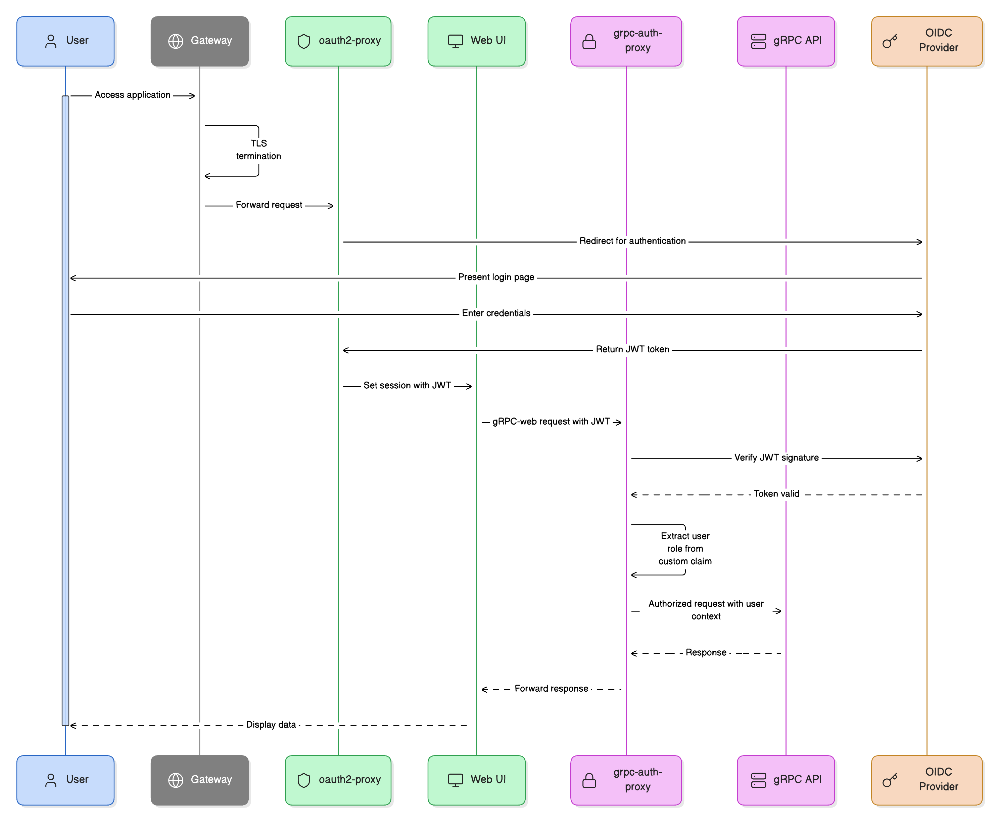

# Hermetiq Cloud Services — Kubernetes Installation

This repository contains the installation walkthrough and example values files for installing Hermetiq's cloud services and dependencies into a customer-managed Kubernetes cluster, as an alternative to using Hermetiq's hosted platform.

The commands and examples are tailored for GKE, but the Helm-based install process works with any modern Kubernetes 1.32+ cluster, including EKS and AKS. For non-GKE clusters, adapt the cloud-managed PostgreSQL service, storage classes, ingress or Gateway implementation, workload identity, DNS, and TLS setup to match your platform.

The Hermetiq, Buildbarn, and bb-worker-operator Helm charts themselves are published as OCI artifacts at `oci://ghcr.io/hermetiq/` and pulled directly by `helm` during install — there is no `charts/` directory in this repo.

## Table of Contents

- [System Diagram](#system-diagram)
  - [Main Components](#main-components)
- [Prerequisites](#prerequisites)
- [Authenticate to the Chart Registry](#authenticate-to-the-chart-registry)
- [Custom Values YAML](#custom-values-yaml)
  - [How overrides merge](#how-overrides-merge)
  - [Inspecting chart docs and values](#inspecting-chart-docs-and-values)
- [Hermetiq Namespace](#hermetiq-namespace)
- [Gateway / Ingress Controller](#gateway--ingress-controller)
- [PostgreSQL Database Requirements](#postgresql-database-requirements)
  - [Create Postgres Password Secret](#create-postgres-password-secret)
- [Identity Provider (OIDC)](#identity-provider-oidc)
- [NATS JetStream Messaging Service](#nats-jetstream-messaging-service)
- [VictoriaMetrics](#victoriametrics)
  - [OTEL Collector for VictoriaMetrics](#otel-collector-for-victoriametrics)
- [DragonflyDB (Redis-like Cache)](#dragonflydb-redis-like-cache)
- [KEDA Auto-scaler for BB Workers](#keda-auto-scaler-for-bb-workers)
- [Hermetiq Core Services](#hermetiq-core-services)
  - [Postgres Database](#postgres-database)
    - [DB Schema Bootstrap and Partition Maintenance](#db-schema-bootstrap-and-partition-maintenance)
  - [Hosts and Routing](#hosts-and-routing)
  - [NATS Streaming Ingest Partitioning](#nats-streaming-ingest-partitioning)
  - [Security](#security)
    - [OIDC and JWKS Authentication](#oidc-and-jwks-authentication)
      - [MCP Server Authentication](#mcp-server-authentication)
    - [Authenticating BEP event requests from Bazel using JWKS](#authenticating-bep-event-requests-from-bazel-using-jwks)
    - [Grafana SSO (oauth2-proxy)](#grafana-sso-oauth2-proxy)
    - [Cloud Workload Identity](#cloud-workload-identity)
      - [GCP Workload Identity (GKE)](#gcp-workload-identity-gke)
      - [Azure Workload Identity](#azure-workload-identity)
      - [Other Providers](#other-providers)
    - [Workload Discovery RBAC (for security review)](#workload-discovery-rbac-for-security-review)
  - [Externally Managed Config ConfigMaps](#externally-managed-config-configmaps)
    - [Custom NATS stream config file](#custom-nats-stream-config-file)
    - [Cache TTL Configuration](#cache-ttl-configuration)
    - [PromQL Query Configuration](#promql-query-configuration)
  - [Progress Log Storage](#progress-log-storage)
    - [How long build logs stay available](#how-long-build-logs-stay-available)
  - [Additional Environment Variables](#additional-environment-variables)
  - [Kubernetes Scheduling](#kubernetes-scheduling)
  - [Hardened Mode](#hardened-mode)
  - [Advanced Customization](#advanced-customization)
    - [Customizing the Quickstart Page](#customizing-the-quickstart-page)
    - [Disabling the metrics-backed infra tools](#disabling-the-metrics-backed-infra-tools)
    - [Project label for self-managed Buildbarn](#project-label-for-self-managed-buildbarn)
  - [Licensing and Trials](#licensing-and-trials)
    - [How the 30-day trial works](#how-the-30-day-trial-works)
    - [Installing a purchased license key](#installing-a-purchased-license-key)
    - [Air-gapped installs](#air-gapped-installs)
    - [Licensing RBAC (for security review)](#licensing-rbac-for-security-review)
    - [What happens when a license lapses](#what-happens-when-a-license-lapses)
  - [Install Hermetiq](#install-hermetiq)
  - [Verify Hermetiq](#verify-hermetiq)
- [BB Worker Operator](#bb-worker-operator)
  - [Install BB Worker Operator](#install-bb-worker-operator)
  - [Verify BB Worker Operator](#verify-bb-worker-operator)
  - [Worker Examples](#worker-examples)
  - [Tuning Worker Autoscaling](#tuning-worker-autoscaling)
- [Buildbarn](#buildbarn)
  - [Planning](#planning)
  - [Storage Model and Sizing](#storage-model-and-sizing)
  - [Storage Operations](#storage-operations)
  - [Raw Block-Device Storage (LVM)](#raw-block-device-storage-lvm)
  - [Size-Class Worker Pools (ISCC)](#size-class-worker-pools-iscc)
  - [Ingress / Gateway](#ingress--gateway)
  - [TLS Certificates](#tls-certificates)
  - [Browser SSO](#browser-sso)
  - [Frontend Auth And Cache Writes](#frontend-auth-and-cache-writes)
  - [Hermetiq grpc-cache-proxy Sidecar](#hermetiq-grpc-cache-proxy-sidecar)
  - [Buildbarn Hardened Mode](#buildbarn-hardened-mode)
  - [Testcontainers Worker Fleets](#testcontainers-worker-fleets)
  - [Tracing And Remote Asset API](#tracing-and-remote-asset-api)
  - [Advanced Jsonnet Overrides](#advanced-jsonnet-overrides)
  - [Install Buildbarn](#install-buildbarn)
  - [Verify Buildbarn](#verify-buildbarn)
- [Examples](#examples)
- [Post Installation Tasks](#post-installation-tasks)
  - [Project Settings](#project-settings)
  - [RPC Configuration Notes](#rpc-configuration-notes)
- [Upgrading](#upgrading)
  - [Migrating from 0.4.x to 0.5.x (BEP NATS Streams)](#migrating-from-04x-to-05x-bep-nats-streams)
- [Uninstalling](#uninstalling)
- [Chart Version History](#chart-version-history)
  - [Hermetiq Chart](#hermetiq-chart)
  - [Buildbarn Chart](#buildbarn-chart)
  - [BB Worker Operator Chart](#bb-worker-operator-chart)
- [Getting Help](#getting-help)
- [Common Operations](#common-operations)
  - [Basic Pod Operations](#basic-pod-operations)
  - [Clean Up Pods in Error State](#clean-up-pods-in-error-state)
  - [Pause / Resume Consumers](#pause--resume-consumers)
  - [Graceful Restart All Hermetiq Pods](#graceful-restart-all-hermetiq-pods)
  - [Check Approximate Size of DB Tables](#check-approximate-size-of-db-tables)
  - [Check pg_partman Configuration](#check-pg_partman-configuration)
  - [Check Partition Maintenance CronJobs](#check-partition-maintenance-cronjobs)
  - [Run a CronJob Immediately](#run-a-cronjob-immediately)
  - [Check NATS Stream State](#check-nats-stream-state)
  - [Purge the BEP Dead-Letter Queue](#purge-the-bep-dead-letter-queue)
  - [Patch Deployment Images](#patch-deployment-images)
  - [Rotating Secrets](#rotating-secrets)
- [Appendix: Chart-wide customization](#appendix-chart-wide-customization)
  - [Template expressions in values](#template-expressions-in-values)

## System Diagram

The following diagrams illustrate the primary components of a Hermetiq deployment in Kubernetes.


### Main Components

| Component | Description                                                                                                                                                                                                     |
| --- |-----------------------------------------------------------------------------------------------------------------------------------------------------------------------------------------------------------------|
| Hermetiq dashboard (`web-ui`) | Browser dashboard for project settings, build exploration, trends and analytics, quickstart instructions, and links into Buildbarn Browser. It is fronted by `oauth2-proxy` for OIDC single sign-on.            |
| Hermetiq API (`grpc-api`) | Serves the dashboard and MCP-facing APIs, including build queries, project metadata, and Bytestream/CAS proxy endpoints.                                        |
| BEP publisher (`bep-nats-pub`) | Receives Bazel Build Event Protocol (BEP) streams over gRPC, authenticates machine-to-machine clients with JWKS, and publishes build events into NATS JetStream.                                                |
| BEP subscribers (`bep-nats-sub-*`) | Consume partitioned BEP streams, optional cache/action streams, and raw archive streams from NATS, then write normalized build analytics into PostgreSQL.                                                       |
| NATS JetStream | Durable messaging layer between BEP ingestion and asynchronous processing. Stream partitioning lets high-volume build traffic spread across multiple subscriber deployments while preserving per-build ordering. |
| PostgreSQL / CloudSQL | Primary Hermetiq data store for projects, invocations, targets, metrics, cache events, and partitioned time-series build analytics.                                                                             |
| DragonflyDB | Redis-compatible cache used by Hermetiq services for short-lived lookup and query acceleration.                                                                                                                 |
| Buildbarn | Remote cache and remote execution stack. The chart deploys Browser, frontend, scheduler, storage, and worker components used by Bazel clients and linked from Hermetiq build views.                             |
| Buildbarn Browser | Web UI for inspecting Buildbarn actions, CAS/AC state, and execution details. It can reuse the Hermetiq `oauth2-proxy` ConfigMap and Secret for SSO.                                                            |
| BB Worker Operator | Reconciles `RbeWorker` custom resources into Buildbarn worker ConfigMaps, Deployments, and KEDA `ScaledObject`s.                                                                                                 |
| VictoriaMetrics and Grafana | Metrics storage and dashboards for Hermetiq, Buildbarn, Kubernetes, and infrastructure health.                                                                                                                  |
| OpenTelemetry Collector | Receives OTLP metrics from Hermetiq and Buildbarn components and forwards them to VictoriaMetrics.                                                                                                              |
| Gateway / Ingress | Exposes the dashboard, APIs, MCP endpoint, BEP ingest endpoint, Buildbarn Browser, and Buildbarn gRPC endpoints with TLS and CORS policy.                                                                       |
| KEDA | Scales operator-managed Buildbarn workers based on queued or active remote execution work.                                                                                                                      |

## Prerequisites

Make sure you have Helm installed (v3.8 or newer for OCI support), see: https://helm.sh/docs/using_helm/#quickstart

Also verify you have `kubectl` and can access the cluster where you plan to install Hermetiq.

We tested this installation process with GKE version 1.33.x. Any conformant Kubernetes 1.32+ cluster should work, including EKS and AKS, once the provider-specific infrastructure and identity pieces are mapped to equivalent services.

> **Note:** This guide is not a tutorial on GCP, GKE, or Kubernetes. It assumes familiarity with these technologies and provides the specific steps needed to deploy Hermetiq's infrastructure.
> Your organization likely has its own policies around networking, identity, access control, and cluster provisioning, so adapt these instructions accordingly.

## Authenticate to the Chart Registry

The Hermetiq, Buildbarn, and bb-worker-operator charts are hosted as OCI artifacts at `ghcr.io/hermetiq` and require authentication while the packages remain private.

1. Generate a [GitHub Personal Access Token (classic)](https://github.com/settings/tokens) with the `read:packages` scope. (A fine-grained PAT will also work if your organization has them enabled — grant `Packages: Read` on the `Hermetiq` org.)

2. Log Helm in to `ghcr.io`:

   ```bash
   echo "$GITHUB_PAT" | helm registry login ghcr.io -u "$GITHUB_USERNAME" --password-stdin
   ```

3. Verify access by inspecting the charts' default values:

   ```bash
   helm show values oci://ghcr.io/hermetiq/hermetiq --version 0.6.4
   helm show values oci://ghcr.io/hermetiq/buildbarn --version 0.6.0
   helm show values oci://ghcr.io/hermetiq/bb-worker-operator --version 0.3.1
   ```

   If you see a permission error, confirm with the Hermetiq team that your GitHub user has been granted package read access for `hermetiq`, `buildbarn`, and `bb-worker-operator`.

> The chart versions referenced throughout this guide are pinned to known-good releases. When new versions are published, the Hermetiq team will share updated version numbers and any migration notes. Customer-facing changes in each chart release are recorded in [Chart Version History](#chart-version-history) at the end of this guide.

> **Placeholders:** values you must replace are written as lowercase angle-bracket tokens, such as `<your-domain>`, `<db-password>`, or `<gcp-project>`. Replace every `<...>` token with the value for your environment before running a command.

## Custom Values YAML

Every Helm chart ships with a `values.yaml` that declares its full set of
configurable inputs and their defaults. Templates inside the chart reference
these values (e.g. `{{ .Values.api.replicas }}`) to render the final Kubernetes
manifests at install time. Think of `values.yaml` as the chart's public API:
the keys and their shapes are the contract, the defaults are sensible starting points.

You should **not edit the chart's `values.yaml` directly** (and with OCI charts, you don't have local access to it anyway). Instead, keep your environment-specific settings in a separate file and pass it to `helm` with `-f` / `--values`. This repo ships starter overrides in the `custom-values` directory.

Copy the `custom-values` directory so that future `git pull` on this repo won't clobber your edits.

```bash
git clone git@github.com:Hermetiq/hermetiq-helm-gke.git
cd hermetiq-helm-gke
cp -r custom-values my-custom-values
```
_Replace `my-custom-values` with a directory name that reflects the environment where you're installing Hermetiq, such as `gke-dev-us-east1`_

The Helm installation commands in the remaining sections of this doc assume you're working from the `my-custom-values` directory; adjust the paths as needed to point to your copy of the values file for each chart.

### How overrides merge

Helm starts from the chart's defaults and layers each `-f` file on top in the
order given. **Maps deep-merge** key-by-key, so you only specify the keys you
want to change. **Lists are replaced wholesale** — if you override a list such
as `k8sNodeScheduling.tolerations`, repeat every entry you want to keep. Pass
`-f` multiple times to compose layers (e.g. a base file plus an environment
overlay); rightmost wins on conflicts. For one-offs, `--set key.path=value`
applies on top of `-f` files.

### Inspecting chart docs and values

This guide installs the Hermetiq chart under the Helm release name `hmq`; the other releases use their component names.

```bash
helm show readme oci://ghcr.io/hermetiq/hermetiq --version 0.6.4   # chart README
helm show readme oci://ghcr.io/hermetiq/buildbarn --version 0.6.0  # chart README
helm show readme oci://ghcr.io/hermetiq/bb-worker-operator --version 0.3.1

helm show values oci://ghcr.io/hermetiq/hermetiq --version 0.6.4   # defaults the Hermetiq chart exposes
helm show values oci://ghcr.io/hermetiq/buildbarn --version 0.6.0  # defaults the Buildbarn chart exposes
helm show values oci://ghcr.io/hermetiq/bb-worker-operator --version 0.3.1

helm get values hmq -n hermetiq                                    # what's actually applied to the Hermetiq release
helm get values buildbarn -n hermetiq                              # what's actually applied to the Buildbarn release
helm get values bb-worker-operator -n hermetiq                     # what's actually applied to the worker operator release
helm get values hmq -n hermetiq --all                              # applied + defaults, fully resolved
helm get values buildbarn -n hermetiq --all                        # applied + defaults, fully resolved
helm get values bb-worker-operator -n hermetiq --all               # applied + defaults, fully resolved
```

## Hermetiq Namespace

Create the `hermetiq` namespace in your existing GKE cluster:
```bash
kubectl create ns hermetiq
```

Point your current Kubernetes config to default to the hermetiq namespace while you perform the installation process:
```bash
kubectl config set-context --current --namespace=hermetiq
```

Ensure you have the required Kubernetes RBAC privileges to create resources in the `hermetiq` namespace:
```bash
kubectl auth can-i "*" "*" -n hermetiq
```
kubectl must respond `yes` in order to move forward with the installation process.

> **Installing a second Hermetiq/Buildbarn deployment on a cluster that
> already has one?** KEDA, the DragonflyDB operator, and `bb-worker-operator`
> are commonly run as cluster-wide singletons — each already watches every
> namespace by default, so a second unscoped copy will conflict with the
> first rather than serving your new namespace independently. Check whether
> each is already installed before repeating its section below (see
> [DragonflyDB](#dragonflydb-redis-like-cache), [KEDA](#keda-auto-scaler-for-bb-workers),
> and [BB Worker Operator](#bb-worker-operator)).

## Gateway / Ingress Controller

You'll need a Gateway API controller (or Ingress controller / Contour)
already running in your cluster, with a Gateway (or Ingress/HTTPProxy)
object that you create and own — the Hermetiq and Buildbarn charts attach
Routes to it, but neither chart creates the Gateway object itself. It needs
a TLS certificate covering `*.<your-domain>` (see [TLS Certificates](#tls-certificates))
and DNS records pointing your chosen hostnames at its address.

Check what your cluster actually has before choosing a `routing.provider`:
```bash
kubectl get gatewayclass
```
Don't assume a GKE cluster has GKE's own Gateway available — many clusters
run a self-managed controller (Envoy Gateway, etc.) instead, or neither.

If this cluster already hosts another Hermetiq/Buildbarn install, you'll
typically need your own Gateway/listener, certificate, and DNS records
scoped to your own hostnames — a Gateway listener matches one hostname
pattern, so a differently-named install can't usually reuse it as-is. See
[Ingress / Gateway](#ingress--gateway) and [Hosts and Routing](#hosts-and-routing)
for how each chart's `routing.provider`/`gateway.*` values map to what
you've provisioned here.

## PostgreSQL Database Requirements

Provision PostgreSQL before installing the Hermetiq chart. On GKE this will commonly be Cloud SQL for PostgreSQL, but the chart does not depend on a specific cloud provider or provisioning tool.

The database must meet these application requirements:

- PostgreSQL 16 or newer. Hermetiq Cloud currently runs PostgreSQL 16.11.
- A dedicated UTF-8 database and application user. The user must own the application schema and be able to create and alter its tables, indexes, functions, and materialized views so the chart's bootstrap and migration jobs can manage the schema.
- The `pg_partman` extension must be available to the database. Install it in the application database before deploying the chart if your managed service does not allow the application user to run `CREATE EXTENSION` during bootstrap. Hermetiq uses `pg_partman` for time-based partitioning.
- A hostname and port reachable from the Hermetiq namespace. Require encrypted client connections; the chart defaults `postgres.sslMode` to `require`. Prefer private network connectivity and restrict access to the cluster and administrative networks.
- Enough storage, I/O throughput, connections, and WAL capacity for the expected BEP ingest rate and retention window. Monitor saturation and retain headroom for schema migrations and partition maintenance.

For production, use high availability where your database service supports it, enable automated backups and point-in-time recovery, and regularly test restores. PostgreSQL is Hermetiq's only system of record; NATS streams are short-lived, while DragonflyDB and Buildbarn storage are rebuildable caches.

Connection pooling is optional but recommended for larger subscriber fleets. A single primary is sufficient to start; an optional read replica can isolate read-heavy analytics queries as ingest volume grows. If you add a replica, it must expose the same database and credentials as the primary and be reachable from the cluster.

Logical decoding is not required by Hermetiq. Enable it only if you plan to operate a separate change-data-capture pipeline. The `pg_cron` extension is not required: the Helm chart schedules schema and partition maintenance with Kubernetes CronJobs.

This guide uses `hermetiq_helm` for both the database and user names. You may choose different names, but use them consistently in `hermetiq-values.yaml` below.

### Create Postgres Password Secret

Once the Postgres instance is provisioned, create a Kubernetes secret named `postgres-db` containing the DB password in the `password` key:
```bash
kubectl -n hermetiq create secret generic postgres-db --from-literal=password="<db-password>"
```

We'll configure the other DB connection settings in the custom Helm `values.yaml` for the Hermetiq helm chart below.

## Identity Provider (OIDC)

You'll need an OIDC identity provider (Auth0, Okta, Azure AD, or similar)
with two separate applications registered — Hermetiq's dashboard login and
its BEP/RBE machine-to-machine auth are two distinct OAuth2 flows, and a
single application registration does not cover both:

- A **Regular Web Application** (Authorization Code flow) for interactive
  login. The Hermetiq dashboard, Grafana, and Buildbarn Browser can all
  authenticate through this one application — register a callback URL for
  each host you plan to SSO (`https://dashboard.<your-domain>/oauth2/callback`,
  plus the Grafana/Browser equivalents if used), and matching logout URLs.
- A **Machine to Machine application**, if Bazel clients should
  authenticate BEP/RBE traffic with JWTs (recommended). This needs its own
  API/audience registered with your provider (e.g. `https://bep.<your-domain>/`),
  and a Client Grant authorizing the M2M application against that API.
  Creating the M2M application alone does not authorize it to request
  tokens for the API — without the grant, token requests fail with an
  authorization error.

Most providers also require a real (or test) end-user identity to actually
sign into the dashboard; creating the OAuth application alone doesn't
create anyone who can log in with it.

We'll configure the resulting client ID/secret and issuer URL into the
Hermetiq and Buildbarn `values.yaml` files later in this guide — see
[OIDC and JWKS Authentication](#oidc-and-jwks-authentication).

## NATS JetStream Messaging Service

[NATS JetStream](https://docs.nats.io/nats-concepts/jetstream) provides the messaging layer for Hermetiq.

Add the NATS helm repo:
```bash
helm repo add nats https://nats-io.github.io/k8s/helm/charts/
```
A 3-node NATS cluster can support tens of thousands of BEP events per second and should be sufficient for most deployments.
Adjust resource requests to your expected ingest volume; the starter values request 1100m of CPU and 2Gi of memory per pod, which is a good starting point.
Every BEP stream uses file-based storage by default, so `jetstream.fileStore` sizing is what matters for BEP ingest. `nats-values.yaml` enables `jetstream.memoryStore` with a 1Gi limit — keep it enabled: the optional `CACHE_EVENTS` stream is memory-backed in the packaged config, and memory storage is also the opt-in lever for the very highest ingest volumes, where the Hermetiq team may recommend moving a BEP stream to `"storage": "memory"` during production sizing and tuning. Memory-backed streams trade durability across NATS pod restarts for throughput, so they are a deliberate tuning decision rather than a default.

Review the NATS helm config settings in `nats-values.yaml`; the settings in this file override the defaults built into the chart.

Each NATS pod stores message data on disk, so review the storageClass setting for your cluster:
```yaml
storageClassName: premium-rwo
```
To see available storage classes in the cluster, do:
```bash
kubectl get sc
```

For additional documentation about how to configure the NATS helm chart, see: https://github.com/nats-io/k8s/tree/main/helm/charts/nats#jetstream

Deploy the NATS Helm chart into the `hermetiq` namespace using:
```bash
helm upgrade --install --namespace hermetiq nats nats/nats --values nats-values.yaml
```

Check that all `nats-N` StatefulSet pods are running.
```bash
kubectl get sts nats
```
Should show 3/3 pods running

You can also connect to the `nats-box` pod to interact with the NATS CLI and confirm JetStream is healthy:

```bash
kubectl exec -it $(kubectl get pods -l app.kubernetes.io/component=nats-box --no-headers -o custom-columns=":metadata.name") -- nats server check jetstream
```

Next, let's install the VictoriaMetrics chart for observability.

## VictoriaMetrics

Create a random password for the Grafana admin user:
```bash
kubectl -n hermetiq create secret generic grafana-admin --from-literal=admin-user=admin --from-literal=admin-password="$(openssl rand -base64 24)"
```

Add the repo:
```bash
helm repo add vm https://victoriametrics.github.io/helm-charts/
helm repo update
```
For additional details about installing the VictoriaMetrics K8s Stack Helm chart, see: https://docs.victoriametrics.com/helm/victoria-metrics-k8s-stack/

Review the settings in `victoriametrics-values.yaml`, especially the DNS host names for Grafana (the starter file ships `helm.hermetiq.dev` values to search-and-replace with your domain):
```yaml
grafana:
  ...
  grafana.ini:
    ...
    server:
      domain: grafana.<your-domain>
      root_url: https://grafana.<your-domain>/
```

Install the VictoriaMetrics chart using:
```bash
helm upgrade --install -n hermetiq vmks vm/victoria-metrics-k8s-stack --values=victoriametrics-values.yaml
```

> The Hermetiq chart (installed later in this guide) ships its Grafana dashboards as ConfigMaps labeled `grafana_dashboard: "1"`, and the Grafana sidecar deployed by this stack imports them automatically. After Hermetiq is installed, verify they appear under **Dashboards** in Grafana.

> On a shared cluster running one VMAgent/VMCluster per tenant namespace, set `vmagent.spec.podScrapeNamespaceSelector` to match only that tenant's namespace so the agent doesn't discover (and store) another tenant's `VMPodScrape` metrics:
> ```yaml
> vmagent:
>   spec:
>     podScrapeNamespaceSelector:
>       matchLabels:
>         kubernetes.io/metadata.name: hermetiq
> ```

### OTEL Collector for VictoriaMetrics

The OpenTelemetry Collector receives metrics from Hermetiq services and forwards them to VictoriaMetrics.

Add the repo:
```bash
helm repo add open-telemetry https://open-telemetry.github.io/opentelemetry-helm-charts
helm repo update
```

For additional details about the OpenTelemetry Collector Helm chart, see: https://github.com/open-telemetry/opentelemetry-helm-charts

Review the settings in `otel-collector-values.yaml`. In particular, confirm the VictoriaMetrics insert endpoint matches your deployment:
```yaml
exporters:
  otlphttp/victoriametrics:
    metrics_endpoint: http://vminsert-vmks.hermetiq.svc:8480/insert/0/opentelemetry/v1/metrics
```

Install the OpenTelemetry Collector chart using:
```bash
helm upgrade --install -n hermetiq otel open-telemetry/opentelemetry-collector \
    --version 0.153.0 \
    --values otel-collector-values.yaml
```

Verify the collector deployment is running:
```bash
kubectl get deploy otel-collector
```
Should show 2/2 pods available.

## DragonflyDB (Redis-like Cache)

Create a random password for the DragonflyDB instance:
```bash
kubectl -n hermetiq create secret generic dragonfly-auth --from-literal=password="$(openssl rand -base64 24)"
```

Check whether the [DragonflyDB operator](https://www.dragonflydb.io/docs/getting-started/kubernetes-operator) is already installed on your cluster:
```bash
kubectl explain dragonflies.dragonflydb.io
```
If you see explain output for `KIND: Dragonfly`, the operator is installed — follow Option A. Otherwise follow Option B.

**Option A — DragonflyDB operator is installed.** Deploy a Dragonfly instance:
```bash
kubectl apply -f dragonflydb-operator-crd-instance.yaml -n hermetiq
```
Make sure the `dragonfly` StatefulSet has 1 running replica:
```bash
kubectl -n hermetiq get sts dragonfly
```

**Option B — no operator.** Install the [DragonflyDB Helm](https://www.dragonflydb.io/docs/getting-started/kubernetes) chart:
```bash
helm upgrade --install -n hermetiq dragonfly \
    oci://ghcr.io/dragonflydb/dragonfly/helm/dragonfly \
    --version v1.38.0 -f dragonflydb-values.yaml
```
For additional details about installing the Dragonfly Helm chart, see: https://www.dragonflydb.io/docs/getting-started/kubernetes

Make sure the `dragonfly` Deployment has 1 running replica:
```bash
kubectl -n hermetiq get deploy dragonfly
```

## KEDA Auto-scaler for BB Workers

```bash
helm repo add kedacore https://kedacore.github.io/charts
```

Install:
```bash
helm upgrade --install -n hermetiq keda kedacore/keda
```

For additional details about installing the Keda Helm chart, see: https://github.com/kedacore/charts

KEDA should remain installed even when the Buildbarn chart's legacy Ubuntu
worker is disabled. Operator-managed `RbeWorker` pools still create KEDA
`ScaledObject`s for autoscaling.

Before moving on, run:
```bash
helm ls -n hermetiq
```
You should see these required dependency releases in the namespace:

| Release     | Component |
|-------------| --- |
| `dragonfly` | DragonflyDB |
| `keda`      | KEDA |
| `nats`      | NATS |
| `otel`      | OpenTelemetry Collector |
| `vmks`      | VictoriaMetrics K8s Stack |

## Hermetiq Core Services

With PostgreSQL, NATS, DragonflyDB, VictoriaMetrics, and KEDA running, you are ready to deploy the `hermetiq` Helm chart. We'll deploy the Buildbarn worker operator and Buildbarn last.

### Postgres Database

Configure the DB connection settings in your copy of `hermetiq-values.yaml`:
```yaml
postgres:
  host: <db-host>
  port: "5432"
  database: hermetiq_helm
  user: hermetiq_helm
```

#### DB Schema Bootstrap and Partition Maintenance

BEP data — and the other build telemetry derived from build activity — is time-series oriented, so Hermetiq organizes high-volume build data with Postgres time-range partitioning (via the pg_partman extension).
This allows for time-based partition pruning during query planning, i.e. a query over 3 days only needs to look at the partitions covering the 3 days in question.
It also lets Postgres drop partitions instantly as they age out, with no locking of rows outside the old partition.

The most important decision is the size of each partition. The chart defaults to 6-hour partitions with 30 days of retention (and the starter values set the same explicitly), which suits most deployments by keeping partition counts moderate while preserving time-based pruning.

> **Critical — choose `bootstrap.partitionInterval` before the first bootstrap:** The partition interval cannot be changed in place after the database partitions have been created. Changing the Helm value or editing `public.part_config.partition_interval` does not rebuild existing partitions and is not a supported migration. Hermetiq has no automated migration path to a different interval. Changing it requires dropping all existing Hermetiq partitions and rebuilding and reloading them in PostgreSQL. Treat that as a destructive database migration requiring a verified backup and restore plan, a maintenance window, and explicit review.

The `bootstrap.retentionDays`, `bootstrap.premake`, and `bootstrap.partitionInterval` values below are first-bootstrap settings. They are passed to the schema bootstrap Job (`database-schema-bootstrap`, which runs `dbadmin migrate-bootstrap`) and are applied only when that Job creates the initial schema and pg_partman parents in an empty database. On later chart upgrades or job retries, the Job still runs pending schema migrations and validates the database, but it intentionally skips the flag-driven partition configuration so operator-tuned rows in `public.part_config` are preserved. **None of the three — including retention — is adjustable through Helm values after first bootstrap.** `dbadmin run-maintenance` reads retention from `public.part_config` and ignores a `--retention-days` argument, so change retention by updating that table:

```sql
UPDATE public.part_config SET retention = '30 days' WHERE parent_table = 'public.invocations';
```

The schema bootstrap Job is a Helm `pre-install,pre-upgrade` hook, so it runs during chart upgrades before the application workloads roll forward. Successful hook Jobs remain visible by default so you can inspect migration logs; Helm deletes the previous hook Job before creating the next one.

The chart sets explicit resource requests/limits and generous active deadlines
for the bootstrap and maintenance jobs. Increase these if large production
schemas or materialized view refreshes legitimately need more CPU, memory, or
runtime:

```yaml
bootstrap:
  activeDeadlineSeconds: 7200
  resources:
    requests:
      cpu: 100m
      memory: 256Mi
    limits:
      cpu: 1000m
      memory: 1Gi

targetTrendsRefresh:
  activeDeadlineSeconds: 21600
```

Set the bootstrap partition policy in your copy of `hermetiq-values.yaml` (the starter file already contains these values):

```yaml
bootstrap:
  projectId: "0"
  projectName: build-analytics
  # Defaults to the Helm release namespace. Set this if Buildbarn is in another namespace.
  projectNamespace: hermetiq
  retentionDays: 30
  premake: 30
  partitionInterval: 6 hour

  namespaceBrowserUrl: https://browser.<your-domain>
  namespaceDashboardUrl: https://grafana.<your-domain>/d/hermetiq
```
Set `namespaceBrowserUrl` and `namespaceDashboardUrl` to the user-facing Buildbarn Browser and dashboard URLs for the namespace. You can omit `projectNamespace` when Buildbarn is installed in the same namespace as this Helm release.

> **Important:** Confirm all bootstrap partition settings before first deployment. After the initial schema bootstrap, `public.part_config` is the source of truth for partition policy, and Helm value changes are not re-applied to it. Retention and premake can be adjusted directly in `public.part_config` with `psql`. Do not edit `partition_interval` in place; changing it requires the destructive drop-and-rebuild process described above.

The chart also installs CronJobs that keep time-range partitions and summary views ahead of incoming data. At each run, partition maintenance pre-creates `premake` (30) future partitions for each partitioned table. `progressesPartitionMaintenance` runs pg_partman maintenance specifically for `public.progresses`, in addition to the main partition-maintenance and target-trend refresh jobs. The main maintenance job runs daily at 01:00 UTC by default (the starter values set the same schedule explicitly):

```yaml
partitionMaintenance:
  enabled: true
  schedule: "0 1 * * *"

progressesPartitionMaintenance:
  enabled: true
  schedule: "15 * * * *"

targetTrendsRefresh:
  enabled: true
  shortSchedule: "5 * * * *"
  longSchedule: "20 0 * * *"
```

Next, let's configure the Hermetiq chart's external host names and routing.

### Hosts and Routing

The Hermetiq chart derives all of its external host names from `hosts.domainBase`. Set it to your organization's Hermetiq domain in your copy of `hermetiq-values.yaml`, and pick the routing provider that matches your cluster:

```yaml
hosts:
  domainBase: <your-domain>   # e.g. hermetiq.example.com

routing:
  enabled: true
  provider: gateway   # gateway | gateway-httproute-only | contour | ingress | none
```

The chart derives these default host names, which the OIDC callback registration, TLS certificates, and DNS records in the rest of this guide refer back to:

| Host                       | Purpose |
|----------------------------|---------|
| `dashboard.<your-domain>`  | Hermetiq dashboard (the `web-ui` Deployment) |
| `bep.<your-domain>`        | BEP ingest gRPC endpoint that Bazel streams build events to |
| `api.<your-domain>`        | Hermetiq gRPC API |
| `api-web.<your-domain>`    | Hermetiq web/REST API |
| `mcp.<your-domain>`        | Hermetiq MCP server |
| `grafana.<your-domain>`    | Grafana, behind the SSO proxy (route rendered when `gateway.routes.grafanaEnabled` is true) |

Each host can be overridden individually under `hosts.*` when your naming scheme differs. The routing provider options are the same as the Buildbarn chart's — `gateway` for Envoy Gateway or another `GRPCRoute`-capable Gateway API controller, `gateway-httproute-only` for GKE Gateway, `contour`, `ingress`, or `none`/`routing.enabled: false` to render only the internal Services and supply your own routing (see [Ingress / Gateway](#ingress--gateway) for details, and [TLS Certificates](#tls-certificates) for certificate options).

### NATS Streaming Ingest Partitioning

The `streamPartitionCount` governs how many unique BEP streams are created in NATS to allow for broader dispersion of concurrent invocation processing across all NATS cluster nodes.
Each partition translates into a `bep-nats-sub-N` deployment that runs stream consumer pods. Since NATS streams are ordered, this helps reduce the lag of how long it takes for an
invocation to show up in the DB and increases ingest throughput significantly. As BEP events arrive, their `build_id` is hashed and assigned to one of the streams; thus all events for the
same build / invocation go to the same consumer.

Each deployment has 1 replica by design, which keeps the ordered delivery within an invocation correct; you can add more replicas per deployment, but you'll start to see some messages get redelivered.
```yaml
app:
  streamPartitionCount: 16
```

The default stream config uses an interest-retention layout: a dedicated file-backed `BEP_BUILD_TOOL` stream (3 replicas, 30-minute retention) carrying build-tool and progress events as a consumer-outage backstop, a file-backed `FWD_STREAM` forwarder stream, and a 24-hour `BEP_DLQ_STREAM` dead-letter queue. The `BEP_STREAM_*` streams from chart `0.4.x` are legacy and are not created on a fresh `0.5.0` install. Most streams are file-backed; the optional `CACHE_EVENTS` stream is memory-backed by default, so keep `jetstream.memoryStore` enabled in `nats-values.yaml`. No `BEP_LIFECYCLE` stream is provisioned in the default `app.invocationStartEvent: build_tool` mode — invocations are created from BEP build-tool events, and the lifecycle stream exists only in the legacy `lifecycle` mode. For the highest ingest volumes the Hermetiq team may recommend switching a stream to `"storage": "memory"` as part of production sizing; that is an opt-in tuning change, not the default. The completed-action stream (`ACTION_STREAM`) is enabled in the default stream config but only receives data once the Completed Action Log integration is enabled for a project; cache-event consumers stay disabled until that integration is explicitly enabled.

Next, let's configure authentication for the Hermetiq dashboard.

### Security

Configure user authentication, machine-to-machine authentication, single sign-on, and cloud workload identity for Hermetiq in this section.

#### OIDC and JWKS Authentication

The following diagram depicts the OIDC flow between the Hermetiq dashboard and gRPC backend.



The dashboard (the `web-ui` Deployment) uses [oauth2-proxy](https://oauth2-proxy.github.io/oauth2-proxy/) as a sidecar to authenticate users via your organization's OIDC provider.
You will need to provide an OIDC client ID and secret (get from your provider) in a Kubernetes secret:

```bash
kubectl -n hermetiq create secret generic oauth2-proxy-client \
  --from-literal=OAUTH2_PROXY_CLIENT_ID='<your-oidc-client-id>' \
  --from-literal=OAUTH2_PROXY_CLIENT_SECRET='<your-oidc-client-secret>' \
  --from-literal=OAUTH2_PROXY_COOKIE_SECRET="$(openssl rand -base64 24 | tr -- '+/' '-_' | tr -d '=')"
```

**Important:** Add the following callback URL to your OIDC client configuration:

```text
https://dashboard.<your-domain>/oauth2/callback
```

If you will also use the same client for Buildbarn Browser single sign-on, add the browser callback URL as well:

```text
https://browser.<your-domain>/oauth2/callback
```

Prefer configuring the OIDC issuer once at the top level. The Hermetiq chart
wires `oidc.issuerUrl` through dashboard OAuth, API JWT validation, and
publisher JWKS validation. JWKS URLs default to
`<issuerUrl>/.well-known/jwks.json`; set per-component values only when one
workload needs a different issuer, JWKS URL, or audience.

```yaml
oidc:
  issuerUrl: https://issuer.example.com/

dashboard:
  oauth2Proxy:
    enabled: true
    backendLogoutUrl: https://issuer.example.com/v2/logout
```

When dashboard OAuth is enabled, the chart renders
`oauth2-proxy-config-web-ui` as shared provider/session configuration and uses
the `oauth2-proxy-client` Secret you created above. The dashboard sidecar sets
its deployment-specific redirect URL and upstream, while Buildbarn Browser and
Grafana can reuse the same ConfigMap and Secret for SSO.

`OAUTH2_PROXY_WHITELIST_DOMAINS` is auto-populated with `.<hosts.domainBase>`
so redirects between chart-rendered hosts work without extra config. Add
external domains with `dashboard.oauth2Proxy.whitelistDomains`.

Set `dashboard.oauth2Proxy.backendLogoutUrl` when your IdP supports a logout
endpoint. Without it, signing out clears only the local oauth2-proxy cookie and
an active IdP session may immediately sign the user back in. For Auth0-style
providers, include the dashboard URL as the `returnTo` destination and add that
URL to the application's allowed logout URLs.

The dashboard oauth2-proxy config forwards OIDC user and group claims to the
dashboard upstream with `X-Forwarded-*` headers and also emits
`X-Auth-Request-*` response headers for ingress `auth_request` integrations.
This lets `/auth/me` and API calls derive admin status from the same OIDC group
signal when your ingress forwards either `X-Forwarded-Groups` or
`X-Auth-Request-Groups`.

Hermetiq maps an OIDC group to its internal super-admin role. Because the OIDC specification does not mandate a standard claim name for groups or roles, you must also specify which JWT claim contains group memberships:

```yaml
api:
  jwt:
    enabled: true
    groupsClaim: hermetiq/roles
```

Only set `api.jwt.issuer` or `api.jwt.jwksUrl` here if the API should not use
the top-level `oidc.issuerUrl` defaults.

If you are unsure which claim to use, retrieve your JWT from the browser and decode it with a tool such as `jwt decode <paste-jwt>`.

You can also grant the Hermetiq admin role directly by email. This is useful for initial bootstrap or for identity providers where group claims are difficult to expose cleanly. The chart joins `app.adminEmails` into the `ADMIN_EMAIL_ALLOWLIST` environment variable for the API/auth-proxy and publisher workloads.

```yaml
app:
  adminEmails:
    - admin@example.com
    - ops@example.com
```

If possible, also configure a logout URL in your OIDC provider.

##### MCP Server Authentication

The Hermetiq MCP server (`https://mcp.<your-domain>`) is an OAuth resource
server. MCP clients such as Claude register themselves with your IdP via OAuth
**Dynamic Client Registration (DCR)**, log the user in, and present a bearer
token whose audience is the MCP resource URL.

**Chart side.** Just enable API JWT. The chart derives the MCP resource URL and
token audience from the MCP host, and the JWKS verifier and advertised
authorization server from `oidc.issuerUrl` — no MCP-specific audience or
`api.env` overrides are needed.

```yaml
oidc:
  issuerUrl: https://<tenant>.auth0.com/
hosts:
  domainBase: <your-domain>          # MCP server is mcp.<your-domain>
api:
  jwt:
    enabled: true
    groupsClaim: hermetiq/roles
```

Trailing slashes are handled for you on the Hermetiq side: the MCP server
normalizes them when comparing the token audience, and it trims any trailing
slash off the advertised authorization server, so `oidc.issuerUrl` works with
or without one (Auth0 issuers end in a slash). The one place the slash still
matters is the **IdP**: the API identifier must match what the client actually
sends as the `resource` — Claude appends a trailing slash.

**IdP side.** Your IdP needs three things: DCR enabled, an API/audience whose
identifier is the MCP resource URL, and a grant that authorizes all
dynamically-registered clients for that audience. For a step-by-step Auth0
tenant walkthrough — the exact CLI commands plus a table of common failure
symptoms and fixes — see [docs/mcp-auth0-runbook.md](docs/mcp-auth0-runbook.md).
Other IdPs (Okta, Entra, Keycloak) expose equivalent concepts, and the chart
side is identical regardless of IdP.

#### Authenticating BEP event requests from Bazel using JWKS

The `bep-nats-pub` deployment can enforce machine-to-machine authentication using [JWKS](https://auth0.com/docs/secure/tokens/json-web-tokens/json-web-key-sets). Enforcement is disabled by default in the chart (`publisher.jwks.enabled: false`); the starter values file enables it, and you should keep it enabled — BEP ingest requires an identity provider (see [Publishers require an IdP](#publishers-require-an-idp) below).
In most cases your issuer already exposes its JWKS at `<issuer-url>/.well-known/jwks.json` and no configuration beyond the values shown here is needed.

Typically, you'll create a machine-to-machine client in your OAuth2 compliant identity provider.
Here's a good overview of how it works with [Auth0 M2M](https://auth0.com/blog/using-m2m-authorization/); the concepts are similar for other platforms.
Configure the JWKS values to verify the JWTs that your Bazel credential helper script attaches to BEP event requests.

Update these settings for your OAuth2 provider's JWKS:
```yaml
publisher:
  jwks:
    enabled: true
    url: https://<tenant>.auth0.com/.well-known/jwks.json
    issuer: https://<tenant>.auth0.com/
    # The API identifier (audience) from your IdP's API definition for BEP requests
    audience: <bep-api-audience>
```

##### Publishers require an IdP

This chart requires an identity provider for BEP ingest.
`grpcAuth.userProvider` accepts `jwks` or `stytch`; the chart does not expose a
credential-less publisher configuration.

> ⚠ `publisher.authProxy.staticForwardedUser` is not a supported alternative.
> A publisher configured with it rejects every BEP publish with
> `UNAUTHENTICATED`.

#### Admitting Buildbarn completed-action events (CAL)

Buildbarn workers stream completed actions to `bep-nats-pub:50091` without a
user credential, so they are admitted by network position. That grant ships
empty and fails closed:

```yaml
publisher:
  trustedCalCidrs: "10.244.0.0/16"
```

Set it to your cluster's pod CIDR, or the narrower range the Buildbarn workers
run in. On GKE:

```bash
gcloud container clusters describe <cluster> --region <region> \
  --format='value(clusterIpv4Cidr)'
```

> ⚠ **Leaving it empty silently disables CAL ingest.** BEP publishing and the
> dashboard keep working and the pods stay healthy, so the only symptom is
> remote-execution action telemetry quietly never arriving. Only set this if
> `bbcal.address` points at Hermetiq — see
> [Worker Examples](#worker-examples).

#### Required JWKS settings

The chart renders the core's gRPC auth environment from `oidc.issuerUrl`,
`api.jwt.*`, and `publisher.jwks.*`. A standard install needs no additional
values.

Wherever JWKS is enabled, both of these are mandatory and `helm upgrade` fails
template validation without them:

- an issuer — `oidc.issuerUrl`, or `api.jwt.issuer` / `publisher.jwks.issuer`
- an audience — `api.jwt.audience` and `publisher.jwks.audience`

Do not set `JWKS_*` or `GRPC_AUTH_*` variables directly in `api.env` or
`publisher.env`; the chart owns them and rejects ambiguous combinations.

#### Grafana SSO (oauth2-proxy)

By default (`grafana.oauth2Proxy.enabled: true`), the Hermetiq chart deploys a standalone `grafana-oauth2-proxy` Deployment and Service that sits in front of the Grafana service installed by the VictoriaMetrics chart. This gives Grafana the same OIDC single sign-on as the dashboard and Buildbarn Browser, reusing the shared `oauth2-proxy-config-web-ui` ConfigMap and `oauth2-proxy-client` Secret.

Because it reuses the dashboard's oauth2-proxy configuration, Grafana SSO also requires `dashboard.oauth2Proxy.enabled: true` (the default — it renders the shared ConfigMap) and `gateway.routes.grafanaEnabled: true`. If you disable dashboard SSO, disable `grafana.oauth2Proxy` as well; otherwise the proxy pods reference a ConfigMap that is never rendered.

Two additional setup steps are required:

1. Register `https://grafana.<your-domain>/oauth2/callback` as an allowed callback URL with your OIDC provider (alongside the dashboard and browser callbacks).

2. Confirm Grafana trusts the proxy's forwarded headers in the VictoriaMetrics chart's grafana values — the starter `victoriametrics-values.yaml` already contains this configuration:
   ```yaml
   grafana:
     grafana.ini:
       auth.proxy:
         enabled: true
         # oauth2-proxy sets X-Forwarded-User and X-Forwarded-Email on the
         # upstream request; Grafana keys the account on the User header.
         header_name: X-Forwarded-User
         header_property: username
         headers: "Email:X-Forwarded-Email Groups:X-Forwarded-Groups"
         auto_sign_up: true
         # Mint a Grafana session cookie on the first authenticated request
         # so the frontend's token-rotate calls succeed.
         enable_login_token: true
   ```

To disable Grafana SSO and route directly to the upstream Grafana service, set:
```yaml
grafana:
  oauth2Proxy:
    enabled: false
```

#### Cloud Workload Identity

Hermetiq pods use a Kubernetes ServiceAccount named `bep-nats` (configurable via `serviceAccount.name`).
To grant these pods access to cloud resources such as GCS buckets or Azure Blob Storage without static credentials, configure workload identity for your cloud provider.

##### GCP Workload Identity (GKE)

1. Create a GCP service account and grant it the required roles (e.g. `roles/storage.objectViewer` for GCS read access):
   ```bash
   gcloud iam service-accounts create hermetiq-bep \
     --display-name="Hermetiq BEP NATS" \
     --project=<gcp-project>
   ```

2. Bind the Kubernetes ServiceAccount to the GCP service account:
   ```bash
   gcloud iam service-accounts add-iam-policy-binding \
     hermetiq-bep@<gcp-project>.iam.gserviceaccount.com \
     --role=roles/iam.workloadIdentityUser \
     --member="serviceAccount:<gcp-project>.svc.id.goog[hermetiq/bep-nats]"
   ```

3. Enable GCP Workload Identity in your copy of `hermetiq-values.yaml`:
   ```yaml
   gcpWorkloadIdentity:
     enabled: true
     serviceAccount: "hermetiq-bep@<gcp-project>.iam.gserviceaccount.com"
   ```

The chart will annotate the `bep-nats` ServiceAccount with `iam.gke.io/gcp-service-account`, which is required for GKE Workload Identity Federation.

##### Azure Workload Identity

If you are running on AKS with Azure Workload Identity:
```yaml
azureWorkloadIdentity:
  enabled: true
  clientId: "<azure-client-id>"
```

This adds the `azure.workload.identity/use` label and `azure.workload.identity/client-id` annotation to the ServiceAccount.

##### Other Providers

For other identity federation mechanisms (e.g. AWS IRSA), use the generic annotations map:
```yaml
serviceAccount:
  annotations:
    eks.amazonaws.com/role-arn: "arn:aws:iam::123456789012:role/hermetiq-role"
```

#### Workload Discovery RBAC (for security review)

The Buildbarn MCP tools answer "what is installed, and is it healthy?" from the
Kubernetes API so that operators and AI assistants do not need cluster access of
their own. Two chart-managed rules on the `<release>-cert-crud` ClusterRole back
this, each individually gated under `rbac.rules` (both default `true`):

1. **`apps` / `deployments`, `statefulsets`** — `get` and `list`, gated by
   `rbac.rules.deployments`. Storage is the one Buildbarn component that is not a
   Deployment, so StatefulSets are read alongside them: `get_buildbarn_status`
   reports each component's role, workload kind, desired and ready replicas,
   container images, and the installed chart version, plus the storage replica
   count — the shard count that per-shard storage metrics key on.
   `list_worker_pools` and `get_worker_scaling_timeline` read the same workloads
   for worker-pool sizing.
2. **`""` / `configmaps`** — `get` and `list`, gated by `rbac.rules.configMaps`.
   `get_buildbarn_config` and `analyze_buildbarn_storage` read the Buildbarn
   Jsonnet configuration from the ConfigMaps the components mount. Secret-like
   fields are redacted before the configuration is returned.

Both rules are **read-only** — `get` and `list`, no `watch`, no write verbs — and
although they live on a ClusterRole, they are bound by a namespaced **RoleBinding**
(`cert-crud-binding`), so they grant nothing outside the release namespace. What
they **cannot** do: read workloads or ConfigMaps in any other namespace, read
Secrets (a separate resource, gated separately by `rbac.rules.secrets`), or modify
anything.

Opting out:

- `rbac.rules.deployments: false` — `get_buildbarn_status` and `list_worker_pools`
  report no components, and worker-scaling analysis loses its pool inventory. The
  metrics-backed health tools still work, but nothing can tell a reader how many
  storage shards exist, so a per-shard metric can no longer be distinguished from
  a worker-local cache series.
- `rbac.rules.configMaps: false` — the Buildbarn configuration tools report no
  configuration discovered. Note that config discovery is also how the tools
  distinguish real Buildbarn config from the observability ConfigMaps that share
  the namespace.

These tools run in the `grpc-api` and `bep-nats-pub` pods, which already need a
ServiceAccount token for licensing. If you run [Hardened Mode](#hardened-mode)
with `serviceAccount.automountServiceAccountToken: false`, the
`api.automountServiceAccountToken: true` and
`publisher.automountServiceAccountToken: true` overrides documented there also
keep workload discovery working.

### Externally Managed Config ConfigMaps

Several Hermetiq config files can be supplied from a ConfigMap you own instead
of the chart-rendered default — useful when another release process owns the
content. The pattern is the same for each:

1. Create (or update) the ConfigMap from your JSON file:
   ```bash
   kubectl -n hermetiq create configmap <configmap-name> \
     --from-file=<key>=./<file>.json \
     --dry-run=client -o yaml | kubectl apply -f -
   ```
2. Reference it from your Hermetiq values file with the feature's
   `existingConfigMap` and `configMapKey` values.
3. Set the feature's `rolloutChecksum` value whenever the ConfigMap contents
   change. Helm cannot hash data from an external ConfigMap, so this checksum
   is what triggers a rollout of the consuming pods.

The selected key is always mounted at the same container path as the packaged
default, so the application configuration does not change:

| Values prefix | Packaged default (in the chart) | Default ConfigMap | Container path | Consumed by |
|---|---|---|---|---|
| `cacheTtl` | `files/config/cache_ttl.json` | `bep-cache-ttl-config` | `/config/cache-ttl/cache_ttl.json` | API |
| `promqlQueries` | `files/config/promql.json` | `bep-promql-config` | `/config/promql/promql.json` | API (MCP infra tools) |
| `nats.streamConfig` | `files/config/nats_streams.json` | `bep-nats-stream-config` | `/config/nats-streams/nats_streams.json` | publisher and subscribers |
| `dashboard.quickstartConfig` | rendered from values | `web-ui-quickstart-config` | served at `/quickstart-config/quickstart-config.json` | dashboard |

(`dashboard.quickstartConfig` is the exception to step 3 — it has no
`rolloutChecksum` value.)

To inspect the packaged defaults as a starting point for your own file:

```bash
helm pull oci://ghcr.io/hermetiq/hermetiq --version 0.6.4 --untar --untardir /tmp

cat /tmp/hermetiq/files/config/nats_streams.json
cat /tmp/hermetiq/files/config/cache_ttl.json
cat /tmp/hermetiq/files/config/promql.json
```

#### Custom NATS stream config file

The Hermetiq chart renders the packaged `files/config/nats_streams.json` into the `bep-nats-stream-config` ConfigMap by default. If the Hermetiq team recommends a custom stream or consumer config, pull the packaged JSON as your starting point (see [Externally Managed Config ConfigMaps](#externally-managed-config-configmaps)), edit it, and supply your copy as an externally managed ConfigMap:

```yaml
nats:
  streamConfig:
    existingConfigMap: hermetiq-nats-stream-config
    configMapKey: nats_streams.json
    rolloutChecksum: "sha256-or-version-of-the-config"
```

The subscriber's worker-pipeline fetch-ahead is tunable per consumer in this file via `workerQueueCapacity`, `pipelineMaxQueuedMessages`, and `pipelineMaxQueuedBytes` (in-app defaults apply when omitted). Keep `maxAckPending` at or above `pipelineMaxQueuedMessages`, or the server caps fetch-ahead before the pipeline budget does. To restore the previous lock-step batch processing, set `NATS_BEP_WORKER_PIPELINE_ENABLED=false` via `subscriber.env` (see [Additional Environment Variables](#additional-environment-variables)).

#### Cache TTL Configuration

The Hermetiq API reads cache TTL settings from `/config/cache-ttl/cache_ttl.json`, rendered by default from the chart's packaged `files/config/cache_ttl.json`. If another release process owns the cache TTL JSON, supply it as an [externally managed ConfigMap](#externally-managed-config-configmaps):

```yaml
cacheTtl:
  existingConfigMap: hermetiq-cache-ttl-config
  configMapKey: cache_ttl.json
  rolloutChecksum: "sha256-or-version-of-the-config"
```

#### PromQL Query Configuration

The MCP server's Buildbarn infrastructure tools (`GetInfraHealthSummary`, `GetSchedulerQueueHealth`, `GetWorkerFleetHealth`, `GetStorageHealth`, `GetGrpcHealth`) read their PromQL queries from `/config/promql/promql.json`, rendered by default from the chart's packaged `files/config/promql.json`.

The packaged queries target Hermetiq's standard Buildbarn recording rules. If you run a **self-managed Buildbarn** whose recording-rule names differ, supply your own queries as an [externally managed ConfigMap](#externally-managed-config-configmaps):

```yaml
promqlQueries:
  existingConfigMap: hermetiq-promql-config
  configMapKey: promql.json
  rolloutChecksum: "sha256-or-version-of-the-config"
```

Partial overrides are supported — only the keys you set are overridden, and the rest keep their packaged defaults. Each query is a template using a fixed set of placeholders — `${labels}`, `${quantile}`, `${range}`, `${side}` — and an invalid override (a blanked query or an unknown `${...}` placeholder) fails API startup rather than running degraded queries.

### Progress Log Storage

Build stdout/stderr (BEP progress events) is the highest-volume data Hermetiq ingests. It is stored one of two ways, chosen **per project in Project Settings**, not by a chart value:

- **Postgres (default)** — progress rows land in the partitioned `public.progresses` table and age out with its retention window: hourly partitions kept for 2 days, maintained by the `progresses-partition-maintenance` CronJob. Nothing extra to configure.
- **Google Cloud Storage** — enable *Store compressed invocation logs in cloud object storage* on the project and set its bucket. Subscribers then write progress logs straight to the bucket as compressed chunk objects and skip Postgres, which keeps the `progresses` table small and its partition maintenance cheap on high-volume projects.

If you enable object storage, three things are on you as the operator:

**1. Bucket access for the subscriber pods.** Subscribers run under the shared Hermetiq ServiceAccount, so granting that identity object read/write on the bucket via [GCP Workload Identity (GKE)](#gcp-workload-identity-gke) is all the wiring needed — no new chart values:

```bash
gcloud storage buckets add-iam-policy-binding gs://<your-bucket> \
  --member="serviceAccount:<hermetiq-gsa>@<project>.iam.gserviceaccount.com" \
  --role=roles/storage.objectAdmin
```

Also confirm subscriber pods have egress to `storage.googleapis.com`; the Postgres-only path does not need it.

**2. A lifecycle rule on the `progress/` prefix — required.** Hermetiq never deletes these objects, so retention is entirely the bucket's TTL. Create the rule in the same Terraform/IaC that creates the bucket, and scope it to the `progress/` prefix so it does not also expire JSON trace profiles, which are stored under `<project>/<invocation>/`:

```json
{
  "lifecycle": {
    "rule": [
      {
        "action": { "type": "Delete" },
        "condition": { "age": 30, "matchesPrefix": ["progress/"] }
      }
    ]
  }
}
```

Pick the age that matches how far back your users need build logs. If the project's storage settings also set an object prefix, match on `<prefix>/progress/` instead. Without a rule, objects accumulate indefinitely. Once objects expire, completed-build log requests return empty logs for those invocations — the same behavior as a `progresses` partition that has aged out.

**3. Know the fallback behavior.** Log reads prefer objects and fall back to `progresses` rows for invocations that have none, so invocations from before you enabled the setting stay readable. If the bucket is unreachable, subscribers keep ingesting by writing progress rows to Postgres rather than dropping events; a sustained rate on `hermetiq_progress_chunk_flush_total{outcome="spilled"}` means storage is failing and needs attention.

#### How long build logs stay available

Progress logs are served from exactly those two places, so **how long users can open a completed build's logs is set by whichever mode the project uses**:

| Mode | Log retention |
|------|---------------|
| Postgres (default) | 2 days — the `public.progresses` partition window |
| Google Cloud Storage | Whatever age your bucket lifecycle rule uses |

Two consequences worth planning for before upgrading:

- Earlier chart versions also kept a separate 30-day compressed copy of each build's logs in the `public.logs` table, written by a background compression ticker. That ticker is gone and the table is no longer read or written, so after upgrading, logs for builds older than the windows above return empty. New builds are unaffected. The table is left in place — drop it once you no longer need its historical contents. The `database-schema-bootstrap` Job raises `public.progresses` retention from the previous 8 hours to 2 days during this upgrade, so plan for roughly 6x the progress-row volume on disk and check CloudSQL headroom first.
- For log retention beyond 2 days, enable Google Cloud Storage for the project and set the bucket lifecycle age accordingly. To keep logs in Postgres for longer instead, raise the retention on the `public.progresses` parent in pg_partman and size CloudSQL for it — progress rows are the highest-volume table Hermetiq writes:

  ```sql
  UPDATE public.part_config SET retention = '5 days' WHERE parent_table = 'public.progresses';
  ```

Chunk sizing is tunable through `subscriber.env` (see [Additional Environment Variables](#additional-environment-variables)), though the defaults suit typical CI volumes:

| Variable | Default | Notes |
|----------|---------|-------|
| `PROGRESS_BLOB_CHUNK_FLUSH_INTERVAL` | `20s` | Also the delay before a running build's newest output shows up when tailing logs live in the dashboard. Lower it for snappier live tailing at the cost of more, smaller objects. |
| `PROGRESS_BLOB_CHUNK_MAX_BYTES` | `262144` | Uncompressed bytes buffered per invocation before a chunk is written. |
| `PROGRESS_BLOB_CHUNK_MAX_EVENTS` | `1000` | Progress events buffered per invocation before a chunk is written. |

### Additional Environment Variables

The chart supports deployment-specific environment-variable maps for
Hermetiq workloads, sidecars, init containers, and maintenance jobs. Use these
for service flags that are intentionally not modeled as first-class chart
values:

```yaml
subscriber:
  env:
    PROGRESS_BLOB_UPLOAD_WORKERS: "8"
```

> Do **not** set `INVOCATION_START_EVENT` here. It is a first-class value —
> `app.invocationStartEvent` — and the chart renders it into the shared env
> ConfigMap that publisher and subscriber both read, so the two stay in step.
> Setting it on `subscriber.env` alone puts the publisher in a different mode.
> The default is `build_tool`, which creates invocations from the BEP
> `BuildEvent_Started` event and provisions no `BEP_LIFECYCLE` stream; the
> legacy value is `lifecycle`. See
> [NATS Streaming Ingest Partitioning](#nats-streaming-ingest-partitioning).

The same simple map shape is available at `api.env`, `api.authProxy.env`,
`publisher.env`, `publisher.authProxy.env`, `subscriber.env`, `dashboard.env`,
`dashboard.oauth2Proxy.env`, `dashboard.prepareDashboardHtml.env`,
`grafana.oauth2Proxy.env`, `bootstrap.env`, `partitionMaintenance.env`,
`progressesPartitionMaintenance.env`, and `targetTrendsRefresh.env`.

These `extraEnv` maps can use template expressions in the safe pass-through
contexts described in [Template expressions in values](#template-expressions-in-values).

### Kubernetes Scheduling

Hermetiq workloads inherit top-level scheduling defaults from
`k8sNodeScheduling`:

```yaml
k8sNodeScheduling:
  nodeSelector:
    kubernetes.io/arch: amd64
    kubernetes.io/os: linux
  tolerations: []
```

Set `nodeSelector` or `tolerations` under an individual workload when it should
run somewhere different. Supported workload keys include `api`, `publisher`,
`subscriber`, `dashboard`, `bootstrap`, `partitionMaintenance`,
`progressesPartitionMaintenance`, and `targetTrendsRefresh`.

### Hardened Mode

The chart keeps backwards-compatible defaults for ServiceAccount token mounting
and chart-managed RBAC. For production hardening, first validate which runtime
Kubernetes API features are enabled in your install, then tighten the token and
RBAC settings in your `hermetiq-values.yaml`.

```yaml
serviceAccount:
  automountServiceAccountToken: false

# Licensing uses the Kubernetes API from grpc-api and the
# publisher — fingerprint derivation and the hermetiq-license-state Secret —
# so these two workloads keep their ServiceAccount token even in hardened
# installs. See "Licensing and Trials".
api:
  automountServiceAccountToken: true
publisher:
  automountServiceAccountToken: true

# Only set this true when optional subscriber lease-based coordination is
# enabled. The default subscriber path does not need a Kubernetes API token.
subscriber:
  automountServiceAccountToken: true

rbac:
  enabled: true
  rules:
    # Keep true only when grpc-api needs runtime Kubernetes Secret access.
    secrets: false
    # Keep true only when subscriber lease coordination is enabled.
    leases: false
    # Licensing grants — see "Licensing RBAC (for security review)".
    # clusterFingerprint=false weakens the install identity (namespace-UID
    # fallback); licenseState=false disables trial persistence and the offline
    # verification cache. Keep both true.
    clusterFingerprint: true
    licenseState: true
```

If your install does not use the non-default API Secret/certificate lookups or
subscriber lease coordination, leave those overrides unset and keep
`serviceAccount.automountServiceAccountToken=false` — but keep the `api` and
`publisher` token overrides above: licensing needs them.

The chart also exposes optional PodDisruptionBudgets. They are disabled by
default so single-replica installs and node drains keep existing behavior. Enable
them after setting replica counts high enough for the selected availability
policy:

```yaml
api:
  podDisruptionBudget:
    enabled: true
    maxUnavailable: 1

# Run at least 2 publisher replicas with the PDB enabled so Bazel clients
# don't see connection errors on the BEP endpoint when nodes drain mid-build.
publisher:
  replicas: 2
  podDisruptionBudget:
    enabled: true
    maxUnavailable: 1
```

NetworkPolicies remain environment-specific because GKE Dataplane V2, ingress
controllers, Cloud SQL connectivity, OIDC, NATS, Redis, OTLP, and metadata
server egress all affect the allowlist. Add namespace-level default-deny and
explicit allow policies only after testing with `kubectl diff` and
`kubectl apply --dry-run=server` in the target cluster.

### Advanced Customization

Use these options when adapting the Hermetiq experience or integrations beyond the standard installation settings.

#### Customizing the Quickstart Page

The Hermetiq dashboard serves an optional `/quickstart-config/quickstart-config.json` file for customer-specific Quickstart copy. Only **Step 1: Download Credential Helper** is customizable; the dashboard ignores unknown fields and never renders raw HTML from this file.

The remote caching snippet on the Quickstart page comes from
`dashboard.remoteCacheUrl`. The starter values set it to the Buildbarn frontend
gRPC host, `grpcs://bb.helm.hermetiq.dev`; update it if you customized the
Buildbarn frontend host in `buildbarn-values.yaml`:

```yaml
dashboard:
  remoteCacheUrl: grpcs://bb.<your-domain>
```

For most installs, put the JSON object directly in your Hermetiq values file and let the chart render the ConfigMap:

```yaml
dashboard:
  quickstartConfig:
    data:
      step1:
        title: Install Your Company Credential Helper
        bullets:
          - Obtain the credential helper script from your platform administrator.
          - - text: "Save it under "
            - code: "%workspace%/tools"
        downloads:
          bash: false
          python: false
        actions:
          - label: Open Internal Helper Docs
            href: https://docs.example.com/hermetiq/credential-helper
        warning:
          title: Security Warning
          paragraphs:
            - Do not commit credential helper scripts or generated credentials.
```

If another release process owns the copy, supply it as an [externally managed ConfigMap](#externally-managed-config-configmaps) instead:

```yaml
dashboard:
  quickstartConfig:
    existingConfigMap: web-ui-quickstart-config
    configMapKey: quickstart-config.json
```

Do not set both `dashboard.quickstartConfig.data` and `dashboard.quickstartConfig.existingConfigMap`.

#### Disabling the metrics-backed infra tools

The infra tools require a VictoriaMetrics/VictoriaLogs read endpoint. Customers who don't expose one set:

```yaml
victoriaMetrics:
  metricsEnabled: false
```

This is the default. When `metricsEnabled` is false, the metrics client is not created and **none of the 7 metrics-backed MCP tools are registered** — the 5 health tools above _and_ the VictoriaLogs-backed `GetBuildbarnEvents` and `GetBuildbarnPodLogs` (they share one client). The remaining MCP tools are unaffected.

The two VictoriaLogs-backed tools are additionally gated by `app.victoriaLogsEnabled` (default `false`) — set it to `true` only when VictoriaLogs is deployed and reachable. `victoriaMetrics.metricsEnabled: true` on its own enables the 5 PromQL health tools.

#### Project label for self-managed Buildbarn

Hermetiq-managed Buildbarn metrics carry a `hermetiq_project_id` label that scopes infra queries to a project. Self-managed Buildbarn deployments typically don't emit that label, so this defaults to `false` — the infra tools omit `hermetiq_project_id` from every PromQL selector and may be called without project context (single-tenant mode).

If you run **Hermetiq-managed Buildbarn** (which emits the label and scopes queries per project), enable it:

```yaml
victoriaMetrics:
  projectLabelEnabled: true   # default: false
```

### Licensing and Trials

Hermetiq on-prem installs require a license. A license key lives in
a Kubernetes Secret; a fresh install with no key automatically receives a **30-day trial**.
The only additional licensing value is a contact email (alongside the chart's database,
Redis, NATS, routing, and other external inputs) — `helm install` fails without it, and
pods refuse to start if it is removed later:

```yaml
license:
  contactEmail: build-team@example.com
```

Nothing else is needed to evaluate Hermetiq. License checks never run in request
processing; they surface only through pod readiness and the status endpoint below.

Check license state at any time (works even when pods report not-ready):

```bash
kubectl -n hermetiq port-forward deploy/grpc-api 8008
```

```bash
curl -s localhost:8008/api/v1/license/status | jq
```

#### How the 30-day trial works

On first boot with no key configured, the Hermetiq pods derive a **cluster fingerprint**
(a SHA-256 of the `kube-system` namespace UID — see
[Licensing RBAC](#licensing-rbac-for-security-review); the raw UID never leaves the
cluster), request a trial license from Hermetiq's licensing service using
`license.contactEmail`, store the key in the `hermetiq-license-state` Secret in the release
namespace, and verify it with the license authority. This normally completes within seconds
of the first pod starting, and the product is fully functional immediately.

Outbound HTTPS to two endpoints is required: `api.cloud-usc1.hermetiq.io` (trial issuance,
first boot only) and `api.keygen.sh` (periodic license verification; a signed verification
is cached in-cluster, so transient outages of up to 7 days on trials — 30 days on paid
licenses — have no effect). Standard `HTTPS_PROXY`/`NO_PROXY` environment variables are
honored. Fully offline environments cannot auto-trial — see
[Air-gapped installs](#air-gapped-installs).

The trial timeline, from install day:

| Day | Behavior |
|-----|----------|
| 0–22 | Fully functional |
| 23 | The license status endpoint and metrics report the approaching expiry and days remaining |
| 30 | Trial expires. **Everything keeps working** for a 14-day grace window; status reports the cutoff date |
| 44 | Grace ends — see [What happens when a license lapses](#what-happens-when-a-license-lapses) |

Trials are **per cluster**: the fingerprint survives `helm uninstall`, namespace deletion,
and reinstalls, and the licensing service always returns the same (possibly expired) trial
for a fingerprint — reinstalling does not restart the clock.

**Converting to a paid license requires no cluster changes.** Contact
[support@hermetiq.com](mailto:support@hermetiq.com); Hermetiq upgrades the existing trial
license in place, the same key keeps working, and pods pick the change up automatically
on the next scheduled validation — normally within 4 hours, or within 24 hours after the
install is already GATED. No Secret or values change is required.

#### Installing a purchased license key

For a license issued directly (no trial), create the Secret under the default name — that
alone is enough, **no values change and no rollout**: the pods mount `hermetiq-license` as
an optional volume from day one and pick a newly created or updated Secret up within about
two minutes:

```bash
kubectl -n hermetiq create secret generic hermetiq-license \
  --from-literal=license.key='<YOUR-LICENSE-KEY>'
```

To use a different Secret name (or key names), reference it in values instead — that is a
values change, so it rolls the Deployments:

```yaml
license:
  key:
    existingSecret: my-license-secret
```

(Alternatively set `license.key.value` inline and the chart creates the Secret.) A mounted
key always takes precedence over an auto-issued trial key. Renewals happen on Hermetiq's
side; there is nothing to rotate in-cluster for a renewal.

#### Air-gapped installs

Trials require egress, so fully offline environments contact Hermetiq for a license key
**plus an offline license file**. Both go in one Secret, and trials must be disabled:

```bash
kubectl -n hermetiq create secret generic hermetiq-license \
  --from-literal=license.key='<YOUR-LICENSE-KEY>' \
  --from-file=license.lic=<path-to-license-file>
```

```yaml
license:
  airGapped: true
  trial:
    enabled: false
  key:
    existingSecret: hermetiq-license
```

The file is verified entirely offline against a public key embedded in the Hermetiq binary
— no network access is ever attempted. Renewals ship as a replacement license file; update
the Secret contents and pods hot-reload it.

#### Licensing RBAC (for security review)

Chart `0.6.4` adds two chart-managed RBAC grants, individually gated under `rbac.rules`
(both default `true`):

1. **ClusterRole + ClusterRoleBinding `<release>-cluster-fingerprint`** — `get` on
   `namespaces`, restricted with `resourceNames: ["kube-system"]`. It reads the **metadata
   of exactly one namespace object** to derive a stable cluster identity (the same
   cluster-fingerprint pattern used by Datadog and Replicated agents). What it **cannot**
   do: list namespaces, or read anything *inside* kube-system — Secrets, ConfigMaps, and
   Pods are separate resources this grant does not touch.
2. **Role + RoleBinding `<release>-license-state`** (namespace-scoped) — `get`/`update`/
   `patch` restricted with `resourceNames` to the single `hermetiq-license-state` Secret,
   plus `create` (RBAC cannot name-scope creates) and `get` on the release namespace object
   (the fingerprint fallback below).

Opting out:

- `rbac.rules.clusterFingerprint: false` — the fingerprint falls back to the **release
  namespace UID**: licensing still works, but the install identity is weaker (deleting and
  recreating the namespace mints a new identity) and is recorded as such.
- `rbac.rules.licenseState: false` — the pods cannot persist the auto-issued trial key or
  the offline verification cache. Paid keys via `existingSecret` still work, but the
  install loses offline-outage tolerance across pod restarts. Not recommended.

Licensing uses the Kubernetes API from the `grpc-api` and `bep-nats-pub` pods, so those
workloads need a ServiceAccount token. If you run [Hardened Mode](#hardened-mode) with
`serviceAccount.automountServiceAccountToken: false`, keep
`api.automountServiceAccountToken: true` and `publisher.automountServiceAccountToken: true`.

#### What happens when a license lapses

While a license problem is unresolved, the license status endpoint reports the cutoff date
and `hermetiq_license_*` metrics are exported for your own alerting. Dashboard banner and
countdown UX are planned separately; they are not part of chart 0.6.4. If the grace window
fully elapses:

- `grpc-api` and `bep-nats-pub` pods report **not-ready** (`0/N READY`; the failing
  readiness check is named `license`) — dashboards, the query API, and BEP ingest stop.
  Restarted pods fail startup with an actionable fatal log (CrashLoopBackOff).
- `kubectl describe pod` and pod logs state the expiry date, the grace end, and how to fix
  it; the [status endpoint](#licensing-and-trials) remains reachable via port-forward.
- **All build data is retained.** Subscribers, PostgreSQL, and NATS are untouched.
- `helm upgrade --wait` blocks while pods are not-ready; either install a valid key first
  or run the upgrade without `--wait`.

Recovery is automatic once a valid license exists: running pods return to ready without a
restart, and crash-looping pods start on their next automatic restart.

### Install Hermetiq

For private registry mirrors, digest pinning, shared metadata, or customer-owned
objects such as NetworkPolicies, see [Appendix: Chart-wide customization](#appendix-chart-wide-customization).

Install the helm chart using (be sure to pass your copy of `hermetiq-values.yaml`):
```bash
helm upgrade --install --namespace hermetiq hmq \
  oci://ghcr.io/hermetiq/hermetiq --version 0.6.4 \
  --values=hermetiq-values.yaml
```

### Verify Hermetiq

After deploying the `hermetiq` Helm chart, verify the core Deployments:

```bash
kubectl get deploy -l app.kubernetes.io/part-of=hermetiq \
  -o jsonpath='{range .items[*]}{.metadata.name}{"\n"}{range .spec.template.spec.initContainers[*]}{"  init/"}{.name}{": "}{.image}{"\n"}{end}{range .spec.template.spec.containers[*]}{"  "}{.name}{": "}{.image}{"\n"}{end}{"\n"}{end}'
```

You should see a list of deployments with the correct image for each:
```text
bep-nats-pub
  bep-nats: us-docker.pkg.dev/hermetiq-cloud/hermetiq-public/bep-nats:v0.5.5

bep-nats-sub-0
  bep-nats-sub: us-docker.pkg.dev/hermetiq-cloud/hermetiq-public/bep-nats:v0.5.5

bep-nats-sub-1
  bep-nats-sub: us-docker.pkg.dev/hermetiq-cloud/hermetiq-public/bep-nats:v0.5.5

bep-nats-sub-2
  bep-nats-sub: us-docker.pkg.dev/hermetiq-cloud/hermetiq-public/bep-nats:v0.5.5

bep-nats-sub-3
  bep-nats-sub: us-docker.pkg.dev/hermetiq-cloud/hermetiq-public/bep-nats:v0.5.5

grafana-oauth2-proxy
  oauth2-proxy: quay.io/oauth2-proxy/oauth2-proxy:v7.15.1

grpc-api
  grpc-auth-proxy: us-docker.pkg.dev/hermetiq-cloud/hermetiq-public/grpc-auth-proxy:v0.5.5
  api: us-docker.pkg.dev/hermetiq-cloud/hermetiq-public/bep-nats:v0.5.5

web-ui
  init/prepare-dashboard-html: us-docker.pkg.dev/hermetiq-cloud/hermetiq-public/hermetiq-web-ui:v0.5.5
  oauth2-proxy: quay.io/oauth2-proxy/oauth2-proxy:v7.15.1
  web-ui: us-docker.pkg.dev/hermetiq-cloud/hermetiq-public/hermetiq-web-ui:v0.5.5
```

> The number of `bep-nats-sub-*` Deployments matches `app.streamPartitionCount`.

Check NATS streams:

```bash
kubectl exec -it $(kubectl get pods -l app.kubernetes.io/component=nats-box --no-headers -o custom-columns=":metadata.name") -- nats stream report
```

Also make sure Hermetiq service endpoints are populated:

```bash
kubectl get endpoints grpc-api web-ui
```

## BB Worker Operator

The `bb-worker-operator` chart installs the `RbeWorker` CRD and controller used
to manage Buildbarn worker pools. This guide installs the operator in the
`hermetiq` namespace so it lines up with the other releases in this walkthrough.

### Install BB Worker Operator

Install the operator with your copy of
[`bb-worker-operator-values.yaml`](custom-values/bb-worker-operator-values.yaml):

```bash
helm upgrade --install --namespace hermetiq bb-worker-operator \
  oci://ghcr.io/hermetiq/bb-worker-operator --version 0.3.1 \
  --values=bb-worker-operator-values.yaml
```

On first install, Helm installs the packaged CRDs. Helm does not upgrade CRDs
on chart upgrade, so before using new `RbeWorker` fields on an existing cluster,
apply the updated CRD explicitly:

```bash
helm show crds oci://ghcr.io/hermetiq/bb-worker-operator --version 0.3.1 \
  | kubectl apply --server-side -f -
```

### Verify BB Worker Operator

```bash
kubectl wait --for=condition=Established crd/rbeworkers.bb.hermetiq.com --timeout=60s
kubectl -n hermetiq rollout status deployment/bb-worker-operator --timeout=120s
kubectl -n hermetiq get deployment/bb-worker-operator
kubectl -n hermetiq get crd/rbeworkers.bb.hermetiq.com
kubectl -n hermetiq get rbeworkers
```

`kubectl get rbeworkers` may be empty until you apply worker pool examples after
installing Buildbarn.

### Worker Examples

Example `RbeWorker` manifests live under
[`custom-values/rbeworkers/`](custom-values/rbeworkers/):

The directory is also a Kustomize base for the standard Ubuntu, Codex, and
Envoy bundle. Use an environment overlay to set the namespace, Prometheus
address/project ID, and completed-action logger without copying the worker
manifests; see the [RBE worker Kustomize instructions](custom-values/rbeworkers/README.md).
Pools with additional scheduler, node-pool, or runtime prerequisites remain
opt-in and are not part of that base.

- [`worker-ubuntu22-04.yaml`](custom-values/rbeworkers/worker-ubuntu22-04.yaml) is the default general-purpose Ubuntu 22.04 worker pool.
- [`worker-codex.yaml`](custom-values/rbeworkers/worker-codex.yaml) is an optional specialized Codex/Bazel runner pool.
- [`worker-envoy.yaml`](custom-values/rbeworkers/worker-envoy.yaml) is an optional specialized Envoy CI runner pool.
- [`worker-sizeclass-small.yaml`](custom-values/rbeworkers/optional/sizeclass/worker-sizeclass-small.yaml) and [`worker-sizeclass-large.yaml`](custom-values/rbeworkers/optional/sizeclass/worker-sizeclass-large.yaml) demonstrate ISCC-backed size-class routing.
- [`worker-testcontainers.yaml`](custom-values/rbeworkers/optional/testcontainers/worker-testcontainers.yaml) is a Docker-in-Docker Testcontainers pool.
- [`worker-testcontainers-sysbox.yaml`](custom-values/rbeworkers/optional/testcontainers-sysbox/worker-testcontainers-sysbox.yaml) is a Sysbox-backed Testcontainers pool.
- [`worker-drake.yaml`](custom-values/rbeworkers/optional/drake/worker-drake.yaml) is an optional runner pool for building [Drake](https://github.com/RobotLocomotion/drake) remotely; it requires publishing [`examples/drake-runner-image`](examples/drake-runner-image) first.

These examples reference the `buildbarn-worker-config` ConfigMap rendered by
the Buildbarn chart, so apply them after the Buildbarn release succeeds. Adjust
node labels, tolerations, platform properties, runner images, and resource
sizes to match your environment.

Each `RbeWorker` that should emit completed action events must set
`spec.config.generated.completedActionLoggerAddress` to the BEP publisher for
your Hermetiq deployment. The starter manifests use
`bep-nats-pub.hermetiq.svc.cluster.local:50091`, matching `bbcal.address` in
[`custom-values/buildbarn-values.yaml`](custom-values/buildbarn-values.yaml).
If you install Hermetiq into a different namespace or customize the service
name, patch these values in your Kustomize overlay before applying it.

The Buildbarn chart still exposes legacy chart-managed worker values for
compatibility, but the recommended path is to keep those disabled and let the
bb-worker-operator reconcile worker Deployments and KEDA `ScaledObject`s from
the `RbeWorker` custom resources above.

`RbeWorker.spec.autoscaling.cron` can define scheduled capacity floors for
known busy windows. If you need complete ownership of scaling outside the
operator, set `spec.manageReplicas: false` and either remove the
`spec.autoscaling` block entirely or set `spec.autoscaling.enabled: false`
while keeping its `prometheus` section — the CRD requires
`autoscaling.prometheus.serverAddress` whenever `autoscaling` is present.
Then create and own your external `ScaledObject` separately.

### Tuning Worker Autoscaling

Each `RbeWorker` with `autoscaling.enabled: true` gets a KEDA `ScaledObject`
whose Prometheus trigger measures **queued-or-executing tasks for that pool's
platform**, derived from Buildbarn scheduler metrics:

```
tasks_scheduled_total - tasks_executing_duration_seconds_count
```

`threshold` is tasks-per-replica, so it should equal the pool's
`config.generated.concurrency`. The generated query wraps that difference in
`avg_over_time(...[queryWindow:queryResolution])`.

Five settings govern how fast a pool reacts, and they fail in different ways.
Reaching for the wrong one is the usual reason a pool "never scales":

| Setting | What it controls | Reach for it when |
|---|---|---|
| `prometheus.queryWindow` | How much the backlog signal is smoothed | The signal is noisy, and you accept a lower steady-state target |
| `prometheus.queryResolution` | Subquery step inside that window | Rarely — keep several steps per window |
| `advanced...behavior.scaleUp.stabilizationWindowSeconds` | HPA uses the **minimum** recommendation across this window | You want short spikes ignored entirely |
| `advanced...behavior.scaleUp.policies` | **Rate limit**: pods or percent per period | You want to pace the climb — the usual answer |
| `advanced...behavior.scaleUp.selectPolicy` | `Max` takes the larger policy, `Min` the smaller | Almost always `Max` for scale-up |
| `pollingIntervalSeconds` | How often KEDA re-queries | Reaction granularity, at the cost of query load |

**To slow a pool down, change `scaleUp.policies`.** It is the only one of these
that is genuinely a rate limiter: it bounds how fast the pool may climb while
still converging on the correct final size. The others delay the onset
(`stabilizationWindowSeconds`), coarsen the signal (`pollingIntervalSeconds`), or
— worst for this purpose — lower the size the pool converges to at all
(`queryWindow`, see below).

#### Why smoothing is not a throttle

Averaging a bursty signal understates it. An RBE queue goes from 0 to hundreds of
tasks the instant a build starts, and a mean over the window needs the whole
window to converge. Measured on a real Envoy build at 8 replicas, target 11:

| Backlog as seen | Value | Replicas the HPA would ask for |
|---|---|---|
| Instantaneous (truth) | 196 | 18 |
| `[1m:15s]` | 198 | 19 |
| `[5m:30s]` | 118 | 11 |

A 5-minute window did not merely slow the ramp — it capped the pool at 11
replicas for work that needed 18. Use `queryWindow` to trade responsiveness for
stability in long-lived production fleets, not to control burst size.

#### Why an over-eager stabilization window looks like "autoscaling is broken"

`scaleUp.stabilizationWindowSeconds` makes the HPA use the **minimum**
recommendation across the window. With it set to 120s, a pool that has been idle
reports `desiredReplicas` equal to its idle count for two full minutes after the
backlog appears, no matter how large. Combined with `selectPolicy: Min` — which
takes the *smaller* of the two policies, granting `min(2 pods, 50%)` = 2 pods/min
at 8 replicas — a pool can sit flat through an entire build while its metric sits
above target. Both were pre-`0.3.1` operator defaults.

#### Defaults as of bb-worker-operator `0.3.1`

| Setting | Default | Notes |
|---|---|---|
| `queryWindow` | `1m` | Was `5m` |
| `queryResolution` | `15s` | New field; was hardcoded `30s` |
| `scaleUp.stabilizationWindowSeconds` | `0` | Kubernetes' own default. Was `120` |
| `scaleUp.selectPolicy` | `Max` | Kubernetes' own default. Was `Min` |
| `scaleUp.policies` | 8 pods/15s, 100%/15s | Was 2 pods/60s, 50%/60s |
| `scaleDown` | `cooldownPeriodSeconds`, `Min`, 2 pods or 50% per 60s | Deliberately unchanged |
| `pollingIntervalSeconds` | `30` | Now the largest remaining lag in the default config |

Scale-up and scale-down are **asymmetric on purpose**. Queued tasks are work a
client is already blocked on, so reacting late costs build wall time while
reacting early costs a few pods the slow scale-down side reclaims. That asymmetry
is also what makes aggressive scale-up safe from flapping: nothing can oscillate
when coming back down takes `cooldownPeriodSeconds` (default 900s).

#### Pacing a pool without crippling it

Keep the immediate reaction, bound the rate:

```yaml
  autoscaling:
    pollingIntervalSeconds: 10
    prometheus:
      threshold: "11"          # match config.generated.concurrency
      queryWindow: 1m          # raise toward 2m-5m for long-lived PROD fleets
    advanced:
      horizontalPodAutoscalerConfig:
        behavior:
          scaleUp:
            stabilizationWindowSeconds: 0   # act on the current recommendation
            selectPolicy: Max
            policies:
              # With Max, Pods governs while small and Percent takes over as the
              # pool grows: at 8 replicas max(4, 4) = 4 per 30s; at 16, max(4, 8) = 8.
              # Drop the Percent policy for a hard rate cap regardless of size.
              - {type: Pods, value: 4, periodSeconds: 30}
              - {type: Percent, value: 50, periodSeconds: 30}
          scaleDown:
            stabilizationWindowSeconds: 900
            selectPolicy: Min
            policies:
              - {type: Pods, value: 2, periodSeconds: 60}
```

**PROD guidance.** Raise `scaleUp.stabilizationWindowSeconds` to 30-120s and
lower the policy values when worker pods are slow or expensive to start, or when
the node pool cannot absorb bursts. Raise `queryWindow` toward 2m-5m for fleets
where tasks are short relative to pod startup, accepting the lower steady-state
target that implies. Leave `scaleDown` conservative in every environment.

There is a floor worth knowing: on preemptible/spot pools a scale-up event often
waits on the cloud provider provisioning a node before the pod can run. Throttling
the HPA below node-provisioning speed limits something that was not the
bottleneck — check pending-pod time before pacing more gently than the above.

#### Verifying

```bash
# What KEDA is telling the HPA, and what the HPA decided.
kubectl get hpa -n hermetiq
# TARGETS shows <current>/<threshold> (avg). If current is over threshold but
# REPLICAS is flat, suspect scaleUp.stabilizationWindowSeconds or selectPolicy,
# not the query.

kubectl describe scaledobject <worker-name> -n hermetiq
kubectl get scaledobject <worker-name> -n hermetiq \
  -o jsonpath='{.spec.triggers[0].metadata.query}'
```

To separate a metric problem from an HPA problem, run the generated query against
your metrics backend both as-is and with the `avg_over_time(...)` wrapper removed.
A large gap between the two means smoothing is hiding the backlog; no gap means
the signal is fine and the HPA behavior is what is holding the pool flat.


## Buildbarn

The following diagram depicts how Buildbarn gets deployed in Kubernetes using the Helm chart referenced in this guide:


Buildbarn provides Hermetiq's remote cache, remote execution backend, Buildbarn Browser UI, and optionally the Bazel Remote Asset API. For upstream background, see https://github.com/buildbarn.

This section covers the deployment flow. For a deeper reference covering Jsonnet config wiring, worker/runner behavior, tracing, frontend auth, and Remote Asset API resources, reach out to the Hermetiq team — chart-internal docs are not republished here.

Open your copy of `custom-values/buildbarn-values.yaml` and customize it for your environment.

The starter values set `workerUbuntu2204.enabled: false`, which is the
recommended operator-managed path. In this mode the Buildbarn chart creates the
core Buildbarn services and shared `buildbarn-worker-config`; worker pools are
then created from `RbeWorker` manifests under `custom-values/rbeworkers/`.
The legacy chart-managed `workerUbuntu2204` Deployment remains available for
compatibility only if you intentionally set `workerUbuntu2204.enabled: true`.
Keep KEDA installed because operator-managed `RbeWorker` autoscaling still
creates KEDA `ScaledObject`s.

### Planning

Plan storage before the first production build. Buildbarn storage is sharded, and changing shard count or disk layout later can invalidate or strand cache data — several `storage.persistence` values are baked into the on-disk layout and cannot change later without flushing the cache; see [Storage Model and Sizing](#storage-model-and-sizing).

Key values:

```yaml
storage:
  replicas: 3 # at least 3 but 5 or more depending on cache size and concurrent build volume
  persistence:
    mode: pvc
    cas:
      storageClassName: premium-rwo
      size: 1000Gi
      blocksSizeGi: 950
```

Use performant disks, such as `premium-rwo` on GKE, for CAS and Action Cache storage. Make sure the Hermetiq namespace has enough quota for the configured storage pods; production storage pods are CPU, memory, and disk intensive.

For maximum local I/O, Buildbarn storage can instead use ephemeral NVMe-backed
storage without PVCs. This is intentionally cache-only storage: Pod recreation,
node drain, node repair, node loss, or rescheduling can erase a shard. Changing
between PVC and ephemeral storage after a release exists requires manually
recreating the Buildbarn storage StatefulSet; Helm cannot safely mutate
StatefulSet volume claim templates or migrate cache data for you.

For GKE Local SSD-backed ephemeral storage node pools, prefer `emptyDir`:

```yaml
storage:
  nodeSelector:
    cloud.google.com/gke-ephemeral-storage-local-ssd: "true"
  resources:
    requests:
      ephemeral-storage: 900Gi
    limits:
      ephemeral-storage: 1000Gi
  persistence:
    mode: emptyDir
    cas:
      size: 1000Gi
      blocksSizeGi: 900
      emptyDir:
        sizeLimit: 1000Gi
    ac:
      size: 20Gi
      blocksSizeGi: 10
      emptyDir:
        sizeLimit: 20Gi
```

If your GKE nodes expose the Local SSD/NVMe mount through a stable path, you can
use `hostPath` instead:

```yaml
storage:
  nodeSelector:
    cloud.google.com/gke-ephemeral-storage-local-ssd: "true"
  persistence:
    mode: hostPath
    cas:
      hostPath:
        path: /mnt/stateful_partition/kube-ephemeral-ssd/buildbarn-storage/cas
        type: DirectoryOrCreate
    ac:
      hostPath:
        path: /mnt/stateful_partition/kube-ephemeral-ssd/buildbarn-storage/ac
        type: DirectoryOrCreate
```

Operator-managed worker pods should be scheduled onto large nodes with fast
local SSD when remote execution is enabled. The default Ubuntu `RbeWorker`
example is KEDA-scaled with `autoscaling.minReplicas: 0`, so it can scale to
zero when idle. Set an environment-specific warm floor in your Kustomize
overlay when cold-start latency matters, and budget for that idle capacity.
The optional Codex and Envoy examples also scale to zero until work is queued.

### Storage Model and Sizing

Each enabled store (`cas`, `ac`, `iscc`, `fsac`) on each storage shard is a fixed-size **key-location map** (the index) plus a ring of fixed-size **blocks** (the data), and every `storage.persistence.*` value maps onto one of the two:

- **Block size is derived — and is the maximum storable blob:** `blocks bytes / (spareBlocks + oldBlocks + currentBlocks + newBlocks)`. Eviction discards whole blocks (LRU-like, via refresh copies); the AC/ISCC/FSAC must keep `newBlocks: 1`.
- **The key-location map never grows.** Size it at 2–10× the expected object count. In-memory maps cost ~64 bytes/entry of eagerly allocated heap, summed across all enabled stores against `storage.resources.requests.memory`.
- **An undersized map fails silently** — writes are dropped and objects evaporate early while disk usage looks healthy; the chart ships an alert on the tell-tale metric.
- **One shard per replica**, rendezvous-hashed: adding a shard remaps only ~1/N of keys. There is no mirroring, so a lost shard is 1/N of the cache (rebuildable by design). The frontend completeness-checks every Action Cache hit against the CAS, so CAS retention must exceed AC retention.

The eviction model, sizing arithmetic, sharding topology, and a worked shard-sizing example are in [docs/buildbarn-storage-model.md](docs/buildbarn-storage-model.md).

### Storage Operations

Persistence requires the blocks, the key-location map, and the persistent-state directory to survive **together** — a store with an in-memory key-location map restarts empty no matter how durable its disks are. (The filesystem-mode CAS is disk-backed and persistent by default; the other stores default to in-memory.) Persistent stores bound crash loss to ~5 minutes of the newest writes.

> **Changing block counts or the blocks/device size discards a persistent store's data on the next start.** Geometry is baked into the on-disk layout — plan such changes as cache flushes.

The chart's VMRules record the retention and key-location-map saturation SLIs and ship alerts for both. The restart matrix (what survives pod restarts, rescheduling, and node loss per mode), the flush table, and runbooks (resizing, scaling shards, invalidating poisoned action results) are in [docs/buildbarn-storage-operations.md](docs/buildbarn-storage-operations.md).

### Raw Block-Device Storage (LVM)

By default each storage shard keeps its CAS and Action Cache blocks in a file on a filesystem volume (the `mode` options above). For lower filesystem overhead, each store can instead put its blocks on a **raw block device** (`volumeMode: Block`) by setting the store's `backend: blockDevice`; the device's full capacity becomes the block store and `blocksSizeGi` is ignored.

Key considerations, covered in full in [docs/buildbarn-block-storage.md](docs/buildbarn-block-storage.md):

- The [key-location map](docs/buildbarn-storage-model.md) defaults to in-memory (`keyLocationMap: inMemory`), which is **not persistent** — the shard is empty after a storage-pod restart. Set `keyLocationMap: file` to persist it on a small companion PVC.
- PVC-backed block devices (`mode: pvc`) keep the storage container non-privileged; hostPath block devices (`mode: hostPath`) require the container to run `privileged: true` and need a baseline/privileged namespace.
- Switching an existing release between filesystem and block storage orphans the old PVCs and starts with an empty cache — plan a reviewed StatefulSet recreate.

The full document also includes three GKE provisioning recipes: Persistent Disk / Hyperdisk (persistent, network-attached), Local NVMe SSD via `partition_ephemeral_disks` (fastest, ephemeral), and TopoLVM CSI (dynamic LVM block devices without privileged pods).

This repo includes a renderable GKE Local SSD raw-block overlay and companion
DaemonSet. Apply the DaemonSet first so it creates `/dev/ephemeral/{cas,ac,iscc,fsac}`
and labels ready nodes, then layer the values overlay after the portable base
values:

```bash
kubectl apply -f partition-ephemeral-disks-daemonset.yaml

helm upgrade --install --namespace hermetiq buildbarn \
  oci://ghcr.io/hermetiq/buildbarn --version 0.6.0 \
  --values=buildbarn-values.yaml \
  --values=buildbarn-values-local-ssd-block.yaml
```

### Size-Class Worker Pools (ISCC)

Buildbarn can route each action to a worker **size class** — a nominal integer denoting a worker's size relative to others serving the same platform. The scheduler's feedback-driven analyzer, backed by the **Initial Size Class Cache (ISCC)**, learns which actions run acceptably on a smaller (cheaper) class and routes them there, retrying on the largest class when they fail. Three pieces work together: the ISCC store, scheduler analysis with a predeclared queue, and two or more worker pools that share a platform and differ only in size class:

```yaml
storage:
  persistence:
    iscc:
      enabled: true          # 1. the ISCC store, sized like the other stores

scheduler:
  sizeClassAnalysis:
    enabled: true            # 2. the analyzer (requires the ISCC store)
  predeclaredPlatformQueues: #    ...plus one queue per multi-size-class platform
    - platform:
        - { name: pool, value: sizeclass }
      sizeClasses: [1, 2]
```

The third piece — `RbeWorker` pools advertising the identical platform with different `sizeClass` values — is demonstrated by [`worker-sizeclass-small.yaml`](custom-values/rbeworkers/optional/sizeclass/worker-sizeclass-small.yaml) and [`worker-sizeclass-large.yaml`](custom-values/rbeworkers/optional/sizeclass/worker-sizeclass-large.yaml). The caveats that make or break the setup, cold-start behavior (an empty ISCC routes everything to the largest class until it accumulates execution history), and metrics-based verification are covered in [docs/iscc-size-classes.md](docs/iscc-size-classes.md). Note that enabling the ISCC store on an existing PVC-backed release changes the storage StatefulSet's `volumeClaimTemplates` and requires a StatefulSet recreate (see the doc).

### Ingress / Gateway

Choose the correct `domainBase` for all Buildbarn URLs in your cluster (this can be the same domain you configured for the Hermetiq chart in [Hosts and Routing](#hosts-and-routing), or a separate one):

```yaml
hosts:
  domainBase: <your-domain>   # e.g. hermetiq.example.com
```

The chart derives these default host names:

| Host                     | Purpose |
|--------------------------| --- |
| `browser.<your-domain>`  | Buildbarn Browser UI |
| `bb.<your-domain>`       | Frontend gRPC endpoint used by Bazel |
| `rbe-web.<your-domain>`  | Buildbarn scheduler web UI |
| `asset.<your-domain>`    | Remote Asset API, when enabled |

The chart supports Contour, Gateway API, GKE HTTPRoute-only Gateway, and nginx-style Ingress:

```yaml
routing:
  enabled: true
  provider: gateway
```

Use `gateway` for Envoy Gateway or another Gateway API controller that supports `GRPCRoute`. For GKE Gateway, set `provider: gateway-httproute-only`; GKE supports `HTTPRoute` but not `GRPCRoute`. Contour and Ingress modes can render a cert-manager wildcard `Certificate`, or use an existing wildcard Secret through `tls.secretName` — see [TLS Certificates](#tls-certificates). Gateway modes assume TLS is configured on the referenced Gateway.

> **`provider: gateway` renders Envoy Gateway CRDs by default.** Beyond the
> standard `GRPCRoute`/`HTTPRoute` resources, both charts emit
> `gateway.envoyproxy.io/v1alpha1` objects — `BackendTrafficPolicy` for route
> timeouts and health checks, and `SecurityPolicy` for CORS. On a
> GRPCRoute-capable controller that is *not* Envoy Gateway those CRDs do not
> exist and the install fails on unknown kinds. Disable them:
>
> ```yaml
> # buildbarn chart
> gateway:
>   cors:
>     enabled: false
>   grpcRoutes:
>     frontend:
>       backendTrafficPolicy:
>         enabled: false
>     bes:
>       backendTrafficPolicy:
>         enabled: false
>     remoteAsset:
>       backendTrafficPolicy:
>         enabled: false
>   clientTrafficPolicy:
>     enabled: false
>
> # hermetiq chart
> gateway:
>   cors:
>     enabled: false
>   timeouts:
>     enabled: false
>   healthChecks:
>     enabled: false
>   clientTrafficPolicy:
>     enabled: false
> ```
>
> Without the timeout policies, whatever default route timeout your controller
> applies governs long-lived gRPC streams — check that it does not truncate
> `ByteStream` transfers or BES uploads.

Set `routing.enabled: false` or `routing.provider: none` in either chart when you want Helm to render only the application resources and internal Services while you supply your own Gateway, Ingress, HTTPProxy, service mesh route, or other external routing implementation. Chart-managed route TLS Certificates, Envoy Gateway policies, and GKE Gateway policies are skipped in that mode.

### TLS Certificates

Every externally exposed endpoint in this guide — the OIDC callbacks, the BEP and Buildbarn gRPC endpoints, and the browser UIs — assumes working TLS on the hosts derived from `hosts.domainBase` in both charts. Create DNS records for those hosts pointing at your Gateway or Ingress address, then provide certificates in whichever way matches your routing mode:

- **Gateway modes** (`gateway`, `gateway-httproute-only`): TLS terminates on the Gateway resource itself, which the charts do not manage. Attach a certificate to the Gateway listener — for GKE Gateway a pre-shared certificate or Certificate Manager map, for Envoy Gateway a TLS listener referencing a Kubernetes Secret.
- **Contour / Ingress modes with cert-manager**: both charts can render a wildcard cert-manager `Certificate` (`*.<your-domain>`), but their defaults differ:
  - Hermetiq chart — **opt-in**. Set `tls.certificate.enabled: true` and `tls.certificate.issuerRef.name` to your `ClusterIssuer` (it defaults to empty).
  - Buildbarn chart — **on by default**, and `certificate.issuerRef.name` defaults to `lets-encrypt-issuer`. On a contour or ingress install you will get a `bb-wildcard-cert` `Certificate` unless you act: set `certificate.issuerRef.name` to your own `ClusterIssuer`, set `tls.secretName` to reuse an existing wildcard Secret, or set `certificate.enabled: false`. If `lets-encrypt-issuer` does not exist in your cluster the Certificate stays pending and the routes serve no usable TLS.
- **Contour / Ingress modes with an existing wildcard Secret**: set `tls.secretName` in either chart to reuse a wildcard TLS Secret you already manage; chart-rendered Certificates are skipped.

If your organization cannot issue wildcard certificates, override the individual `hosts.*` values in each chart to names you can obtain certificates for.

### Browser SSO

When the Hermetiq chart is installed first with dashboard OAuth enabled, the Buildbarn chart can reuse its `oauth2-proxy-config-web-ui` ConfigMap and `oauth2-proxy-client` Secret.

```yaml
browser:
  oauth2Proxy:
    enabled: true
    existingConfigMap: oauth2-proxy-config-web-ui
    client:
      existingSecret: oauth2-proxy-client
```

Browser SSO protects the Buildbarn Browser Web UI. It does not protect the Bazel gRPC endpoint.

If you do not reuse the Hermetiq `oauth2-proxy-config-web-ui` ConfigMap and
instead render a Buildbarn-specific oauth2-proxy ConfigMap, review the
provider/TLS verification flags before exposing Browser:

```yaml
browser:
  oauth2Proxy:
    existingConfigMap: ""
    insecureOidcAllowUnverifiedEmail: false
    insecureOidcSkipIssuerVerification: false
    sslInsecureSkipVerify: false
    showDebugOnError: false
```

### Frontend Auth And Cache Writes

For frontend gRPC auth, enable JWKS validation:

```yaml
frontend:
  jwks:
    enabled: true
    issuer: https://<tenant>.auth0.com/
    audience: <bep-api-audience>
    configMapName: frontend-jwks
    configMapKey: jwks.json
```

The frontend verifies JWTs from a mounted JWKS ConfigMap; Buildbarn does not
fetch JWKS over HTTP at request time. It can also render a bundled JWKS sync
CronJob:

```yaml
frontend:
  jwks:
    enabled: true
    sync:
      enabled: true
      url: https://<tenant>.auth0.com/.well-known/jwks.json
      schedule: "0 */6 * * *"
      initialSyncEnabled: true
```

With sync enabled, the CronJob patches the JWKS ConfigMap as the IdP rotates
keys, and kubelet updates the mounted file in the frontend pod.

Add deadline and cleanup guardrails for the sync CronJob and install/upgrade
hook Job so a bad JWKS endpoint cannot leave long-running Jobs behind:

```yaml
frontend:
  jwks:
    sync:
      startingDeadlineSeconds: 600
      job:
        activeDeadlineSeconds: 300
        ttlSecondsAfterFinished: 3600
      initialJob:
        activeDeadlineSeconds: 300
        ttlSecondsAfterFinished: 3600
```

When JWKS is enabled, the frontend can tag authenticated requests with
`private.canWriteToCache=true`. CAS reads and Action Cache reads remain open by
default so cache lookups stay fast and unauthenticated reads can continue. Use
`requireCanWriteToCache` for the write and execute authorizers when Action
Cache writes, CAS uploads, or Execute calls should require an authenticated
JWT:

```yaml
frontend:
  actionCache:
    putAuthorizer:
      mode: requireCanWriteToCache
  contentAddressableStorage:
    putAuthorizer:
      mode: requireCanWriteToCache
  executeAuthorizer:
    mode: requireCanWriteToCache
```

### Hermetiq grpc-cache-proxy Sidecar

Bazel reports which actions it *ran*, but not which ones it *skipped* because the
remote cache already had them. Action Cache lookups happen entirely between Bazel
and Buildbarn, so per-action cache hit/miss data is invisible to the Build Event
Protocol. The `grpc-cache-proxy` sidecar closes that gap: it rides in the
Buildbarn frontend pod, observes `GetActionResult` calls as they pass through, and
publishes hit/miss events to NATS, where bep-nats joins them to the invocation
that caused them.

Enable it under the Buildbarn chart's `frontend` key:

```yaml
images:
  # The public registry needs no imagePullSecret. Pin a released version.
  grpcCacheProxy:
    repository: us-docker.pkg.dev/hermetiq-cloud/hermetiq-public/grpc-cache-proxy
    tag: v0.5.5

frontend:
  grpcCacheProxy:
    enabled: true
    # The same NATS the hermetiq chart uses (its nats.url).
    natsUrl: nats://nats.hermetiq.svc:4222
    cacheEvents:
      subjectPrefix: prod_cache
      # MUST match the hermetiq chart's app.streamPartitionCount.
      numShards: 9
    # Buildbarn keeps enforcing its own authorizers; the proxy just forwards.
    enforceAuth: false
    maxMessageSizeBytes: 67108864
```

The sidecar takes over the `frontend-grpc` Service's `targetPort` while the
Service port stays `8980`, so **no ingress, Gateway, or route changes are
needed** — external gRPC traffic flows through the proxy, which forwards to the
frontend container on `127.0.0.1:8980`. The Browser, portal, and remote-asset
components read the storage shards directly and are unaffected.

With `enforceAuth: false` the proxy is a transparent forwarder and **not** an
authorization boundary. Whatever you configured in
[Frontend Auth And Cache Writes](#frontend-auth-and-cache-writes) is still the
only thing gating access, exactly as before the sidecar existed. Setting
`enforceAuth: true` instead makes the proxy validate Hermetiq-issued M2M tokens
or client certificates itself, which additionally requires
`frontend.grpcCacheProxy.stytch.apiHost` and a pre-created Stytch credentials
Secret named by `stytch.existingSecret`.

Two values must line up with the rest of the deployment:

| Value | Must satisfy |
| --- | --- |
| `cacheEvents.numShards` | Equal to the hermetiq chart's `app.streamPartitionCount`. Events published to a shard subject nothing consumes are discarded silently. |
| `maxMessageSizeBytes` | At least `config.maximumMessageSizeBytes` (the chart floors it for you). The proxy sits in front of the frontend, so a smaller limit would reject responses Buildbarn is willing to send. |

#### Buildbarn Config Requirements

The proxy never inspects Buildbarn's stored data. It classifies each
`GetActionResult` purely by the **gRPC status code** the frontend returns:

| Status from the frontend | Recorded as |
| --- | --- |
| `OK` | cache **hit** |
| `NotFound` | cache **miss** |
| anything else | **no event at all** — silently skipped |

That third row is the one to keep in mind: any frontend config that turns a cache
lookup into some *other* error makes those lookups vanish from analytics rather
than show up as misses. So the requirements are all about which status code
`GetActionResult` ends up returning.

If you use the chart's generated jsonnet, everything below is already correct and
there is nothing to do. These matter when you supply your own config through
`configOverrides` / `workerConfigOverrides` (see
[Advanced Jsonnet Overrides](#advanced-jsonnet-overrides)):

- **Keep the frontend listening on `:8980`.** The sidecar forwards to
  `127.0.0.1:8980`, and that upstream port is fixed. Changing
  `grpcServers[].listenAddresses` in a frontend override breaks the proxy's
  upstream leg, and because the Service `targetPort` now points at the sidecar, it
  takes the whole frontend endpoint down with it.

- **Keep Action Cache *reads* open.** `actionCache.getAuthorizer` must permit the
  traffic — the chart's default is `{ allow: {} }`, which is why
  [Frontend Auth And Cache Writes](#frontend-auth-and-cache-writes) only tightens
  the *put* and *execute* authorizers. A denied read returns `PermissionDenied`,
  which is neither a hit nor a miss, so those lookups disappear from your cache
  analytics entirely. The same applies to `grpcServers[].authenticationPolicy`: a
  request rejected as `Unauthenticated` produces no event.

- **Keep `completenessChecking` on the Action Cache.** This is a chart default and
  it is what makes the hit rate *truthful*. It returns `NotFound` when an
  `ActionResult` is found but its output blobs are no longer in the CAS — which is
  exactly what Bazel experiences, since it would have to re-run the action anyway.
  Drop it and those lookups are reported as hits while Bazel treats them as
  misses, inflating your hit rate precisely when CAS eviction pressure is worst.

- **Watch short Action Cache deadlines.** A `deadlineEnforcing` wrapper around the
  Action Cache returns `DeadlineExceeded` when storage is slow, and those lookups
  produce no event. This is worth knowing rather than avoiding: a dip in recorded
  lookups during a storage slowdown is the analytics reflecting the timeout, not
  lost traffic.

- **`actionResultExpiring` is safe.** It turns entries older than its validity
  window into `NotFound`, which is recorded as a miss — matching what Bazel sees.

Attribution to a Hermetiq project comes from the request itself, not from
Buildbarn. With `enforceAuth: false` the proxy resolves the project from the
`x-hermetiq-project-id` header if present, and otherwise falls back to Bazel's
`--remote_instance_name`. **Set `--remote_instance_name` to your Hermetiq project
ID** unless you are sending the header. Buildbarn accepts any instance name here —
the chart's blobstore does not demultiplex on it — but if you also use remote
execution, that name must still satisfy the scheduler's `instanceNamePrefix`
(empty by default, which matches everything). Lookups whose project cannot be
resolved are counted as `unresolved` in the sidecar's log summary.

Not to be confused with the scheduler stanza that forwards the same header:

```jsonnet
schedulers: {
  '': {
    endpoint: {
      address: 'scheduler:8982',
      addMetadataJmespathExpression: {
        expression: |||
          {
            "build.bazel.remote.execution.v2.requestmetadata-bin": incomingGRPCMetadata."build.bazel.remote.execution.v2.requestmetadata-bin"
          }
        |||,
      },
    },
  },
},
```

That belongs to **remote execution**, not the cache proxy. It passes Bazel's
request metadata down to the scheduler and workers so the Completed Action Logger
can attribute remote actions to an invocation — see
[Tracing And Remote Asset API](#tracing-and-remote-asset-api) and the `bbcal`
values. `GetActionResult` never reaches the scheduler, and the sidecar sits
*upstream* of the frontend, so it reads Bazel's `requestmetadata-bin` directly off
the incoming request. Removing this stanza costs you remote-execution attribution
and leaves cache events untouched; it is not a cache-proxy dependency.

Enabling the sidecar collects the events; it does not by itself surface them.
Turn on the consuming side in the **hermetiq** chart as well:

```yaml
app:
  cacheEventsEnabled: true
```

Also make sure the Action Cache Hit Tracker setting is enabled for your project(s) in Project Settings.

To roll the sidecar out in stages, or to run it before a Hermetiq backend is
reachable, leave `natsUrl` empty. Cache-event capture is then switched off
entirely and the sidecar is a plain pass-through, which is a useful way to
confirm the traffic path is healthy before turning analytics on.

> **NATS authentication is not supported.** `natsUrl` is a bare URL: there are no
> values for NATS credentials, nkeys, or TLS, so the endpoint must accept
> unauthenticated in-cluster connections. Restrict access with a NetworkPolicy
> rather than NATS auth, or contact Hermetiq if your NATS requires credentials.

Verify the sidecar is running alongside the frontend and forwarding cleanly:

```bash
kubectl get pods -n hermetiq -l app=frontend
```

Each frontend pod should report `2/2` ready. Check the proxy's own logs — it logs
a one-line publisher summary each minute rather than per request:

```bash
kubectl logs -n hermetiq -l app=frontend -c grpc-cache-proxy --tail=20
```

`published` climbing after a build means events are reaching NATS. A high
`unresolved` count means events are being captured but no Hermetiq project can be
attributed to them, which normally means Bazel's `--remote_instance_name` does not
match a project ID. `dropped` counts events discarded because NATS was
unreachable or too slow; cache traffic itself is never blocked or failed by the
event path, so a non-zero `dropped` costs analytics, never builds.

Then run a build and confirm the events landed, either on the Hermetiq dashboard's
cache analytics or through the Hermetiq MCP server.

### Buildbarn Hardened Mode

The Buildbarn chart keeps backwards-compatible defaults for ServiceAccount token
mounting and availability controls. For production hardening, disable default
token mounting for application and worker pods, then opt JWKS sync back in only
when the bundled sync job is enabled:

```yaml
serviceAccount:
  automountServiceAccountToken: false

frontend:
  jwks:
    sync:
      # Required only when frontend.jwks.sync.enabled=true.
      automountServiceAccountToken: true
```

The Buildbarn Browser, frontend, scheduler, storage, remote asset, and worker
pods do not need Kubernetes API tokens for the normal chart paths. JWKS sync is
the exception because it patches the mounted JWKS ConfigMap through Kubernetes
RBAC.

The chart also exposes optional PodDisruptionBudgets. They are disabled by
default so single-replica installs and node drains keep existing behavior.
Enable them after setting replica counts high enough for the selected workload:

```yaml
storage:
  podDisruptionBudget:
    enabled: true
    maxUnavailable: 1

frontend:
  replicas: 2
  podDisruptionBudget:
    enabled: true
    maxUnavailable: 1
```

#### Restricting direct storage access

The storage shards serve unauthenticated gRPC on `:8981`. That port is the CAS
and Action Cache themselves, so anything able to reach it can read and write
cache entries directly — the frontend authorizers described in
[Frontend Auth And Cache Writes](#frontend-auth-and-cache-writes) are not a
boundary for traffic that bypasses the frontend. The port is never routed
externally, so the exposure is in-cluster: by default any pod in the cluster can
reach it.

`storage.networkPolicy` restricts it to the Buildbarn components plus peers you
name. It is disabled by default because it has to know where your workers run:

```yaml
storage:
  networkPolicy:
    enabled: true
    # Operator-managed RbeWorker pods outside the Buildbarn namespace.
    additionalClientPeers:
      - podSelector:
          matchLabels:
            app.kubernetes.io/name: bb-worker
        namespaceSelector:
          matchLabels:
            kubernetes.io/metadata.name: rbe-workers
    # Peers allowed to scrape metrics on :9980. An empty list allows any
    # source, which is usually what you want for a scraper that runs in
    # another namespace.
    metricsPeers:
      - namespaceSelector:
          matchLabels:
            kubernetes.io/metadata.name: victoriametrics
```

Enable this only after enumerating every client. Workers, the frontend, the
scheduler, Browser, and the remote asset service all talk to storage directly,
and missing a peer surfaces as cache misses and RBE failures rather than a clear
connection error. Your cluster also needs a NetworkPolicy-enforcing CNI —
without one the policy is accepted and silently does nothing.

### Testcontainers Worker Fleets

Use the operator-managed `RbeWorker` examples for Bazel tests that need a
Docker daemon during remote execution. Keep the chart-managed
`workerTestcontainers` and `workerTestcontainersSysbox` values disabled unless
you are deliberately using the legacy compatibility path.

`custom-values/rbeworkers/optional/testcontainers/worker-testcontainers.yaml` runs a privileged
Docker-in-Docker sidecar and exposes `unix:///var/run/docker.sock` to the
runner. `custom-values/rbeworkers/optional/testcontainers-sysbox/worker-testcontainers-sysbox.yaml` runs
Docker inside the runner container with `spec.docker.mode: sysbox`,
`runtimeClassName: sysbox-runc`, `hostUsers: false`, and no privileged DinD
sidecar.

Apply these CRs only after the dedicated node pools described below exist:

```bash
kubectl apply -f rbeworkers/optional/testcontainers/worker-testcontainers.yaml
kubectl apply -f rbeworkers/optional/testcontainers-sysbox/worker-testcontainers-sysbox.yaml
```

Bazel routes actions to these fleets with execution platform properties:

```starlark
go_test(
    name = "integration_test",
    env = {
        "DOCKER_HOST": "unix:///var/run/docker.sock",
        "TESTCONTAINERS_DOCKER_SOCKET_OVERRIDE": "/var/run/docker.sock",
        "TESTCONTAINERS_HOST_OVERRIDE": "localhost",
    },
    exec_properties = {
        "pool": "testcontainers",
    },
)
```

Use `pool=testcontainers-sysbox` for the Sysbox fleet. The default Ubuntu
worker should not advertise a `pool` property, so actions without a pool
continue to land there.

The chart does not create the required node pools. DinD nodes need the labels
and taints configured in `worker-testcontainers.yaml`, an Ubuntu containerd
image, and enough memory for privileged Docker workloads. Sysbox nodes need the
labels and taints configured in `worker-testcontainers-sysbox.yaml`, Sysbox
installed, a `sysbox-runc` `RuntimeClass`, Kubernetes user namespaces, and a
reachable Sysbox runner image.

Image pulls happen inside the worker pod's Docker daemon, not from the normal
node image cache. Use `spec.docker.preloadImages` in the relevant `RbeWorker`
for common images, and consider a registry mirror for larger DinD fleets.
These tests usually have a low Action Cache hit rate because container runtime
state is not part of the action digest.

### Tracing And Remote Asset API

Buildbarn tracing is configured once through chart values and shared across the Jsonnet configs:

```yaml
tracing:
  enabled: true
```

The chart injects the required `SERVICE_NAME` environment variables into containers that use the shared tracing config. Reach out to the Hermetiq team for node-local collector, TLS, mTLS, diagnostics, and runner-specific details.

The Remote Asset API is optional:

```yaml
remoteAsset:
  enabled: true
```

When enabled, the chart deploys the `remote-asset` Deployment, Services, Jsonnet config, health probes, optional route, and optional `VMPodScrape`. This lets Bazel ask Buildbarn to fetch external HTTP assets into CAS instead of having every client or worker fetch the same asset independently.

### Advanced Jsonnet Overrides

Buildbarn itself is configured through Jsonnet rendered into ConfigMaps. Most
installs should use chart values, but for deep config changes the chart exposes
per-file overrides:

```bash
helm upgrade --install --namespace hermetiq buildbarn \
  oci://ghcr.io/hermetiq/buildbarn --version 0.6.0 \
  --values=buildbarn-values.yaml \
  --set-file 'configOverrides.frontend\.jsonnet'=./my-frontend.jsonnet \
  --set-file 'workerConfigOverrides.worker-ubuntu22-04\.jsonnet'=./my-worker.jsonnet
```

`configOverrides` targets Buildbarn service Jsonnet files such as frontend,
storage, scheduler, browser, remote asset, and shared `common.libsonnet`.
`workerConfigOverrides` targets legacy chart-managed worker and runner Jsonnet
files. Overrides are verbatim; Helm templating is not applied to the override
contents, so an override owns the full file it replaces.

### Install Buildbarn

For private registry mirrors, digest pinning, shared metadata, or customer-owned
objects such as NetworkPolicies, see [Appendix: Chart-wide customization](#appendix-chart-wide-customization).

After editing your copy of `buildbarn-values.yaml`, install the chart using:

```bash
helm upgrade --install --namespace hermetiq buildbarn \
  oci://ghcr.io/hermetiq/buildbarn --version 0.6.0 \
  --values=buildbarn-values.yaml
```

The Buildbarn chart renders `buildbarn-worker-config`, which the `RbeWorker`
examples reference. Apply worker examples only after this Helm release succeeds:

```bash
kubectl apply -f rbeworkers/worker-ubuntu22-04.yaml
```

For optional specialized worker pools:

```bash
kubectl apply -n hermetiq -f rbeworkers/worker-codex.yaml
kubectl apply -n hermetiq -f rbeworkers/worker-envoy.yaml
kubectl apply -n hermetiq -f rbeworkers/optional/sizeclass/worker-sizeclass-small.yaml
kubectl apply -n hermetiq -f rbeworkers/optional/sizeclass/worker-sizeclass-large.yaml
kubectl apply -n hermetiq -f rbeworkers/optional/testcontainers/worker-testcontainers.yaml
kubectl apply -n hermetiq -f rbeworkers/optional/testcontainers-sysbox/worker-testcontainers-sysbox.yaml
kubectl apply -n hermetiq -f rbeworkers/optional/drake/worker-drake.yaml
```

If you have problems with the storage StatefulSet during installation, such as not choosing the correct PVC storage class name, then it's best to delete the sts and re-apply the helm upgrade command:
```bash
kubectl delete sts storage
```
Also check the state of the PVCs:
```bash
kubectl get pvc
```

### Verify Buildbarn

After deploying the `buildbarn` Helm chart, verify the Buildbarn Deployments and StatefulSets:

```bash
kubectl get deploy browser frontend scheduler-ubuntu22-04
kubectl get sts storage
```

The `browser`, `frontend`, `scheduler-ubuntu22-04`, and `storage` resources
should have ready counts matching their configured replica counts.

Verify the operator-managed worker pools and their KEDA scalers:

```bash
kubectl get rbeworkers
kubectl get scaledobjects
kubectl get deploy -l app.kubernetes.io/name=bb-worker,app.kubernetes.io/managed-by=bb-worker-operator
```

Pools with `autoscaling.minReplicas: 0`, including the standard Ubuntu, Codex,
and Envoy examples, may show `0/0` replicas until KEDA scales them in response
to queued work. Environment overlays can set a nonzero warm floor per pool.

Also make sure Buildbarn service endpoints are populated:

```bash
kubectl get endpoints browser frontend-grpc scheduler storage
```

If Remote Asset API is enabled, also check:

```bash
kubectl get deploy remote-asset
kubectl get endpoints remote-asset remote-asset-grpc
```

Inspect route resources for the routing provider you selected.

If you set `routing.enabled=false` or `routing.provider=none`, skip the route checks below and verify that the internal Services you target from your own routing implementation exist:

```bash
kubectl get svc
```

For GKE Gateway HTTPRoute-only routing:

```bash
kubectl get httproute
kubectl get healthcheckpolicy
kubectl get gcpbackendpolicy
```

For GRPCRoute-capable Gateway API routing:

```bash
kubectl get httproute
kubectl get grpcroute
```

For Contour routing:

```bash
kubectl get httpproxy
```

For Ingress routing:

```bash
kubectl get ingress
```

If VictoriaMetrics `VMPodScrape` or `VMRule` resources are enabled, verify the
scrape and recording rule resources were accepted by the operator:

```bash
kubectl get vmpodscrape,vmrule
```

For worker startup issues, inspect both worker and runner containers:

```bash
kubectl describe rbeworker worker-ubuntu22-04
kubectl describe pod -l bb.hermetiq.com/worker=worker-ubuntu22-04
kubectl logs deploy/worker-ubuntu22-04 -c worker
kubectl logs deploy/worker-ubuntu22-04 -c runner
```

Verify Buildbarn works with your JWT:
```bash
export JWT="..."

grpcurl -H "authorization: Bearer $JWT" -d @ \
  bb.<your-domain>:443 \
  build.bazel.remote.execution.v2.Capabilities/GetCapabilities \
  <<<'{"instance_name":"0"}' | jq '.executionCapabilities'
```
You should see:
```json
{
  "digestFunction": "SHA256",
  "execEnabled": true,
  "executionPriorityCapabilities": {
    "priorities": [
      {
        "minPriority": -2147483648,
        "maxPriority": 2147483647
      }
    ]
  },
  "digestFunctions": [
    "BLAKE3",
    "GITSHA1",
    "MD5",
    "SHA1",
    "SHA256",
    "SHA256TREE",
    "SHA384",
    "SHA512"
  ]
}
```
Make sure updates are enabled:
```bash
grpcurl -H "authorization: Bearer $JWT" -d @ \
  bb.<your-domain>:443 \
  build.bazel.remote.execution.v2.Capabilities/GetCapabilities \
  <<<'{"instance_name":"0"}' | jq '.cacheCapabilities.actionCacheUpdateCapabilities'
```
Expect:
```json
{
  "updateEnabled": true
}
```

Once all pods are running and healthy, open the Hermetiq dashboard at `https://dashboard.<your-domain>` and log in. The [**Quickstart** page](#customizing-the-quickstart-page) provides instructions for integrating the Hermetiq BEP endpoint into your builds.

Run `helm ls -n hermetiq` for a final release check. You should see these releases:

| Release     | Component |
|-------------| --- |
| `bb-worker-operator` | Buildbarn Worker Operator |
| `buildbarn` | Buildbarn |
| `dragonfly` | DragonflyDB |
| `hmq`       | Hermetiq |
| `keda`      | KEDA |
| `nats`      | NATS |
| `otel`      | OpenTelemetry Collector |
| `vmks`      | VictoriaMetrics K8s Stack |

## Examples

The `examples/` directory contains runnable examples, project notes, and
supporting assets for validating Hermetiq and Buildbarn remote execution
setups. Start with [`examples/README.md`](examples/README.md) for the full
catalog.

- `examples/testcontainers/` is a Bazel + Go workspace that runs
  [testcontainers-go](https://pkg.go.dev/github.com/testcontainers/testcontainers-go)
  tests through Buildbarn remote execution. It includes a lightweight Redis
  smoke test and a larger Vespa deploy/feed/query workflow, with
  `exec_properties` showing how to route Docker-dependent tests to the
  Testcontainers worker pools.
- `examples/abseil-cpp.md`, `examples/bazel-examples.md`,
  `examples/codex.md`, and `examples/envoy.md` document tested Hermetiq
  configurations for larger open-source Bazel projects.
- `examples/sysbox-runner-image/` contains an example Dockerfile and entrypoint
  for building a Sysbox-compatible Buildbarn runner image. Use it with
  `custom-values/rbeworkers/optional/testcontainers-sysbox/worker-testcontainers-sysbox.yaml` when you want
  Docker to run inside the runner container instead of in a DinD sidecar.

## Post Installation Tasks

Once the system is up and running, you may need to tune resource requests for the publisher and subscriber deployments.
You may also need to tune the JetStream consumer configuration — see [Custom NATS stream config file](#custom-nats-stream-config-file), and [Externally Managed Config ConfigMaps](#externally-managed-config-configmaps) for how to pull and inspect the packaged config files.

If you haven't already, run at least 2 publisher replicas with the PodDisruptionBudget enabled so Bazel clients don't experience connection issues on the BEP endpoint during node drains — see [Hardened Mode](#hardened-mode).

Before onboarding users, log in to the Hermetiq dashboard as an administrator and configure the Buildbarn namespace plus the real project settings. These values are stored by Hermetiq, not by Helm, so review them whenever you add a namespace, create a project, or change Buildbarn endpoints.

### Project Settings

Open **Project Settings** (`/project-settings`) for the default project.

- `Project ID` and `Data Retention`: read-only values that identify the project and show the backend retention window.
- `Project Name` and `Description`: user-facing project metadata shown throughout the dashboard.
- `Managed Buildbarn Namespace`: the namespace configured in **Namespaces**. This connects the project to its Browser, dashboard, CAS, and bytestream defaults.
- `Browser URL` and `Dashboard URL`: project-specific links to Buildbarn Browser and Grafana. Use these when a project has dedicated Buildbarn infrastructure or should override the namespace defaults.
- `Store Successful Actions from BEP`: stores successful action details as well as failed action details. Enable only when you need that analysis, because it can significantly increase storage usage.
- `Analytics & Trends`: controls whether project-level trend and analytics pages are visible.
- `Store compressed invocation logs in cloud object storage`: writes build stdout/stderr from BEP progress events to GCS or Azure Blob Storage instead of Postgres, keeping the `progresses` table small on high-volume projects. For GKE, use Google Cloud Storage. Before enabling it, read [Progress Log Storage](#progress-log-storage) — subscriber pods need workload identity access to the bucket, and the bucket needs a lifecycle rule you own.
- `Completed Action Log`: enables per-action execution details from Buildbarn workers for remote action analytics.
- `Action Cache Hit Tracker`: leave disabled unless you have also deployed the Hermetiq gRPC cache proxy sidecar on the Buildbarn frontend pods — see [Hermetiq grpc-cache-proxy Sidecar](#hermetiq-grpc-cache-proxy-sidecar).
- `Output Files Processing`: enable only if users need Hermetiq to download and analyze build output files. Disable it when output files are not needed to reduce ingest load and database storage.
- `MCP Server Access`: enables the Hermetiq MCP server for AI-assisted build analytics and diagnostics.
- `Default Project`: when available, selects this project automatically for users who have not chosen one.
- `BEP Forward Endpoints`: optional SaaS-mode forwarding of Build Event Protocol events to additional gRPC endpoints.
- `CAS Client Configuration` and `Bytestream Client Configuration`: project-level overrides for remote CAS and blob download access. You do not need to configure them when the namespace defaults already point at the Buildbarn instance this project uses.

### RPC Configuration Notes

Use these fields consistently in both namespace-level and project-level `CAS Client Configuration` / `Bytestream Client Configuration` sections:

- `Address`: the gRPC endpoint Hermetiq should use for CAS or bytestream reads.
- `Instance Name`: the Buildbarn REAPI instance name, when your deployment requires one.
- `Bytestream URI Host Aliases`: the external address of the Buildbarn frontend — usually `bb.<your-domain>` or whatever host you configured for the Buildbarn frontend gRPC route. Include the port when bytestream URIs include it, for example `bb.example.com:443`.
- `Insecure Connection`: skips TLS verification. Leave this disabled for production unless you are deliberately testing a non-production endpoint.
- `Supports Bytestream`: available on the CAS client. Enable it when the CAS endpoint can also serve bytestream reads so a separate bytestream client is unnecessary.
- `Max Message Size (bytes)`: increase only if large blobs or server limits require a larger gRPC message size than the default.
- `mTLS Configuration`: upload custom server CAs or client certificate/private key material when the remote Buildbarn endpoint requires them.
- `gRPC Metadata`: add required request headers such as authorization metadata. Mark sensitive values as secret.
- `Buildbarn Browser Mapping`: available on project-level bytestream settings when you choose Browser mapping instead of direct bytestream downloads. Use it to rewrite bytestream hosts to Buildbarn Browser hosts.

The bytestream host alias is especially important on GKE Gateway installs: Hermetiq must be allowed to read JSON trace profiles, test logs, and output files from bytestream URIs whose host is the public Gateway address rather than an internal Kubernetes service name.

## Upgrading

When the Hermetiq team announces new chart versions, upgrade with the same `helm upgrade --install` commands used in this guide, bumping `--version` and re-passing your values files. A few practices keep upgrades predictable:

- **Read the release notes first.** [Chart Version History](#chart-version-history) records customer-facing changes, and the Hermetiq team will call out any migration steps or required values changes.
- **Diff your overrides against the new defaults** before upgrading:
  ```bash
  diff <(helm show values oci://ghcr.io/hermetiq/hermetiq --version 0.6.4) \
       <(helm show values oci://ghcr.io/hermetiq/hermetiq --version <new-version>)
  ```
- **Upgrade order:** apply the bb-worker-operator CRD update first (Helm does not upgrade CRDs — see [Install BB Worker Operator](#install-bb-worker-operator)), then upgrade the `bb-worker-operator`, `hmq`, and `buildbarn` releases. Stick to chart-version combinations shared by the Hermetiq team; the pinned trio in this guide is a known-good set.
- Hermetiq schema migrations run automatically: the `database-schema-bootstrap` Job is a pre-install/pre-upgrade hook, so pending migrations apply before the new workloads roll forward. Inspect its logs (`kubectl -n hermetiq logs job/database-schema-bootstrap`) if an upgrade stalls.
- **Upgrading from hermetiq `0.4.x`:** chart `0.5.x` changes the BEP NATS stream layout — see [Migrating from 0.4.x to 0.5.x (BEP NATS Streams)](#migrating-from-04x-to-05x-bep-nats-streams) below before upgrading.

### Upgrading to buildbarn `0.5.0`: cache data is discarded

Buildbarn chart `0.5.0` changes the CAS and AC block-geometry defaults (CAS `oldBlocks` 6→8, `newBlocks` 2→3, `spareBlocks` 2→3; `spareBlocks` 3 for AC/ISCC/FSAC). The block count determines the derived block size, so **any store with persistence discards all of its data the first time it starts on the new geometry.**

- `storage.persistence.mode: pvc` — the default, and durable — **loses the entire cache.** Plan for a cold cache: the first builds after the upgrade will miss on every action and blob.
- `storage.persistence.mode: emptyDir` or `hostPath` with an in-memory key-location map (including the shipped `buildbarn-values-local-ssd-block.yaml` overlay) is volatile anyway, so this is just the usual restart cold cache.

To keep the old geometry across the upgrade, pin the previous values explicitly before you upgrade:

```yaml
storage:
  persistence:
    cas:
      oldBlocks: 6
      newBlocks: 2
      spareBlocks: 2
    ac:
      spareBlocks: 2
```

Nothing about the data is recoverable once the store restarts on a new geometry, so decide before upgrading, not after.

### Upgrading to hermetiq `0.5.0`: build logs and database sizing

Hermetiq chart `0.5.0` removes the `public.logs` table's role as a separate 30-day compressed copy of each build's stdout/stderr. Logs are now served only from the project's chosen progress storage, which changes both retention and disk usage:

- **Logs older than the new window return empty after upgrading.** New builds are unaffected. The `logs` table is left in place so its historical contents stay queryable until you choose to drop it.
- **`public.progresses` retention rises from 8 hours to 2 days**, applied by the schema bootstrap Job. Expect roughly **6x the progress-row volume on disk** — check database headroom before upgrading. Raise it further with a `part_config` update on `public.progresses` if you need longer in-database history.
- For long-term log retention, enable **"Store compressed invocation logs in cloud object storage"** per project. That path needs subscriber pods to have bucket access (the shared chart ServiceAccount plus `azureWorkloadIdentity`/`gcpWorkloadIdentity`, and egress to the storage endpoint) and a **bucket lifecycle/TTL rule scoped to the `<prefix>/progress/` key prefix** — Hermetiq never deletes those objects, so retention is the bucket's TTL. See [Progress Log Storage](#progress-log-storage).

### Migrating from 0.4.x to 0.5.x (BEP NATS Streams)

Chart `0.5.x` moves BEP ingestion to a split JetStream layout: a dedicated file-backed `BEP_BUILD_TOOL_*` stream per partition (carrying build-tool and progress events), with the legacy `BEP_STREAM_*` streams retiring. A `BEP_LIFECYCLE_*` stream per partition is created only in the legacy `app.invocationStartEvent: lifecycle` mode; the default `build_tool` mode provisions none. The JetStream migration is **automatic**: upgraded subscriber pods migrate the stream topology at startup, and publisher pods hold readiness (rejecting BEP ingest with `UNAVAILABLE`) until the topology is ready, then latch ready. There are no manual NATS CLI steps and no rollout-ordering requirements.

Two rules make this upgrade safe and effectively invisible:

1. **Be on chart `0.4.6` first.** The automatic migration is only supported from `0.4.6`. Installs on older versions must upgrade to `0.4.6`, verify healthy ingest, and then move to `0.5.x`.
2. **Upgrade during a period of low or no build activity.** The only data at risk is lifecycle backlog that the old subscribers haven't processed at the moment of cutover — with no builds running, that backlog is zero and the migration has no blast radius at all.

The full procedure — preflight checks, what to expect during the rollout, verification, migration metrics, legacy stream cleanup, and troubleshooting — is in [docs/bep-nats-stream-migration.md](docs/bep-nats-stream-migration.md).

## Uninstalling

To remove a Hermetiq installation, uninstall the Helm releases in reverse install order:

```bash
helm -n hermetiq uninstall buildbarn bb-worker-operator hmq
helm -n hermetiq uninstall keda otel vmks nats dragonfly
```

If you installed DragonflyDB through the operator (Option A) there is no `dragonfly` Helm release — delete the instance with `kubectl -n hermetiq delete dragonfly dragonfly` instead, and decommission the DragonflyDB operator separately if nothing else uses it.

`helm uninstall` intentionally leaves several things behind — clean them up if you want the namespace empty:

- `RbeWorker` custom resources and their CRD: `kubectl -n hermetiq delete rbeworkers --all`, then `kubectl delete crd rbeworkers.bb.hermetiq.com`.
- StatefulSet PVCs from NATS, Buildbarn storage, and Dragonfly: review `kubectl -n hermetiq get pvc` and delete what you no longer need. Deleting the Buildbarn PVCs deletes the build cache.
- The hand-created Secrets (`postgres-db`, `grafana-admin`, `dragonfly-auth`, `oauth2-proxy-client`) and any externally managed ConfigMaps you created.
- The CloudSQL instance and its data are untouched by all of the above; decommission it through your normal database process.

## Chart Version History

The Hermetiq, Buildbarn, and bb-worker-operator charts are versioned independently. Customer-facing changes in each chart release are recorded here as install commands and values examples evolve.

### Hermetiq Chart

| Chart version | App version | Overview                                                                                                                                                                                                                                                                                                                                                                                                                                                                                                                                                                                                                                                                                                                                                                                                                                                                                                                                                                                                                                                                                                                                                                                                                                                                                                                                                                                                                                                                                                                                                                                                                                                                                                                                                                                                                                                                                                                                                                                                                                                                                                                                                                                                                                                                                                                                                                                                                                                                                                                                                                                                                                                                                                                                                                                                                                                                                                                                                                                                                                    |
|---------------|-------------|---------------------------------------------------------------------------------------------------------------------------------------------------------------------------------------------------------------------------------------------------------------------------------------------------------------------------------------------------------------------------------------------------------------------------------------------------------------------------------------------------------------------------------------------------------------------------------------------------------------------------------------------------------------------------------------------------------------------------------------------------------------------------------------------------------------------------------------------------------------------------------------------------------------------------------------------------------------------------------------------------------------------------------------------------------------------------------------------------------------------------------------------------------------------------------------------------------------------------------------------------------------------------------------------------------------------------------------------------------------------------------------------------------------------------------------------------------------------------------------------------------------------------------------------------------------------------------------------------------------------------------------------------------------------------------------------------------------------------------------------------------------------------------------------------------------------------------------------------------------------------------------------------------------------------------------------------------------------------------------------------------------------------------------------------------------------------------------------------------------------------------------------------------------------------------------------------------------------------------------------------------------------------------------------------------------------------------------------------------------------------------------------------------------------------------------------------------------------------------------------------------------------------------------------------------------------------------------------------------------------------------------------------------------------------------------------------------------------------------------------------------------------------------------------------------------------------------------------------------------------------------------------------------------------------------------------------------------------------------------------------------------------------------------------|
| `0.6.4`       | `0.6.0`     | **Adds licensing and automatic 30-day trials — read [Licensing and Trials](#licensing-and-trials) before upgrading.** `license.contactEmail` is now **required**: `helm upgrade` fails template validation without a valid email. Adds two chart-managed RBAC grants, individually gated (`rbac.rules.clusterFingerprint`, `rbac.rules.licenseState`, both default true): a ClusterRole+ClusterRoleBinding that reads the metadata of the `kube-system` namespace object (cluster fingerprint; cannot list namespaces or read anything inside kube-system) and a namespaced Role that writes the single `hermetiq-license-state` Secret. Hardened installs must keep the ServiceAccount token on `api` and `publisher`. `grpc-api` now runs `APP_MODE=api` (query/dashboard/MCP only; drops its NATS dependency) — BEP/BES ingest is served exclusively by `bep-nats-pub`, with **no client endpoint change** since all packaged routes already targeted it; the optional bbcal route now also targets `bep-nats-pub`. Adds the unauthenticated `GET /api/v1/license/status` endpoint, license state metrics (`hermetiq_license_*`), air-gapped license-file support (`license.airGapped`), and post-install NOTES describing license state. |
| `0.5.6`       | `0.5.5`     | Harden BEP async publishing and graceful shutdown. Pins the `v0.5.5` application images                                                                                                                                                                                                                                                                                                                                                                                                                                                                                                                                                                                                                                                                                                                                                                                                                                                                                                                                                                                                                                                                                                                                                                                                                                                                                                                                                                                                                                                                                                                                                                                                                                                                                                                                                                                                                                                                                                                                                                                                                                                                                                                                                                                                                                                                                                                                                                                                                                                                                                                                                                                                                                                                                                                                                                                                                                                                                                                                                     |
| `0.5.2`       | `0.5.4`     | Pins the `v0.5.4` application images (chart and app versions no longer track each other). Expands the packaged BEP ingest performance dashboard with direct-invocation-start outcome and SQL-latency panels, redelivery-pressure and dispatcher-vs-worker-pipeline views, and lease renewal/age headroom panels. Updates the packaged `nats_streams.json`. No values changes beyond the image tags.                                                                                                                                                                                                                                                                                                                                                                                                                                                                                                                                                                                                                                                                                                                                                                                                                                                                                                                                                                                                                                                                                                                                                                                                                                                                                                                                                                                                                                                                                                                                                                                                                                                                                                                                                                                                                                                                                                                                                                                                                                                                                                                                                                                                                                                                                                                                                                                                                                                                                                                                                                                                                                         |
| `0.5.0`       | `0.5.0`     | **Changes where build logs live — read [Progress Log Storage](#progress-log-storage) and [Upgrading](#upgrading) before upgrading.** The `public.logs` table and its separate 30-day compressed copy of each build's stdout/stderr are gone; logs are now served only from the project's chosen progress storage, so after upgrading, logs older than that window return empty. `public.progresses` retention rises from 8 hours to 2 days (applied by the schema bootstrap Job), roughly 6x the row volume on disk — check database headroom first. Projects with compressed invocation logs in cloud object storage now write BEP progress logs straight to the bucket at ingest, which requires subscriber bucket access (chart ServiceAccount plus `azureWorkloadIdentity`/`gcpWorkloadIdentity` and egress) and a bucket lifecycle rule scoped to the `<prefix>/progress/` key prefix, because Hermetiq never deletes those objects. Reworks BEP ingestion: subscribers process events through independent per-worker pipelines (fetch-ahead tunable via `workerQueueCapacity`/`pipelineMaxQueuedMessages`/`pipelineMaxQueuedBytes` in `nats_streams.json`; `NATS_BEP_WORKER_PIPELINE_ENABLED=false` restores lock-step batches), and the packaged stream config moves to the interest-retention layout with a dedicated file-backed `BEP_BUILD_TOOL` stream. New `app.invocationStartEvent` defaults to `build_tool`, in which invocations are created from BEP build-tool events and **no `BEP_LIFECYCLE` stream is provisioned or required** — set `lifecycle` for the legacy dedicated-stream mode. The stream migration from `0.4.6` is automatic and needs no rollout ordering (see [docs/bep-nats-stream-migration.md](docs/bep-nats-stream-migration.md)). Adds explicit Envoy Gateway stream timeouts on the BEP, API, and bbcal gRPC routes (`gateway.timeouts`, `routing.provider=gateway` only) and an opt-in `ClientTrafficPolicy` (`gateway.clientTrafficPolicy`) for high-RTT clients — enable the policy in only one chart, since `ClientTrafficPolicy` resources do not merge. MCP auth now derives the token audience from the MCP host and the authorization server from `oidc.issuerUrl` (`api.jwt.audience` configures only the gRPC auth-proxy), with JWKS wired onto the api container. Renders the dashboard Quickstart remote cache URL from `dashboard.remoteCacheUrl` instead of falling back to the Hermetiq SaaS cache, and disables the OpenCost-backed cost report ticker by default on-prem (`app.costReportTickerEnabled`, `app.openCostUrl`). Adds chart-wide knobs: `global.imageRegistry`/`imagePullSecrets`, `commonLabels`/`commonAnnotations`, `standardLabels.appVersion`, `extraObjects`, image digest pinning, and template expressions in safe pass-through values. Adds BEP TestSummary ingestion and richer invocation metadata. First-bootstrap partition defaults for all partitioned tables are 6-hour intervals, 30 days of retention, and premake 30. App images pinned at `v0.5.0`. |
| `0.4.6`       | `0.4.6`     | Hardens publisher graceful shutdown for open BEP streams and adds `nats.streamConfig.existingConfigMap`/`configMapKey`/`rolloutChecksum` so operators can supply a customized `nats_streams.json` from an external ConfigMap.                                                                                                                                                                                                                                                                                                                                                                                                                                                                                                                                                                                                                                                                                                                                                                                                                                                                                                                                                                                                                                                                                                                                                                                                                                                                                                                                                                                                                                                                                                                                                                                                                                                                                                                                                                                                                                                                                                                                                                                                                                                                                                                                                                                                                                                                                                                                                                                                                                                                                                                                                                                                                                                                                                                                                                                                               |
| `0.4.5`       | `0.4.5`     | Improved the MCP Buildbarn infra tools for on-prem deployments: `invocation_id` is now optional (the tools default to the current project over the last 24h, or honor a `time_range`), and tool descriptions were reworded accordingly. Added configurable PromQL via `promqlQueries.existingConfigMap`/`configMapKey`/`rolloutChecksum` (packaged `promql.json` mounted at `/config/promql/promql.json`) so operators can override queries to match self-managed Buildbarn recording-rule names. Added `victoriaMetrics.projectLabelEnabled` (default `false` for self-managed Buildbarn whose metrics lack the `hermetiq_project_id` label; set `true` for Hermetiq-managed Buildbarn). Clarified that `victoriaMetrics.metricsEnabled=false` unregisters all 7 metrics-backed tools, including the VictoriaLogs-backed `GetBuildbarnEvents`/`GetBuildbarnPodLogs`.                                                                                                                                                                                                                                                                                                                                                                                                                                                                                                                                                                                                                                                                                                                                                                                                                                                                                                                                                                                                                                                                                                                                                                                                                                                                                                                                                                                                                                                                                                                                                                                                                                                                                                                                                                                                                                                                                                                                                                                                                                                                                                                                                                       |
| `0.4.3`       | `0.4.3`     | Improved UI consistency across build and invocation views, clarified invocation-level Trends wording, fixed Critical Path Trends phase math and zero-duration bottleneck rows, stabilized UTC date labels, added Grafana SSO handoff/auth proxy support, and various other UI improvements. Added `cacheTtl.existingConfigMap`, `cacheTtl.configMapKey`, and `cacheTtl.rolloutChecksum` so operators can mount an externally managed cache TTL ConfigMap at `/config/cache-ttl/cache_ttl.json` without editing the packaged chart file.                                                                                                                                                                                                                                                                                                                                                                                                                                                                                                                                                                                                                                                                                                                                                                                                                                                                                                                                                                                                                                                                                                                                                                                                                                                                                                                                                                                                                                                                                                                                                                                                                                                                                                                                                                                                                                                                                                                                                                                                                                                                                                                                                                                                                                                                                                                                                                                                                                                                                                     |

### Buildbarn Chart

| Chart version | App version | Overview                                                                                                                                                                                                                                                                                                                                                                                                                                                                                                                                                                                                                                                                                                                                                                                                                                                                                                                                                                                                                                                                                                                                                                                                                                                                                                                                                                                                                                                                                                                                                                                                                                                                                                                                                                                                                                                                                                                                                                                                                                                                                                                                                                                                                                                                                                                                                                                                                |
|---------------|-------------|-------------------------------------------------------------------------------------------------------------------------------------------------------------------------------------------------------------------------------------------------------------------------------------------------------------------------------------------------------------------------------------------------------------------------------------------------------------------------------------------------------------------------------------------------------------------------------------------------------------------------------------------------------------------------------------------------------------------------------------------------------------------------------------------------------------------------------------------------------------------------------------------------------------------------------------------------------------------------------------------------------------------------------------------------------------------------------------------------------------------------------------------------------------------------------------------------------------------------------------------------------------------------------------------------------------------------------------------------------------------------------------------------------------------------------------------------------------------------------------------------------------------------------------------------------------------------------------------------------------------------------------------------------------------------------------------------------------------------------------------------------------------------------------------------------------------------------------------------------------------------------------------------------------------------------------------------------------------------------------------------------------------------------------------------------------------------------------------------------------------------------------------------------------------------------------------------------------------------------------------------------------------------------------------------------------------------------------------------------------------------------------------------------------------------|
| `0.6.0`       | `20260814T085338Z` | Improvements for node scheduling and labels                                                                                                                                                                                                                                                                                                                                                                                                                                                                                                                                                                                                                                                                                                                                                                                                                                                                                                                                                                                                                                                                                                                                                                                                                                                                                                                                                                                                                                                                                                                                                                                                                                                                                                                                                                                                                                                                                                                                                                                                                                                                                                                                                                                                                                                                                                                                                                             |
| `0.5.5`       | `20260814T085338Z` | Update images to latest from upstream and adapt to single bb-portal deployment                                                                                                                                                                                                                                                                                                                                                                                                                                                                                                                                                                                                                                                                                                                                                                                                                                                                                                                                                                                                                                                                                                                                                                                                                                                                                                                                                                                                                                                                                                                                                                                                                                                                                                                                                                                                                                                                                                                                                                                                                                                                                                                                                                                                                                                                                                                                          |
| `0.5.1`       | `20260609T094425Z` | Adds a key-location-map sizing guard (`storage.keyLocationMapSizing`, opt-in via `validate`) that fails `helm template` when a store's map cannot index its blocks device — the condition where blobs are written but become unreachable and clients fail with "Lost inputs no longer available remotely" (Bazel exit 39). Corrects the chart's own undersized defaults for that rule: CAS `keyLocationMapSizeMi` 800→7168, AC map entries 5M→21M, and smaller ISCC/FSAC devices sized to their tiny objects rather than larger maps. Adds values-driven `config.actionCache.actionResultExpiring` (periodic-rebuild freshness; `completenessChecking` remains the correctness layer and all three fields are now always rendered because bb-storage validates them unconditionally) and `frontend.contentAddressableStorage.existenceCaching` (size/duration, previously hardcoded 1M/300s — shorten it over non-persistent stores). Raises the default frontend replica count 1→2, and adds `gateway.grpcRoutes.<route>.backendTrafficPolicy.circuitBreaker` with the frontend route raised past Envoy Gateway's per-cluster default of 1024, which was rejecting 22% of a large build's requests with "UNAVAILABLE ... reset reason: overflow". See [Storage Model and Sizing](#storage-model-and-sizing) and [Ingress / Gateway](#ingress--gateway).                                                                                                                                                                                                                                                                                                                                                                                                                                                                                                                                                                                                                                                                                                                                                                                                                                                                                                                                                                                                                                                                |
| `0.5.0`       | `20260609T094425Z` | **Changes the CAS/AC block-geometry defaults — for `storage.persistence.mode: pvc` (the durable default) this discards all persisted cache data on the next storage start. See [Upgrading](#upgrading).** Aligns block geometry with Buildbarn recommendations (CAS `oldBlocks` 6→8, `newBlocks` 2→3, `spareBlocks` 2→3; `spareBlocks` 3 for AC/ISCC/FSAC). Makes operator-managed workers the recommended default by disabling the legacy `worker-ubuntu22-04` Deployment by default, and adds the worker/operator integration needed for size-class pools. Adds opt-in raw block-device storage (`backend=blockDevice`, `volumeMode: Block`) for CAS/AC/ISCC/FSAC with in-memory or file key-location maps, plus optional Initial Size Class Cache (ISCC) and File System Access Cache (FSAC) stores and their scheduler (`sizeClassAnalysis`) and worker (prefetching) wiring — the customer examples now use a portable PVC base plus an opt-in GKE raw Local SSD overlay. Adds storage validation (block geometry ≤ 100 per store, `emptyDir.sizeLimit` required when `mode=emptyDir`), `storage.terminationGracePeriodSeconds`, an opt-in storage `NetworkPolicy`, not-ready addresses on the headless storage Service, and VMRule alerts for key-location-map saturation and sub-24h cache retention. Stops emitting Buildbarn `persistent` state config for filesystem-backend AC/ISCC/FSAC stores whose key-location map is in memory (set `keyLocationMap.type=blockDevice` for real persistence), and moves `writeConcurrencyLimit` inside the blockdevice `source` message as `storage.persistence.<store>.writeConcurrencyLimit` (`blockDevice.writeConcurrencyLimit` remains a deprecated alias). Adds the Hermetiq grpc-cache-proxy sidecar hook — gRPC message limit from `frontend.grpcCacheProxy.maxMessageSizeBytes` floored at `config.maximumMessageSizeBytes`, empty `natsUrl` for pure pass-through with cache events off, the Stytch Secret mounted only when `enforceAuth=true`, and native gRPC health probes — plus a Browser sidecar hook, optional bb-portal (`portal.enabled`) backend/frontend and routes, and `config.maximumMessageSizeBytes`. Adds an opt-in Envoy Gateway `ClientTrafficPolicy` (`gateway.clientTrafficPolicy`) for high-RTT Bazel clients and `routing.maxStreamDuration`; enable the policy in only one chart, since `ClientTrafficPolicy` resources do not merge. |
| `0.3.2`       | `20260609T094425Z` | Upgrades Buildbarn images to the latest release built on Go 1.24.6; adds `storage.persistence.mode` for emptyDir or hostPath storage, including ephemeral NVMe-backed storage without PVCs; adds opt-in ServiceAccount token hardening controls, disabled-by-default PodDisruptionBudgets, Remote Asset API probes, and JWKS sync job deadline/TTL guardrails; includes the GKE Gateway HTTPRoute-only routing, h2c Service hints, GKE policy, and routing disablement improvements from the 0.3.x series.                                                                                                                                                                                                                                                                                                                                                                                                                                                                                                                                                                                                                                                                                                                                                                                                                                                                                                                                                                                                                                                                                                                                                                                                                                                                                                                                                                                                                                                                                                                                                                                                                                                                                                                                                                                                                                                                                                              |
| `0.3.0`       | `20260417T091355Z` | Adds `gateway-httproute-only` routing for GKE Gateway installs, rendering HTTPRoute resources for gRPC endpoints, h2c Service protocol hints, and GKE HealthCheckPolicy/GCPBackendPolicy resources while preserving the existing GRPCRoute-capable `gateway` mode for Envoy Gateway. Adds `routing.enabled=false` / `routing.provider=none` for user-managed routing.                                                                                                                                                                                                                                                                                                                                                                                                                                                                                                                                                                                                                                                                                                                                                                                                                                                                                                                                                                                                                                                                                                                                                                                                                                                                                                                                                                                                                                                                                                                                                                                                                                                                                                                                                                                                                                                                                                                                                                                                                                                   |
| `0.2.0`       | `20260417T091355Z` | Adds optional Docker-in-Docker and Sysbox Testcontainers worker fleets for Bazel actions that need Docker; adds related runner image values and KEDA autoscaler settings; documents routing, node-pool prerequisites, the example Sysbox runner image, and trust/caching tradeoffs; refactors shared worker Jsonnet so additional worker fleets can reuse the default worker configuration.                                                                                                                                                                                                                                                                                                                                                                                                                                                                                                                                                                                                                                                                                                                                                                                                                                                                                                                                                                                                                                                                                                                                                                                                                                                                                                                                                                                                                                                                                                                                                                                                                                                                                                                                                                                                                                                                                                                                                                                                                             |

### BB Worker Operator Chart

| Chart version | App version | Overview |
|---------------|-------------|----------|
| `0.3.1`       | `v0.3.1`    | Makes KEDA autoscaling react during a build instead of after it. `prometheus.queryWindow` default `5m`→`1m`, new `prometheus.queryResolution` (default `15s`; the subquery step was hardcoded at `30s`), and responsive scale-up defaults: `stabilizationWindowSeconds` `120`→`0` and `selectPolicy` `Min`→`Max` (both Kubernetes' own defaults), policies 2 pods/60s→8 pods/15s. Scale-down stays conservative. **This changes autoscaling behavior for every RbeWorker that does not override `advanced.horizontalPodAutoscalerConfig.behavior`** — pools grow faster and burn more burst capacity. See [Tuning Worker Autoscaling](#tuning-worker-autoscaling). |
| `0.3.0`       | `v0.3.0`    | Adds `config.generated.prefetching` so operator-managed pools can use the File System Access Cache (FSAC): the worker reads each action's recorded input-root access pattern and warms those paths before execution instead of faulting them in one lazy FUSE read at a time. Requires a `virtualBuildDirectory` on the pool (rejected on native pools) and `storage.persistence.fsac.enabled=true` in the Buildbarn chart; a pool that opts in against a chart without the store runs without prefetching rather than failing to start. Adds namespace-mode support and more advanced KEDA configuration. |
| `0.2.2`       | `v0.2.0`    | Installs the `RbeWorker` CRD and controller; supports generated worker Deployments/ConfigMaps, KEDA `ScaledObject`s with cron/additional triggers and advanced options, size classes, and `manageReplicas: false` for externally managed scalers. |

## Getting Help

If you hit issues during installation, please [open an issue](../../issues/new/choose) in this repo. Including the failing command, the relevant `kubectl describe` / `kubectl logs` output, and a redacted copy of the values file you used will get you a faster answer.

## Common Operations

Commands in this section pass `-n hermetiq` explicitly, so they work from any terminal regardless of your current kubectl context.

### Basic Pod Operations

List pods in the namespace:
```bash
kubectl -n hermetiq get pods
```

Describe a specific pod:
```bash
kubectl -n hermetiq describe po <pod-name>
```

Tail a pod's logs:
```bash
kubectl -n hermetiq logs -f --tail=100 <pod-name>
```

To collect the core Hermetiq pod logs (replace `N` with your configured number of stream partitions minus one):
```bash
LOG=hermetiq-logs-$(date +%Y%m%d-%H%M%S).log

echo "===== bep-nats-pub =====" >> "$LOG"
kubectl logs -n hermetiq -l app=bep-nats-pub  --all-containers --prefix --tail=2000 >> "$LOG" 2>&1

for idx in $(seq 0 N); do
  echo "===== bep-nats-sub-${idx} =====" >> "$LOG"
  kubectl logs -n hermetiq -l "app=bep-nats-sub-${idx}" --all-containers --prefix --tail=2000 >> "$LOG" 2>&1
done

echo "===== grpc-api =====" >> "$LOG"
kubectl logs -n hermetiq -l app=grpc-api --all-containers --prefix --tail=2000 >> "$LOG" 2>&1

echo "===== web-ui =====" >> "$LOG"
kubectl logs -n hermetiq -l app=web-ui --all-containers --prefix --tail=2000 >> "$LOG" 2>&1

zip "${LOG%.log}.zip" "$LOG"
```

### Clean Up Pods in Error State

Delete all pods currently in `Error` status:
```bash
kubectl -n hermetiq get pods | grep -i error | tr -s " " | cut -d' ' -f1 - | xargs kubectl -n hermetiq delete po --force
```

### Pause / Resume Consumers

Temporarily pause all consumers (for example, during expensive DB operations). 
Incoming messages will queue up in the NATS streams with no data loss, subject to the `maxAge` retention on the BEP streams (30 minutes on the `BEP_BUILD_TOOL` backstop stream, which carries build-tool and progress events):

Replace `N` in `$(seq 0 N)` with your configured number of stream partitions **minus one** — deployments are numbered `bep-nats-sub-0` through `bep-nats-sub-(count-1)`.

```bash
for idx in $(seq 0 N); do
  kubectl -n hermetiq scale deploy "bep-nats-sub-${idx}" --replicas=0
done
```
Resume consumers:
```bash
for idx in $(seq 0 N); do
  kubectl -n hermetiq scale deploy "bep-nats-sub-${idx}" --replicas=1
done
```

> **Note:** The default subscriber replica count is 1 per shard. Adjust the `--replicas` value as needed.

### Graceful Restart All Hermetiq Pods

Replace `N` in `$(seq 0 N)` with your configured number of stream partitions **minus one** — deployments are numbered `bep-nats-sub-0` through `bep-nats-sub-(count-1)`.

```bash
kubectl -n hermetiq rollout restart deploy bep-nats-pub
kubectl -n hermetiq rollout restart deploy grpc-api
kubectl -n hermetiq rollout restart deploy web-ui

for idx in $(seq 0 N); do
  kubectl -n hermetiq rollout restart deploy "bep-nats-sub-${idx}"
done
```

> **Caution:** Restarting all subscribers at once may cause a temporary processing pause. Consider rolling restarts in batches if build ingest latency is a concern.

### Check Approximate Size of DB Tables

In `psql`:
```sql
SELECT relname AS table_name,
       reltuples::bigint AS approx_rows,
       pg_size_pretty(pg_total_relation_size(c.oid)) AS total_size
FROM pg_class c
JOIN pg_namespace n ON n.oid = c.relnamespace
WHERE n.nspname = 'public'
  AND c.relkind IN ('r', 'p')
ORDER BY reltuples DESC;
```

**Important:** If any `*_default` tables are accumulating rows, partition maintenance is failing for that table and needs immediate attention. Default partitions should remain empty under normal operation.

### Check pg_partman Configuration

```sql
SELECT parent_table, control, partition_interval, retention, retention_keep_table, infinite_time_partitions, maintenance_last_run
FROM public.part_config
ORDER BY parent_table;
```

Verify that `maintenance_last_run` is within one maintenance interval. As configured in this guide, `partition-maintenance` runs daily at 01:00 UTC (`0 1 * * *`) and `progresses-partition-maintenance` runs hourly at minute 15. If it is stale, check the CronJob status below.

After the initial database bootstrap, this table is the authoritative configuration for retention, premake, and partition intervals; later runs of the `database-schema-bootstrap` Job do not re-apply `bootstrap.retentionDays`, `bootstrap.premake`, or `bootstrap.partitionInterval`, and `run-maintenance` ignores `--retention-days`. You may update retention and premake in the relevant `public.part_config` rows with `psql`, then let the maintenance CronJobs run or trigger them manually as shown below. Do not update `partition_interval`: Hermetiq has no automated interval migration, and changing it requires dropping and rebuilding all existing Hermetiq partitions as described in [DB Schema Bootstrap and Partition Maintenance](#db-schema-bootstrap-and-partition-maintenance).

### Check Partition Maintenance CronJobs

View the CronJob definitions:
```bash
kubectl -n hermetiq get cronjob partition-maintenance -o yaml
kubectl -n hermetiq get cronjob progresses-partition-maintenance -o yaml
```

Look for job pods with errors:
```bash
kubectl -n hermetiq get pods | grep partition-maintenance
```

If any pods have Error status, inspect the logs (replace `<pod-name>` with the actual pod name):
```bash
kubectl -n hermetiq logs <pod-name>
```

### Run a CronJob Immediately

Trigger partition maintenance now:
```bash
kubectl -n hermetiq create job partition-maintenance-once --from=cronjob/partition-maintenance
kubectl -n hermetiq create job progresses-partition-maintenance-once --from=cronjob/progresses-partition-maintenance
```

Trigger materialized view refreshes:
```bash
kubectl -n hermetiq create job target-trends-refresh-long-once --from=cronjob/target-trends-refresh-long
kubectl -n hermetiq create job target-trends-refresh-short-once --from=cronjob/target-trends-refresh-short
```

### Check NATS Stream State

The `nats-box` pod has the `nats` CLI for interacting with the NATS cluster. View a summary report of all streams:
```bash
kubectl -n hermetiq exec -it $(kubectl -n hermetiq get pods -l app.kubernetes.io/component=nats-box --no-headers -o custom-columns=":metadata.name") -- nats stream report
```

Get detailed information about a specific stream (e.g., `BEP_BUILD_TOOL_0`):
```bash
kubectl -n hermetiq exec -it $(kubectl -n hermetiq get pods -l app.kubernetes.io/component=nats-box --no-headers -o custom-columns=":metadata.name") -- nats stream info BEP_BUILD_TOOL_0
```

### Purge the BEP Dead-Letter Queue

Messages that exceed the retry threshold (10 attempts for lifecycle consumers, 4 for buildTool consumers, 3 for progress consumers) are routed to `BEP_DLQ_STREAM`. The DLQ has a 24-hour retention but can be purged manually to free storage:
```bash
kubectl -n hermetiq exec -it $(kubectl -n hermetiq get pods -l app.kubernetes.io/component=nats-box --no-headers -o custom-columns=":metadata.name") -- nats stream purge BEP_DLQ_STREAM --force
```

### Patch Deployment Images

Use these commands to quickly patch a new container image without waiting for a Git-driven deployment.

> **Note:** a patched image drifts from the Helm-managed state and will be reverted by the next `helm upgrade`. Prefer setting the image tag in your values file for anything long-lived.

**BEP subscribers** (`bep-nats-sub-0` through `bep-nats-sub-(count-1)`; replace `N` with your configured number of stream partitions minus one):
```bash
IMAGE=us-docker.pkg.dev/hermetiq-cloud/hermetiq-public/bep-nats:<tag>

for i in $(seq 0 N); do
  kubectl -n hermetiq patch deployment "bep-nats-sub-$i" \
    --type=strategic \
    -p "{\"spec\":{\"template\":{\"spec\":{\"containers\":[{\"name\":\"bep-nats-sub\",\"image\":\"$IMAGE\"}]}}}}"
done
```

**BEP publisher** (`bep-nats-pub`):
```bash
IMAGE=us-docker.pkg.dev/hermetiq-cloud/hermetiq-public/bep-nats:<tag>

kubectl -n hermetiq patch deployment "bep-nats-pub" \
  --type=strategic \
  -p "{\"spec\":{\"template\":{\"spec\":{\"containers\":[{\"name\":\"bep-nats\",\"image\":\"$IMAGE\"}]}}}}"
```

**gRPC API** (`grpc-api`; the application container is named `api`):
```bash
IMAGE=us-docker.pkg.dev/hermetiq-cloud/hermetiq-public/bep-nats:<tag>

kubectl -n hermetiq patch deployment "grpc-api" \
  --type=strategic \
  -p "{\"spec\":{\"template\":{\"spec\":{\"containers\":[{\"name\":\"api\",\"image\":\"$IMAGE\"}]}}}}"
```

**Web UI** (`web-ui`; note this uses the `hermetiq-web-ui` image, not `bep-nats`):
```bash
IMAGE=us-docker.pkg.dev/hermetiq-cloud/hermetiq-public/hermetiq-web-ui:<tag>

kubectl -n hermetiq patch deployment "web-ui" \
  --type=strategic \
  -p "{\"spec\":{\"template\":{\"spec\":{\"containers\":[{\"name\":\"web-ui\",\"image\":\"$IMAGE\"}]}}}}"
```

### Rotating Secrets

The installation creates four long-lived credentials by hand. To rotate one, update the Secret in place, then restart the Deployments that consume it — Secrets are injected as environment variables, so running pods keep the old value until restarted:

| Secret | Consumed by | After updating, restart |
| --- | --- | --- |
| `postgres-db` | API, publisher, subscribers, DB maintenance jobs | `grpc-api`, `bep-nats-pub`, every `bep-nats-sub-*` |
| `dragonfly-auth` | API, publisher, subscribers (and the Dragonfly server itself) | the `dragonfly` StatefulSet or Deployment, then `grpc-api`, `bep-nats-pub`, every `bep-nats-sub-*` |
| `oauth2-proxy-client` | dashboard oauth2-proxy sidecar, `grafana-oauth2-proxy`, Buildbarn Browser SSO, and the API (which derives its default JWT audience from the client ID) | `web-ui`, `grafana-oauth2-proxy`, `browser`, `grpc-api` |
| `grafana-admin` | Grafana (VictoriaMetrics chart) | the Grafana Deployment |

To update a secret value in place:
```bash
kubectl -n hermetiq create secret generic postgres-db \
  --from-literal=password="<new-db-password>" \
  --dry-run=client -o yaml | kubectl apply -f -
```

Coordinate the `postgres-db` rotation with the CloudSQL user's password change, and expect a brief window of connection errors between the two steps. Rotating `OAUTH2_PROXY_COOKIE_SECRET` (in `oauth2-proxy-client`) invalidates all active dashboard sessions and signs everyone out.

## Appendix: Chart-wide customization

The Hermetiq and Buildbarn charts share a small set of chart-wide knobs for
private registries, image pinning, metadata, and customer-owned Kubernetes
objects. These are local chart features; the charts do not depend on Bitnami's
`common` chart.

For air-gapped installs or private registry mirrors, set `global.imageRegistry`
to the registry host that should replace each image's original registry host.
Do not include a URL scheme:

```yaml
global:
  imageRegistry: registry.internal.example.com
  imagePullSecrets:
    - name: hermetiq-regcred
```

`global.imageRegistry` rewrites only the images deployed by the Hermetiq and
Buildbarn charts. To enumerate the images you need to mirror, render each chart
and grep for image references:

```bash
helm template hmq oci://ghcr.io/hermetiq/hermetiq --version 0.6.4 \
  --values=hermetiq-values.yaml | grep 'image:' | sort -u
```

The dependency charts (NATS, VictoriaMetrics, OTEL Collector, DragonflyDB,
KEDA) and the runner images referenced by your `RbeWorker` manifests are
outside `global.imageRegistry` — mirror those and override them through each
chart's own image values.

`global.imagePullSecrets` is merged with chart-level `imagePullSecrets`, so you
can keep one shared registry credential and still add chart-specific pull
secrets when needed:

```yaml
global:
  imagePullSecrets:
    - name: hermetiq-regcred

imagePullSecrets:
  - name: additional-chart-secret
```

For immutable image pinning, set `digest` next to an image's tag. The rendered
image keeps the tag for readability and appends the digest. Digest values may
be written as `sha256:...` or `@sha256:...`:

```yaml
images:
  oauth2Proxy:
    tag: v7.15.1
    digest: sha256:0000000000000000000000000000000000000000000000000000000000000000
```

Use `commonLabels` and `commonAnnotations` for organization-wide metadata such
as ownership, environment, or cost allocation. These labels are not added to
immutable workload selectors, so setting them does not change which pods a
Service, Deployment, StatefulSet, or PodDisruptionBudget selects.

```yaml
commonLabels:
  app.kubernetes.io/owner: platform
  cost-center: build-infra

commonAnnotations:
  example.com/change-ticket: CHG-12345
```

The `app.kubernetes.io/version` standard label is opt-in for the Hermetiq and
Buildbarn charts so existing installs keep exact render compatibility unless
you enable it:

```yaml
standardLabels:
  appVersion: true
```

Use `extraObjects` for Kubernetes resources that are owned by your environment
rather than by the chart. NetworkPolicies are a common example because the
correct rules depend on your ingress controller, DNS, monitoring stack, cloud
database connectivity, OIDC provider, and namespace layout.

```yaml
extraObjects:
  - apiVersion: networking.k8s.io/v1
    kind: NetworkPolicy
    metadata:
      name: example-allow-from-ingress
      namespace: "{{ .Release.Namespace }}"
    spec:
      podSelector:
        matchLabels:
          app: replace-me
      policyTypes:
        - Ingress
      ingress:
        - from:
            - namespaceSelector:
                matchLabels:
                  kubernetes.io/metadata.name: ingress-system
```

Render and review the chart before applying any `extraObjects` policy:

```bash
helm template --namespace hermetiq hmq \
  oci://ghcr.io/hermetiq/hermetiq --version 0.6.4 \
  --values=hermetiq-values.yaml > /tmp/hmq-render.yaml

kubectl diff -f /tmp/hmq-render.yaml
kubectl apply --dry-run=server -f /tmp/hmq-render.yaml
```

### Template expressions in values

Some pass-through values are rendered with Helm's template context so you can
derive them from the release name, namespace, or other values. Templating is
enabled for annotations, `extraEnv` maps, `extraObjects`, and user-supplied
monitor/service labels.

```yaml
commonAnnotations:
  example.com/release: "{{ .Release.Name }}"

api:
  env:
    DEPLOY_ENVIRONMENT: "{{ .Release.Namespace }}"
```

For workload-specific environment-variable maps, use the workload key
documented by that chart, such as Hermetiq `api.env` or Buildbarn
`frontend.env`.

Do not use template expressions in `hosts.*` values. Several renderers consume
those values verbatim (for example `OAUTH2_PROXY_WHITELIST_DOMAINS` and
wildcard Certificate `dnsNames`), so a templated host ends up as a literal
`{{ ... }}` string in the rendered manifests.

Use template expressions only in values your team owns and reviews. A bad
template expression fails at render time, before anything is applied to the
cluster.
