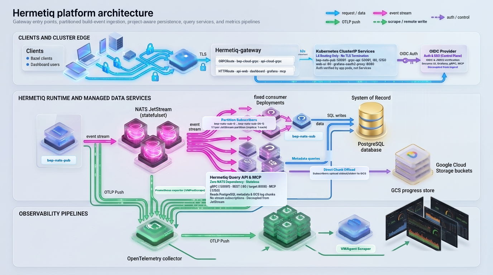
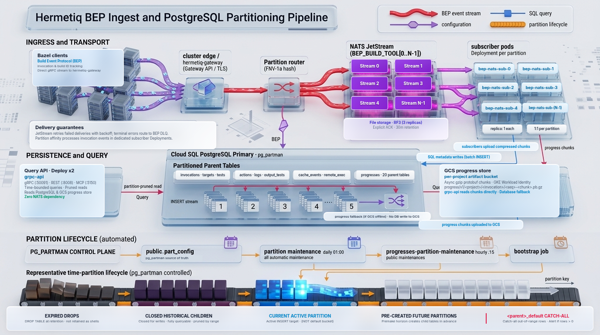
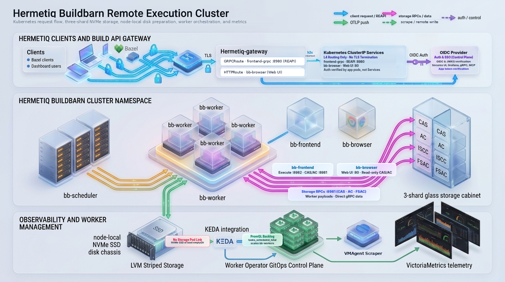

# Hermetiq on Kubernetes

This repository is the source for Hermetiq's Kubernetes deployment artifacts:

- Helm charts for Hermetiq, Buildbarn, and Hermetiq's RBE worker operator
- starter values for the charts and their external dependencies
- example `RbeWorker` pools and Bazel integrations
- operational and architecture runbooks

The Helm charts, starter values, examples, and operational runbooks in this
repository are licensed under Apache-2.0. The Hermetiq application container
images deployed by the charts are commercial software distributed under the
[Hermetiq Software License Agreement](charts/hermetiq/SOFTWARE-LICENSE-AGREEMENT.md);
see [License](#license).

Customer installations should use the versioned OCI charts published at
`oci://ghcr.io/hermetiq/`. The chart sources under [`charts/`](charts/) are for
development, review, and pre-release testing.

The examples are tailored for GKE, but the Helm charts work on any conformant
Kubernetes 1.32+ cluster. EKS, AKS, and other environments need equivalent
PostgreSQL, storage, workload identity, Gateway/Ingress, DNS, and TLS
configuration.

## Contents

- [Key features](#key-features)
  - [Hermetiq chart](#hermetiq-chart)
  - [Buildbarn chart](#buildbarn-chart)
- [Repository layout](#repository-layout)
- [Supported chart bundle](#supported-chart-bundle)
- [Architecture](#architecture)
- [Prerequisites](#prerequisites)
- [Installation](#installation)
  - [Prepare custom values](#prepare-custom-values)
  - [Create the namespace](#create-the-namespace)
  - [Prepare routing, DNS, and TLS](#prepare-routing-dns-and-tls)
  - [Provision shared services](#provision-shared-services)
  - [Install Hermetiq](#install-hermetiq)
  - [Install the worker operator](#install-the-worker-operator)
  - [Install Buildbarn and worker pools](#install-buildbarn-and-worker-pools)
- [Verify the stack](#verify-the-stack)
- [Post-installation configuration](#post-installation-configuration)
- [Examples and runbooks](#examples-and-runbooks)
- [Shared chart conventions](#shared-chart-conventions)
- [Upgrading](#upgrading)
- [Uninstalling](#uninstalling)
- [Getting help](#getting-help)
- [License](#license)

## Key features

### Hermetiq chart

Understand slow builds, cache misses, flaky tests, and remote execution costs
with Bazel analytics running in your own cluster.

- **Find the action behind a slow build.** Connect completed remote actions to
  their invocations, with queue, input-fetch, execution, and upload timings
  broken down by worker and platform.
- **Investigate with AI.** The built-in MCP server lets assistants explore build
  analytics, diagnose Buildbarn health, inspect Kubernetes deployments, and
  analyze remote execution costs through OpenCost.
- **Keep ingestion moving through CI peaks.** Partitioned NATS JetStream streams
  distribute load while preserving each build's event order. Publisher
  autoscaling and a dead-letter queue help handle spikes and isolate bad events.
- **Automate routine data maintenance.** Helm hooks run schema migrations;
  scheduled jobs maintain partitions, retention, and trend views. Optional
  object storage keeps build logs out of the database.
- **Connect your existing identity provider.** Shared OIDC configuration powers
  dashboard SSO and authenticated Bazel uploads, with group-based admin access
  and shared sessions for Grafana and Buildbarn Browser.
- **Bring the analytics stack online together.** One Helm release wires the API,
  dashboard, ingestion pipeline, and MCP server, with tailored Bazel setup
  instructions and bundled Grafana dashboards. A 30-day trial is issued on first
  boot when you provide a contact email.

### Buildbarn chart

Give Bazel a shared remote cache and execution backend, with storage and worker
pools sized for your workloads.

- **Deploy a coordinated build backend.** One chart configures the frontend,
  scheduler, sharded storage, and Browser from a shared Jsonnet model, keeping
  authentication, tracing, and service addresses aligned.
- **Scale workers with demand.** With the worker operator and KEDA, declare
  `RbeWorker` pools that scale from zero as work queues, keep scheduled minimum
  capacity, and route actions by size class.
- **Run Docker-dependent tests remotely.** Optional Docker-in-Docker and Sysbox
  fleets support Testcontainers suites, with image preloading and registry
  mirrors to reduce startup overhead.
- **Choose storage for your workload.** Run sharded caches on persistent disks,
  local SSDs, or raw NVMe. Optional sizing checks catch invalid storage
  configurations before deployment.
- **Catch cache problems early.** Cache-hit completeness checks verify that
  outputs are available. Configurable expiry, storage health metrics, and
  retention alerts help expose problems that disk-usage graphs miss.
- **See execution in context.** The Completed Action Logger feeds remote-action
  details into Hermetiq, while project-labeled worker and storage metrics let
  teams track their own performance and cache health.

## Repository layout

| Path | Purpose |
|---|---|
| [`charts/hermetiq/`](charts/hermetiq/) | Hermetiq API, MCP server, BEP ingestion, dashboard, and database maintenance |
| [`charts/buildbarn/`](charts/buildbarn/) | Buildbarn cache, remote execution, Browser, portal, storage, and routing |
| [`charts/bb-worker-operator/`](charts/bb-worker-operator/) | `RbeWorker` CRD and controller |
| [`custom-values/`](custom-values/) | Starter overrides for the supported stack and its dependencies |
| [`examples/`](examples/) | Bazel integrations, runner images, and validation projects |
| [`docs/`](docs/) | Focused architecture and operational runbooks |

The component READMEs are the canonical references for chart-specific values
and operations:

- [Hermetiq chart reference](charts/hermetiq/README.md)
- [Buildbarn chart reference](charts/buildbarn/README.md)
- [BB Worker Operator reference](charts/bb-worker-operator/README.md)

## Architecture







| Component | Responsibility |
|---|---|
| Hermetiq dashboard (`web-ui`) | Project settings, build exploration, trends, analytics, and Quickstart instructions |
| Hermetiq API (`grpc-api`) | Dashboard, query, MCP, CAS, and bytestream-facing APIs |
| BEP publisher (`bep-nats-pub`) | Authenticates Bazel BEP/CAL traffic and publishes events to NATS JetStream |
| BEP subscribers (`bep-nats-sub-*`) | Consume partitioned event streams and persist build analytics |
| PostgreSQL | Hermetiq's system of record |
| NATS JetStream | Durable buffer between BEP ingestion and subscribers |
| DragonflyDB | Redis-compatible application cache |
| Buildbarn | Remote cache and remote execution services |
| BB Worker Operator | Reconciles `RbeWorker` resources into worker Deployments and KEDA scalers |
| VictoriaMetrics and Grafana | Metrics storage, alerting, and dashboards |
| OpenTelemetry Collector | Receives OTLP telemetry and forwards it to VictoriaMetrics |
| Gateway or Ingress | Exposes dashboard, API, MCP, BEP, Browser, portal, and Buildbarn gRPC endpoints |

## Prerequisites

You need:

- Kubernetes 1.32 or newer and namespace-administrator access
- Helm 3.8 or newer for OCI support
- `kubectl` configured for the target cluster
- a Gateway API, Contour, or Ingress controller
- DNS and a TLS certificate for the external hosts
- cert-manager installed and a configured issuer (`ClusterIssuer` by default)
  if the charts manage TLS certificates for Contour or Ingress (also required
  by optional TopoLVM)
- PostgreSQL 16 or newer with `pg_partman`
- an OIDC identity provider
- persistent storage suitable for NATS and, when selected, Buildbarn

The Hermetiq chart defaults to namespace RBAC, including permission to read
its own Namespace UID for license identity. It creates no ClusterRole or
ClusterRoleBinding in that mode. The bb-worker-operator chart
defaults to cluster RBAC; for a namespace-scoped operator installation, set
`rbac.mode=namespace` and `metrics.secure=false`. See the
[Hermetiq RBAC settings](charts/hermetiq/README.md#serviceaccount-tokens-and-rbac)
and [operator RBAC settings](charts/bb-worker-operator/README.md#rbac-scope).
For a namespace-scoped operator installation, a cluster administrator must
install its CRD separately.

Verify the basics before starting:

```bash
helm version
kubectl version
kubectl get gatewayclass
kubectl get storageclass
```

This guide assumes familiarity with Kubernetes and your cloud provider. Apply
your organization's networking, identity, backup, secret-management, and
change-control policies to every example.

## Supported chart bundle

The following versions form the first tested bundle in this repository:

| Chart | Chart version | Application version |
|---|--------------:|--------------------:|
| Hermetiq |       `0.9.3` |             `0.9.4` |
| Buildbarn |       `0.9.5` |  `20260908T142448Z` |
| BB Worker Operator |       `0.3.5` |            `v0.3.5` |

The release PR updates the chart versions and README pins together. Tag the
merged commit to publish the matching OCI packages. Maintenance PRs leave
both version sets unchanged and describe their user-visible change in the
chart's `artifacthub.io/changes` annotation. This guide documents the
supported current state, not a cumulative release history.

## Installation

Install in this order:

1. Prepare the namespace, routing, DNS, TLS, and shared services below. Follow
   the [Hermetiq prerequisite guide](charts/hermetiq/README.md#install-prerequisites)
   to provision PostgreSQL, NATS JetStream, and DragonflyDB.
2. Install Hermetiq. It creates the shared dashboard OAuth configuration used
   by the optional Grafana and Buildbarn Browser proxies.
3. Install the BB Worker Operator.
4. Install Buildbarn.
5. Apply the `RbeWorker` pools appropriate for the cluster.

### Prepare custom values

Clone this repository and copy the starter values into an environment-specific
directory so future updates do not overwrite your configuration:

```bash
git clone git@github.com:Hermetiq/hermetiq-k8s.git
cd hermetiq-k8s
cp -R custom-values my-custom-values
```

`my-custom-values/` is ignored by Git, as is any directory whose name ends in
`-custom-values`, so a more descriptive name such as
`gke-production-custom-values` also stays out of version control.

The files in `custom-values/` are starter overrides, not copies of every chart
setting. Each values file points to the chart's full `values.yaml` (or the
`helm show values` command for an upstream chart) when you need advanced options.

Helm deep-merges maps and replaces lists wholesale. When overriding a list,
repeat every entry that should remain. Multiple `-f` arguments are applied
left-to-right, with the rightmost value winning.

### Create the namespace

```bash
kubectl create namespace hermetiq
kubectl config set-context --current --namespace=hermetiq
kubectl auth can-i '*' '*' -n hermetiq
```

The Buildbarn release and its `RbeWorker` pools must share a namespace. FUSE
workers need privileged containers, so if Pod Security Admission enforces a
restrictive policy, allow privileged Pods in that namespace before applying
the worker pools:

```bash
kubectl label namespace hermetiq pod-security.kubernetes.io/enforce=privileged --overwrite
```

Use dedicated worker nodes. A Hermetiq release installed in a separate
namespace can retain `restricted` admission there; install the namespace-scoped
worker operator with Buildbarn so it can reconcile their shared worker pools.

If the cluster already hosts another Hermetiq installation, check for
cluster-scoped singleton operators before installing another copy. KEDA, the
DragonflyDB operator, and an unscoped BB Worker Operator commonly watch every
namespace and should not be duplicated without explicit namespace scoping.

### Prepare routing, DNS, and TLS

The Hermetiq and Buildbarn charts attach routes to infrastructure you own; they
do not create the Gateway or Ingress controller. Prepare:

- a Gateway/listener, Contour installation, or Ingress controller
- a wildcard certificate or individual certificates for the selected hosts
- DNS records pointing those hosts at the controller address
- a routing provider that matches the controller:
  - `gateway` for Envoy Gateway and other `GRPCRoute`-capable implementations
  - `gateway-httproute-only` for GKE Gateway
  - `contour` for `HTTPProxy`
  - `ingress` for classic Ingress
  - `none` when another system owns all external routes

Both application charts expose a Gateway-scoped `ClientTrafficPolicy`. When
Hermetiq and Buildbarn share a Gateway, enable that policy in exactly one chart;
Envoy Gateway does not merge two policies targeting the same Gateway.

The `gateway` provider renders Envoy Gateway policy resources in addition to
the standard routes. On a `GRPCRoute`-capable controller that is not Envoy
Gateway those kinds do not exist and the install fails on unknown kinds;
disable them with the values listed in each chart reference.

TLS depends on the provider. In the Gateway modes, TLS terminates on the
Gateway listener you own and the charts render no certificates. In the Contour
and Ingress modes, each chart can render a wildcard cert-manager `Certificate`
or reuse an existing wildcard Secret through `tls.secretName`. The Hermetiq
chart's shared Certificate is opt-in; it can also use per-route cert-manager
Certificates for Contour or cert-manager Ingress annotations when enabled. The
Buildbarn chart renders a Certificate by default and references the
`ClusterIssuer` named by `certificate.issuerRef.name`. Install cert-manager and
configure the issuer before using these chart-managed certificate modes. If
you manage TLS Secrets outside the charts, supply those Secrets instead.

The exact Hermetiq routing values are documented in the
[Hermetiq chart reference](charts/hermetiq/README.md#routing). Buildbarn routing
is documented in the
[Buildbarn chart reference](charts/buildbarn/README.md#routing-and-tls).

### Provision shared services

These services support multiple parts of the stack. Install them before the
application charts, then follow the
[Hermetiq prerequisite guide](charts/hermetiq/README.md#install-prerequisites)
for its PostgreSQL, NATS JetStream, and DragonflyDB setup.

| Service | Used by |
| --- | --- |
| OIDC identity provider | Hermetiq dashboard and authenticated BEP/API traffic; Buildbarn Browser and Grafana can share the dashboard sign-in. |
| VictoriaMetrics and Grafana | Hermetiq and Buildbarn dashboards, metrics, and alert rules; Buildbarn frontend and operator-managed worker autoscaling query VictoriaMetrics. |
| OpenTelemetry Collector | Receives Hermetiq telemetry and optional operator/Buildbarn telemetry, then exports metrics to VictoriaMetrics. |
| KEDA | Reconciles `ScaledObject` resources for operator-managed `RbeWorker` pools and optional Buildbarn frontend scaling. |

#### Identity provider

Prepare two OIDC applications:

- A regular web application using Authorization Code flow for the dashboard.
  Register callback URLs for every enabled UI, for example
  `https://dashboard.<your-domain>/oauth2/callback`,
  `https://grafana.<your-domain>/oauth2/callback`, and
  `https://browser.<your-domain>/oauth2/callback`.
- A machine-to-machine application for authenticated Bazel BEP and remote-cache
  traffic. Register the expected API audiences and authorize the client for
  those audiences.

Create the shared dashboard OAuth Secret:

```bash
kubectl -n hermetiq create secret generic oauth2-proxy-client \
  --from-literal=OAUTH2_PROXY_CLIENT_ID='<client-id>' \
  --from-literal=OAUTH2_PROXY_CLIENT_SECRET='<client-secret>' \
  --from-literal=OAUTH2_PROXY_COOKIE_SECRET="$(openssl rand -base64 32 | tr -- '+/' '-_')"
```

The Hermetiq, Grafana, and Buildbarn Browser proxies can share this Secret and
the ConfigMap rendered by the Hermetiq chart. Configure issuer, audiences,
groups, and the Buildbarn CAL trust boundary using the
[Hermetiq authentication reference](charts/hermetiq/README.md#authentication-and-sso).

#### VictoriaMetrics and OpenTelemetry

Create the Grafana administrator Secret and install the metrics stack:

```bash
kubectl -n hermetiq create secret generic grafana-admin \
  --from-literal=admin-user=admin \
  --from-literal=admin-password="$(openssl rand -base64 24)"

helm repo add vm https://victoriametrics.github.io/helm-charts/
helm repo add open-telemetry https://open-telemetry.github.io/opentelemetry-helm-charts
helm repo update

helm upgrade --install --namespace hermetiq vmks \
  vm/victoria-metrics-k8s-stack \
  --values my-custom-values/victoriametrics-values.yaml

helm upgrade --install --namespace hermetiq otel \
  open-telemetry/opentelemetry-collector \
  --version 0.153.0 \
  --values my-custom-values/otel-collector-values.yaml
```

Confirm the VictoriaMetrics insert endpoint and Grafana domain in the starter
values before installation. Hermetiq and Buildbarn render dashboards, scrape
objects, and recording rules consumed by this stack. The operator's worker
autoscaling and Buildbarn's optional scalers query VictoriaMetrics; configure
their Prometheus-compatible server addresses to match the installation.

#### KEDA

KEDA reconciles `ScaledObject` resources for operator-managed Buildbarn
workers and, when enabled in Buildbarn values, the frontend:

```bash
helm repo add kedacore https://kedacore.github.io/charts
helm repo update
helm upgrade --install --namespace hermetiq keda kedacore/keda
```

Before installing the application charts, verify the shared service releases
and workloads. The [Hermetiq readiness checks](charts/hermetiq/README.md#verify-dependencies-ready)
cover the remaining dependencies:

```bash
helm list -n hermetiq
kubectl -n hermetiq get pods
```

### Install Hermetiq

Follow the [Hermetiq chart install instructions](charts/hermetiq/README.md#install)
for the required inputs, readiness checks, and installation command.

### Install the worker operator

Follow the [worker operator install instructions](charts/bb-worker-operator/README.md#install),
including its CRD and [RBAC scope](charts/bb-worker-operator/README.md#rbac-scope)
steps.

### Install Buildbarn and worker pools

Follow the [Buildbarn chart install instructions](charts/buildbarn/README.md#install),
then the [RBE worker pool instructions](custom-values/rbeworkers/README.md)
to apply and tailor the worker manifests.

## Verify the stack

Check Helm releases and workload readiness:

```bash
helm list -n hermetiq
kubectl -n hermetiq get deploy,statefulset
kubectl -n hermetiq get rbeworkers,scaledobjects
kubectl -n hermetiq get pods
```

The release list should contain `hmq`, `buildbarn`, `bb-worker-operator`, NATS,
VictoriaMetrics, OpenTelemetry, KEDA, and either a Dragonfly Helm release or an
operator-managed Dragonfly resource.

Verify service endpoints and the active routing resources:

```bash
kubectl -n hermetiq get endpoints \
  grpc-api web-ui bep-nats-pub frontend-grpc browser scheduler storage
kubectl -n hermetiq get httproute,grpcroute,httpproxy,ingress 2>/dev/null
```

It is normal for worker pools with `minReplicas: 0` to show zero ready replicas
until KEDA observes queued work. Verify the operator and KEDA objects rather
than assuming a zero-replica pool is unhealthy.

Finally:

1. Open `https://dashboard.<your-domain>` and complete an OIDC login.
2. Confirm the Hermetiq, Buildbarn, NATS, and Kubernetes dashboards appear in
   Grafana.
3. Run a small Bazel build with the configured BEP and remote cache endpoints.
4. Confirm the invocation appears in Hermetiq and the action/cache data is
   visible through Buildbarn.

## Post-installation configuration

Sign in as an administrator and review **Project Settings** for each project:

- user-facing project name and description
- managed Buildbarn namespace and Browser/Grafana URLs
- successful-action, completed-action-log, and output-file processing settings
- analytics and MCP access
- cloud object storage for progress logs and its lifecycle policy
- CAS and bytestream endpoints, instance names, aliases, TLS, and metadata

Project settings are stored by Hermetiq, not in Helm values. Review them after
adding a Buildbarn namespace or changing public endpoints. Several settings
depend on cluster configuration:

- **Completed Action Log** only receives data when the publisher admits
  Buildbarn workers through `publisher.trustedCalCidrs`; see
  [gRPC authentication](charts/hermetiq/README.md#grpc-authentication) in the
  Hermetiq reference.
- **Action Cache Hit Tracker** needs the grpc-cache-proxy sidecar on the
  Buildbarn frontend and `app.cacheEventsEnabled=true` in the Hermetiq chart;
  see the
  [sidecar section](charts/buildbarn/README.md#hermetiq-grpc-cache-proxy-sidecar)
  of the Buildbarn reference.
- **Store compressed invocation logs in cloud object storage** needs workload
  identity for the subscriber pods and a bucket lifecycle rule you own; see
  [progress log storage](charts/hermetiq/README.md#progress-log-storage).
- **Bytestream URI Host Aliases** in the CAS and bytestream client settings
  must include the external Buildbarn frontend host, for example
  `bb.<your-domain>:443`, on Gateway installs. Hermetiq reads trace profiles,
  test logs, and output files from bytestream URIs that carry the public host
  rather than an internal Service name.

For Bazel client examples, start with [`examples/README.md`](examples/README.md).

## Examples and runbooks

| Document | Purpose |
|---|---|
| [`examples/README.md`](examples/README.md) | Bazel integration and runnable project examples |
| [`docs/buildbarn-storage-model.md`](docs/buildbarn-storage-model.md) | Storage sizing, sharding, and eviction model |
| [`docs/buildbarn-storage-operations.md`](docs/buildbarn-storage-operations.md) | Buildbarn storage lifecycle and runbooks |
| [`docs/buildbarn-block-storage.md`](docs/buildbarn-block-storage.md) | Raw block-device deployment guidance |
| [`docs/iscc-size-classes.md`](docs/iscc-size-classes.md) | Initial Size Class Cache design and operations |
| [`docs/mcp-auth0-runbook.md`](docs/mcp-auth0-runbook.md) | Auth0 setup and MCP authentication troubleshooting |

## Shared chart conventions

Hermetiq and Buildbarn expose a common set of deployment controls. Use the
individual chart defaults as the exact contract.

- `global.imageRegistry` rewrites the registry host for images deployed by that
  chart. It does not rewrite third-party dependency charts or `RbeWorker`
  runner images.
- `global.imagePullSecrets` is combined with chart-level `imagePullSecrets`.
- Image `digest` values pin immutable content while retaining readable tags.
- `commonLabels` and `commonAnnotations` add organizational metadata without
  changing immutable workload selectors.
- `standardLabels.appVersion` opts into the standard application-version label.
- `extraObjects` renders customer-owned Kubernetes objects in the chart's Helm
  context. NetworkPolicy rules remain environment-specific and should be
  reviewed with `helm template`, `kubectl diff`, and server-side dry-run.
- Template expressions are supported only by the values explicitly documented
  as templated. Do not put template expressions in `hosts.*`; several consumers
  use host values verbatim.

For private-registry or air-gapped installations, enumerate and mirror images
from every application and dependency chart plus every worker manifest. Do not
assume `global.imageRegistry` covers the entire stack.

## Upgrading

When a new chart version is released:

1. Read the `Chart.yaml` release metadata and GitHub release notes.
2. Compare the new defaults with the version currently deployed.
3. Back up PostgreSQL and assess whether Buildbarn storage changes imply a cold
   cache.
4. Apply the BB Worker Operator CRD first, then upgrade the operator, Hermetiq,
   and Buildbarn using a tested version combination.
   After upgrading to operator 0.3.4, remove
   `spec.autoscaling.prometheus.projectID` from every existing `RbeWorker`.
   Buildbarn 0.9.4 no longer labels its metrics with `hermetiq_project_id`, so
   drop `project.id` from Buildbarn values and leave the Hermetiq chart's
   `victoriaMetrics.projectLabel` at `namespace`.
5. Reuse the same custom values files and verify every rollout before continuing.

Example defaults comparison:

```bash
helm show values oci://ghcr.io/hermetiq/hermetiq \
  --version 0.9.2 > /tmp/hermetiq-old-values.yaml
helm show values oci://ghcr.io/hermetiq/hermetiq \
  --version '<new-version>' > /tmp/hermetiq-new-values.yaml
diff -u /tmp/hermetiq-old-values.yaml /tmp/hermetiq-new-values.yaml
```

Hermetiq schema migrations run through the chart's bootstrap job. Consult the
chart README and release notes before changing bootstrap or hook behavior.

## Uninstalling

Uninstall in reverse application order:

```bash
helm -n hermetiq uninstall buildbarn bb-worker-operator hmq
helm -n hermetiq uninstall keda otel vmks nats dragonfly
```

If Dragonfly is operator-managed, delete the `Dragonfly` resource instead of a
nonexistent Helm release.

Helm intentionally leaves external and stateful data behind. Review before
deleting:

- `RbeWorker` objects and the `rbeworkers.bb.hermetiq.com` CRD
- NATS, Buildbarn, and Dragonfly PVCs
- manually created Secrets and externally managed ConfigMaps
- PostgreSQL instances, databases, backups, object-storage buckets, DNS, TLS,
  and Gateway infrastructure

Deleting Buildbarn or NATS PVCs is destructive. PostgreSQL and object storage
are not removed by these commands.

## Getting help

Open an [installation issue](https://github.com/Hermetiq/hermetiq-k8s/issues/new/choose)
with:

- the failing command
- the relevant `helm status`, `kubectl describe`, and container logs
- the chart versions from `helm list -n hermetiq`
- a redacted copy of the applicable values file

Do not include passwords, tokens, license keys, private certificates, or
unredacted Kubernetes Secrets.

## License

- **This repository.** The Helm charts, starter values, examples, and runbooks
  are licensed under the [Apache License 2.0](LICENSE).
- **Hermetiq container images.** The Hermetiq application, the
  grpc-cache-proxy sidecar, and the Buildbarn worker operator are proprietary
  software distributed under the
  [Hermetiq Software License Agreement](charts/hermetiq/SOFTWARE-LICENSE-AGREEMENT.md),
  packaged with the chart. Installing the
  `hermetiq` chart requires `license.agreement.accepted: true` and a trial or
  purchased
  license key.
- **Buildbarn images.** The upstream Buildbarn components pulled from
  `ghcr.io/buildbarn` are Apache-2.0 open source maintained by the Buildbarn
  project.
